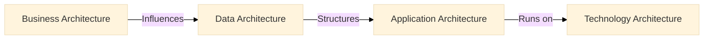

# TOGAF Foundations Notes

## 1. Introduction to TOGAF

### What is TOGAF?

- TOGAF (The Open Group Architecture Framework) is a **framework for enterprise architecture**.
- Provides a **structured approach** for designing, planning, implementing, and governing IT architecture.
- Includes **principles, methods, and guidelines** for developing enterprise architectures.

### Why Use TOGAF?

- Establishes a **common language** for architecture teams.
- **Reduces complexity** in enterprise architecture development.
- **Ensures alignment** between business and IT strategies.
- **Encourages reuse** of existing architectural components.

## 2. TOGAF Components

### Core Elements of TOGAF

- **Architecture Development Method (ADM)** – Step-by-step process for developing an enterprise architecture.
- **Enterprise Continuum** – A classification system for architecture assets.
- **Reference Models** – Includes the Technical Reference Model (TRM) and Integrated Information Infrastructure Reference Model (III-RM).
- **Governance Frameworks** – Defines compliance, review, and decision-making processes.

### The Four Architecture Domains (BDAT)

| Domain       | Description |
|-------------|-------------|
| **Business Architecture** | Defines business strategy, governance, organization, and key processes. |
| **Data Architecture** | Describes data assets, storage, management, and governance. |
| **Application Architecture** | Specifies individual applications, their relationships, and integration. |
| **Technology Architecture** | Covers IT infrastructure, networks, hardware, and software. |

### BDAT Layered Model

## 3. ADM (Architecture Development Method) Overview

### ADM Lifecycle

- **Iterative approach** to enterprise architecture development.
- Ensures **continuous improvement** and alignment with business needs.

### ADM Phases

## 4. TOGAF Documentation Structure

- **Core TOGAF Standard** – Defines the fundamental framework.
- **Series Guides** – Best practices and detailed methodologies.
- **Reference Models & Tools** – Supporting assets for architecture development.

---
