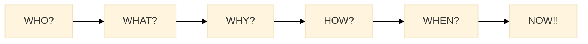

# TOGAF ADM (Architecture Development Method) - Module 2

## 1. Introduction to ADM

### 1.1 What is ADM?

- The **Architecture Development Method (ADM)** is the **core process** in TOGAF for developing enterprise architectures.
- It provides a **step-by-step approach** for defining, planning, and governing architecture projects.
- ADM is **iterative** and **flexible**, allowing customization for different organizations.

### 1.2 Key Characteristics of ADM

- **Iterative and Continuous** – Not a one-time process, but ongoing.
- **Guides Decision-Making** – Helps determine architecture scope and deliverables.
- **Adaptable** – Can be tailored based on business needs.

## 2. ADM Phases in Detail

### 2.1 Preliminary Phase – Establishing Architecture Framework (**WHY?**)

📌 *This phase sets the foundation by defining governance, scope, and guiding principles.*

- **BIG Question:** *What are the principles, governance, and scope that will guide our enterprise architecture?*
- Define **architecture principles, governance**, and scope.
- Identify **business drivers** and initial stakeholder concerns.

### 2.2 Phase A: Architecture Vision (**WHAT?**)

📌 *Ensures all stakeholders share a common vision before detailed planning begins.*

- **BIG Question:** *What is the high-level vision and value of this architecture initiative?*
- Define **high-level vision** of the target architecture.
- Identify **key stakeholders** and their requirements.
- Create a **Statement of Architecture Work**.

### 2.3 Phase B: Business Architecture (**WHO & WHERE?**)

📌 *Defines how the business operates and where key capabilities exist.*

- **BIG Question:** *How should the business be structured to achieve its goals?*
- Develop the **business layer** of the architecture.
- Define **business capabilities, processes, and governance**.
- Ensure business needs align with IT strategy.

### 2.4 Phase C: Data Architecture (**WHAT DATA?**)

📌 *Focuses on managing and structuring enterprise data effectively.*

- **BIG Question:** *What data is needed, and how should it be managed?*
- Identify **data entities and relationships**.
- Define **data governance and lifecycle policies**.
- Ensure data supports business and application needs.

### 2.5 Phase D: Application Architecture (**HOW?**)

📌 *Defines what applications are required and how they interact.*

- **BIG Question:** *What applications do we need, and how will they integrate into the architecture?*
- Define **major applications** and their interactions.
- Ensure applications align with business and data layers.
- Identify integration points and dependencies.

### 2.6 Phase E: Opportunities & Solutions (**WHAT IF?**)

📌 *Identifies potential solutions and evaluates their feasibility.*

- **BIG Question:** *What are the best strategic solutions to achieve the architecture vision?*
- Identify **strategic solutions** for implementation.
- Evaluate **architecture alternatives and trade-offs**.
- Develop high-level migration strategies.

### 2.7 Phase F: Migration Planning (**WHEN & HOW?**)

📌 *Creates a structured plan for rolling out the architecture.*

- **BIG Question:** *How do we implement this architecture in a structured way?*
- Create a **roadmap** for architecture implementation.
- Define **work packages and dependencies**.
- Align projects with business priorities.

### 2.8 Phase G: Implementation Governance (**ENSURING COMPLIANCE?**)

📌 *Ensures adherence to architectural standards during implementation.*

- **BIG Question:** *How do we ensure the architecture is implemented correctly?*
- Ensure architecture is **implemented as designed**.
- Define **governance structures** for compliance.
- Monitor progress and manage risks.

### 2.9 Phase H: Architecture Change Management (**WHAT NOW?**)

📌 *Manages necessary updates and ensures alignment with evolving business needs.*

- **BIG Question:** *How do we manage changes and maintain architecture alignment?*
- Handle **ongoing changes and iterations**.
- Ensure architecture remains aligned with business goals.
- Implement **continuous improvement processes**.

### 2.10 Requirements Management (Ongoing Phase) (**ALWAYS?**)

📌 *Ensures requirements are continually tracked and refined.*

- **BIG Question:** *Are all stakeholder needs being met throughout the process?*
- **Central phase connecting all others**.
- Ensures that requirements are **captured, validated, and addressed** throughout ADM.

---

## Resources

[TOGAF 10 Foundation - Course by Educba on Coursera](https://www.coursera.org/learn/togaf-10-foundation/home/welcome)