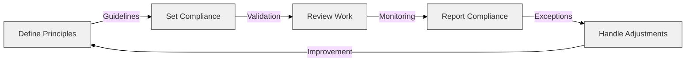

# TOGAF Governance, Risk, and Techniques - Module 3

## 1. Introduction to Governance in TOGAF

- Governance ensures **architecture compliance** with business goals and IT standards.
- Provides **control mechanisms** for managing architecture development.
- Involves **stakeholders, policies, and processes** for decision-making.

## 2. Architecture Governance Framework

- **Key Components:**
  - **Architecture Board** – Oversees architecture decisions and compliance.
  - **Compliance Processes** – Ensures adherence to TOGAF principles.
  - **Architecture Contracts** – Defines agreements between architecture teams.
  - **Governance Logs** – Tracks decisions, risks, and deviations.

## 3. Risk Management in Enterprise Architecture

- Identifies and mitigates **architectural risks** early.
- Establishes **risk frameworks** for addressing security, scalability, and compliance.
- Requires **continuous monitoring** and adaptation.

## 4. Key TOGAF Techniques

### 4.1 Capability-Based Planning

- Aligns **business capabilities** with IT strategy.
- Ensures that investments **deliver measurable business value**.

### 4.2 Gap Analysis

- Compares **baseline and target architectures** to identify **gaps**.
- Helps in **prioritizing initiatives** to bridge architecture differences.

### 4.3 Maturity Models

- Assesses **organizational readiness** for architecture initiatives.
- Guides organizations in **progressing from ad hoc to optimized architectures**.

### 4.4 Stakeholder Management

- Identifies and categorizes stakeholders **based on influence and interest**.
- Ensures alignment between **technical and business perspectives**.

## 5. Governance Compliance Process

## 6. Summary

- Governance ensures **architecture consistency and accountability**.
- Risk management helps **anticipate and mitigate** potential failures.
- TOGAF techniques **optimize architecture planning and execution**.

---
*Made by Ramsi K. – Part of the GenAI Bootcamp 2025 repository.*
