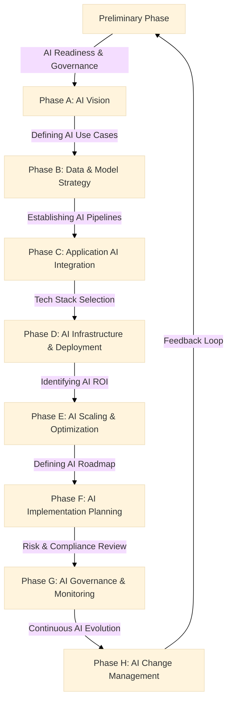

# TOGAF for GenAI - AI Mapping Guide

## **Overview**

This document maps **TOGAF architecture principles** to **Generative AI (GenAI) workflows**, ensuring structured enterprise AI adoption.

## **Mapping TOGAF ADM to GenAI Lifecycle**

## **Phase-Wise AI Integration**

### **Preliminary Phase – AI Readiness & Governance**

- Define **AI governance frameworks**.
- Assess **AI readiness** and compliance.
- Align AI adoption with **business strategy**.
- Identify key risks such as **model bias, security vulnerabilities, and regulatory challenges**.

### **Phase A – AI Vision**

- Establish **AI objectives & long-term vision**.
- Identify **stakeholders & key AI initiatives**.
- Define initial **AI ethical considerations and responsible AI guidelines**.
- Highlight **use case validation strategies** to ensure AI aligns with business goals.

### **Phase B – Data & Model Strategy**

- Develop **AI data strategy & pipeline architecture**.
- Select **pre-trained models vs. custom model training**.
- Ensure **data security, privacy & bias mitigation**.
- Define data storage solutions such as **AWS S3, PostgreSQL, or Vector Databases**.

### **Phase C – Application AI Integration**

- Identify AI applications across **business functions**.
- Establish **AI API integrations & orchestration frameworks**.
- Define **KPIs for AI-driven business processes**.
- Consider AI-driven **feedback loops to improve user experience**.

### **Phase D – AI Infrastructure & Deployment**

- Select **AI computing stack (cloud vs. on-premises)**.
- Optimize **AI model training & inference performance**.
- Deploy AI workloads via **MLOps & CI/CD pipelines**.
- Use technologies like **Kubernetes for scaling, AWS Lambda for serverless AI inference**.

### **Phase E – AI Scaling & Optimization**

- Improve AI performance via **continuous training & tuning**.
- Identify **bottlenecks & inefficiencies in AI workflows**.
- Align AI scalability with **business expansion goals**.
- Implement cost-effective model hosting solutions such as **Hugging Face Inference API or Triton Inference Server**.

### **Phase F – AI Implementation Planning**

- Create an **AI roadmap & work package prioritization**.
- Develop **business cases for AI investments**.
- Align AI projects with **regulatory compliance**.
- Establish AI evaluation metrics, such as **model latency and accuracy benchmarks**.

### **Phase G – AI Governance & Monitoring**

- Establish **AI audit & monitoring mechanisms**.
- Ensure compliance with **AI ethics & bias reduction**.
- Define **AI model versioning & accountability policies**.
- Implement AI model observability solutions such as **Weights & Biases, MLflow, or Prometheus**.

### **Phase H – AI Change Management**

- Develop **AI adoption training for employees**.
- Create a **feedback loop for continuous AI improvements**.
- Ensure **AI adaptability to evolving business needs**.
- Use structured **change management strategies** for AI-driven transformation.

## **Key Takeaways**

- **TOGAF provides a structured AI adoption framework**.
- **AI governance & ethics** are critical for enterprise AI success.
- **Continuous AI evolution & feedback loops** ensure long-term AI viability.
- **Enterprise AI adoption should align with organizational change management strategies**.

📌 *This mapping guide will evolve as AI practices mature!*
---

*Made by Ramsi K. – Part of the GenAI Bootcamp 2025 repository.*
