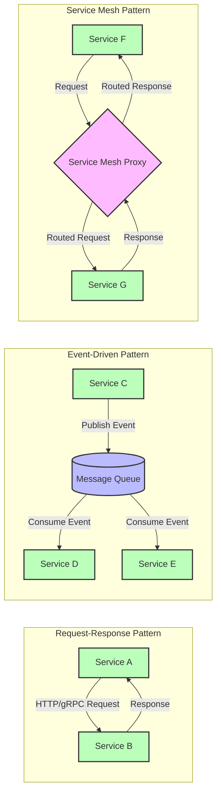
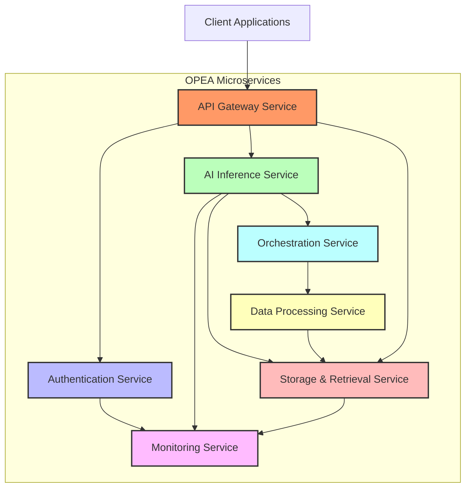

# Basics of Microservices in OPEA

## 📌 Index

1. 🔹 [What are Microservices?](#1️⃣-what-are-microservices)
2. 🍽️ [Microservices vs. Monolith: The Restaurant Analogy](#2️⃣-microservices-vs-monolith-the-restaurant-analogy)
3. 🚀 [Simple Scenarios for Understanding OPEA Microservices](#3️⃣-simple-scenarios-for-understanding-opea-microservices)
4. 🛠️ [Basic Microservices in OPEA](#4️⃣-basic-microservices-in-opea)
5. 🔄 [How Microservices Communicate](#5️⃣-how-microservices-communicate)
6. 🎨 [Microservices Diagram](#6️⃣-microservices-diagram)
7. 🏗️ [Simple Hands-On Example](#7️⃣-simple-hands-on-example)
8. 🤯 [Common Misconceptions About Microservices](#8️⃣-common-misconceptions-about-microservices)
9. 📚 [Glossary of Microservices Terms](#glossary-of-microservices-terms)

---

## **1️⃣ What are Microservices?**

Think of microservices like a team of specialists working together, each with their own expertise:

✅ Instead of one application doing everything (**a monolith**), microservices **split responsibilities**.  
✅ Each service **focuses on one job** and does it well.  
✅ Services **talk to each other** over a network.  
✅ If one service fails, **the others can keep running**.

---

## **2️⃣ Microservices vs. Monolith: The Restaurant Analogy**

### 🍽️ **Monolithic Application (One Chef Restaurant)**

- **One chef** does everything—takes orders, cooks all dishes, serves food, and handles payments.
- **Pros**: Simple to coordinate, no communication issues.
- **Cons**: If the chef is sick, the entire restaurant shuts down.

### 🍽️ **Microservices Architecture (Specialized Kitchen Staff)**

- **Host takes orders**, different chefs cook different dishes, **servers deliver food**, and **cashier handles payment**.
- **Pros**: More efficient, staff can specialize, one absent worker doesn’t shut down the whole restaurant.
- **Cons**: Requires coordination, communication overhead.

---

## **3️⃣ Simple Scenarios for Understanding OPEA Microservices**

### **Scenario 1: Processing a User Query in OPEA**

1. **User asks a chatbot a question**.
2. **Gateway Service** authenticates the user.
3. **Orchestration Service** determines which AI model to use.
4. **Data Processing Service** cleans and formats the input.
5. **AI Inference Service** runs the query through the model.
6. **Storage Service** retrieves relevant data to improve the response.
7. **Gateway Service** sends the final response back to the user.

### **Scenario 2: Scaling During High Traffic**

1. **Monday morning**: Many users start using OPEA simultaneously.
2. **Monitoring Service** detects increased CPU usage on AI Inference Service.
3. **Kubernetes HPA** automatically creates more AI Inference Service pods.
4. **Load Balancer** distributes requests evenly.
5. **After peak hours**: System scales down to save resources.

---

## **4️⃣ Basic Microservices in OPEA**

- **🛠️ Gateway Service** → Routes API requests and ensures authentication.
- **📜 Authentication Service** → Manages user login and API keys.
- **🧠 AI Inference Service** → Runs AI models to generate responses.
- **💾 Storage Service** → Stores and retrieves structured & unstructured data.
- **⚙️ Orchestration Service** → Manages workflows and service coordination.
- **📊 Monitoring Service** → Tracks service health, logs, and system performance.

---

## **5️⃣ How Microservices Communicate**

🔹 **REST APIs** – Simple, stateless HTTP requests between services.  
🔹 **Message Queues (Kafka, RabbitMQ)** – Event-driven processing.  
🔹 **Service Discovery** – Services find each other dynamically inside Kubernetes.



---

## **6️⃣ Microservices Diagram**



## **7️⃣ Simple Hands-On Example**

A basic **FastAPI-based microservice** in Python:

```python
from fastapi import FastAPI

app = FastAPI()

@app.get("/ping")
def ping():
    return {"message": "Service is running"}
```

🚀 **Run the service**:

```bash
uvicorn main:app --host 0.0.0.0 --port 8000
```

---

## **8️⃣ Common Misconceptions About Microservices**

#### **1: "Microservices are always better than monoliths"**

**Reality**: Microservices add complexity that may not be justified for smaller applications or teams. OPEA uses microservices because of its enterprise scale and complex AI requirements.

#### **2: "Each microservice should be as small as possible"**

**Reality**: Services should be sized by business capability, not code volume. Breaking things down too much creates unnecessary communication overhead.

#### **3: "Microservices eliminate all dependencies"**

**Reality**: They change the nature of dependencies from in-code to network-based. Services still rely on each other, just in different ways.

#### **4: "Microservices can scale infinitely"**

**Reality**: While microservices allow for targeted scaling, constraints still exist—like database bottlenecks, network latency, and resource limits.

#### **5: "Microservices guarantee better performance"**

**Reality**: Microservices can introduce latency due to inter-service communication. Without proper optimizations (caching, batching, etc.), they can be **slower** than a well-optimized monolith.

#### **6: "Microservices are just about splitting code"**

**Reality**: Microservices architecture is about **independent deployment and scaling**, not just breaking code into small pieces.

---

## **Glossary of Microservices Terms**

| Term              | Definition                                                             |
| ----------------- | ---------------------------------------------------------------------- |
| **API Gateway**   | The entry point that routes requests to appropriate microservices      |
| **Container**     | A lightweight package that includes everything needed to run a service |
| **Docker**        | Platform used to package applications into containers                  |
| **Kubernetes**    | System for managing and scaling containerized applications             |
| **Load Balancer** | Distributes incoming network traffic across multiple service instances |

---

_Made by Ramsi K. – Part of the GenAI Bootcamp 2025 repository._
