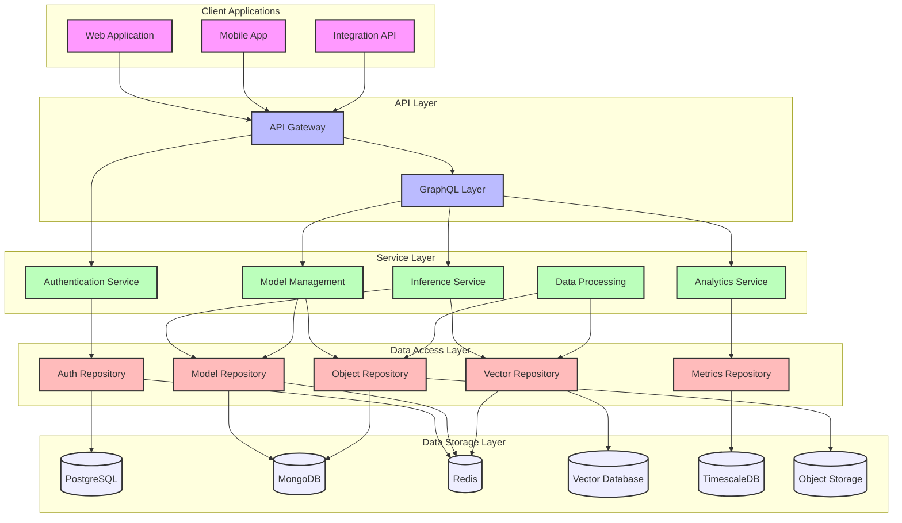
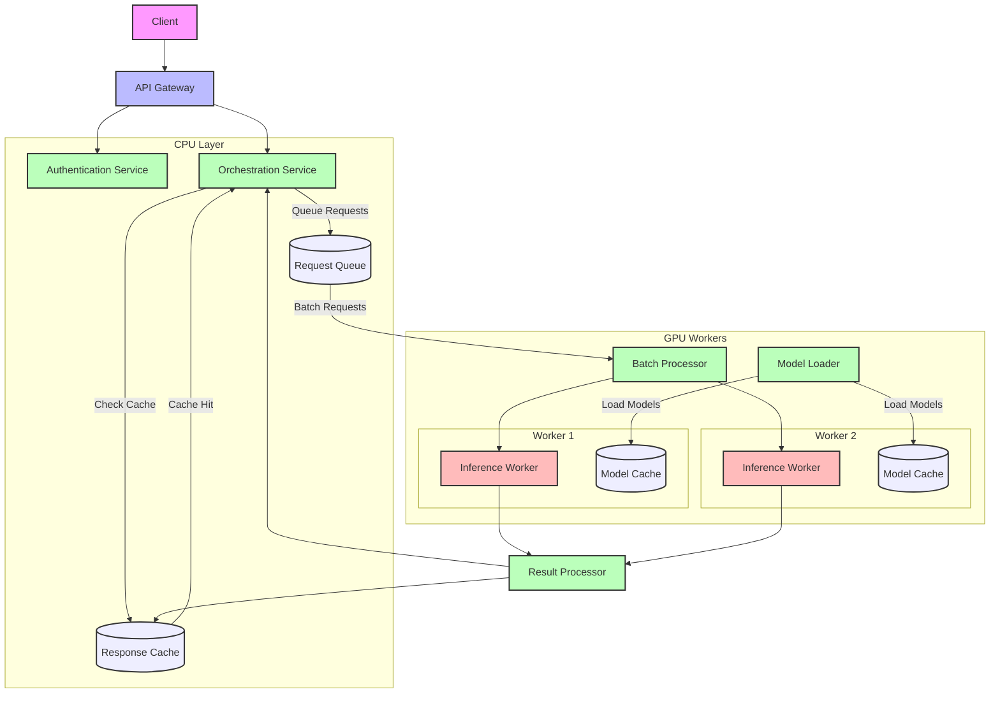
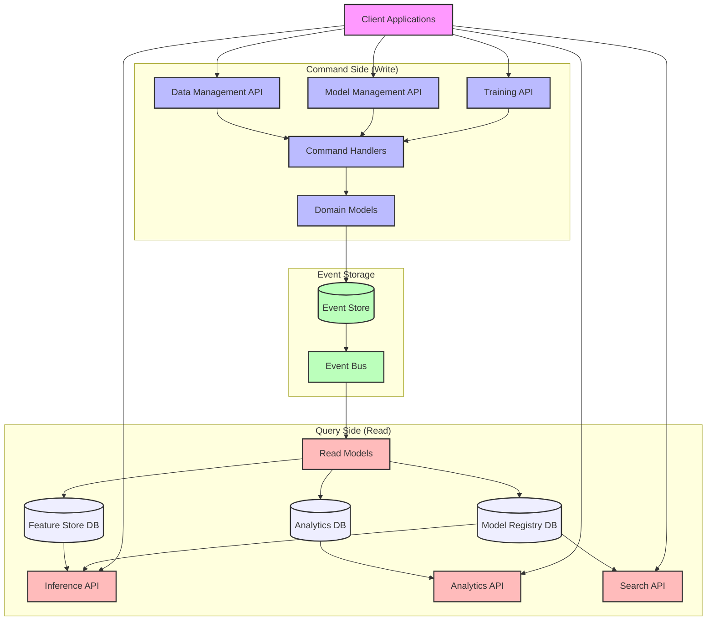
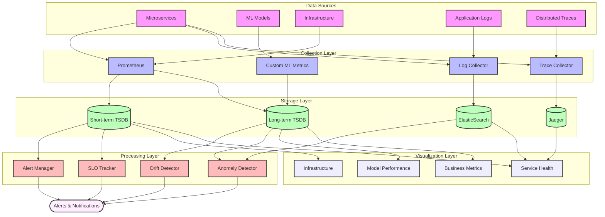
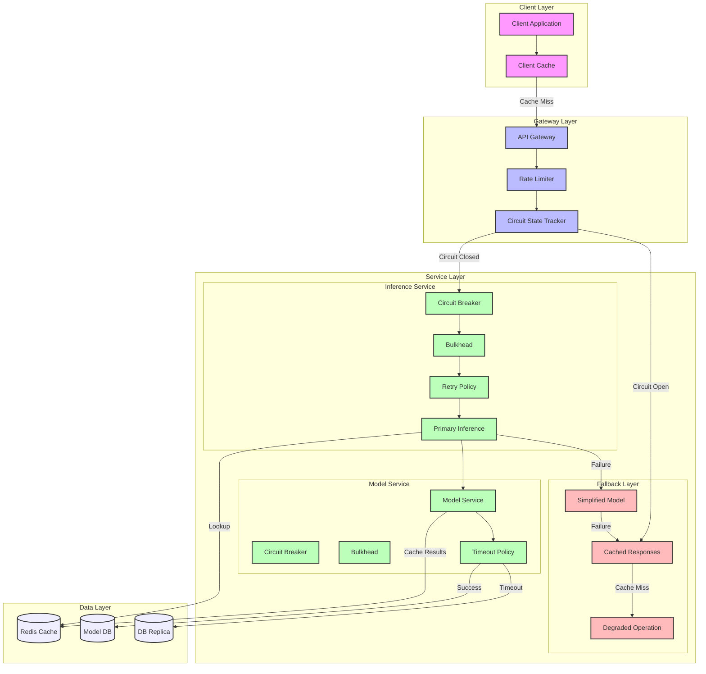
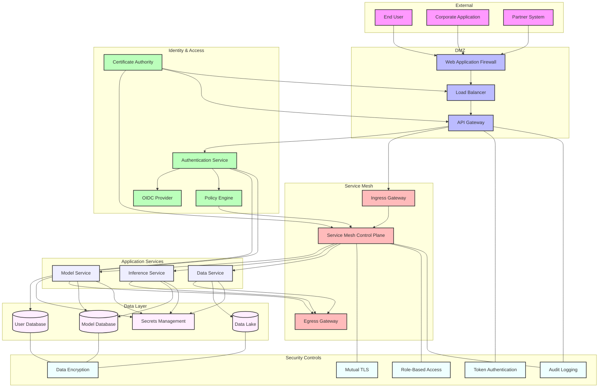
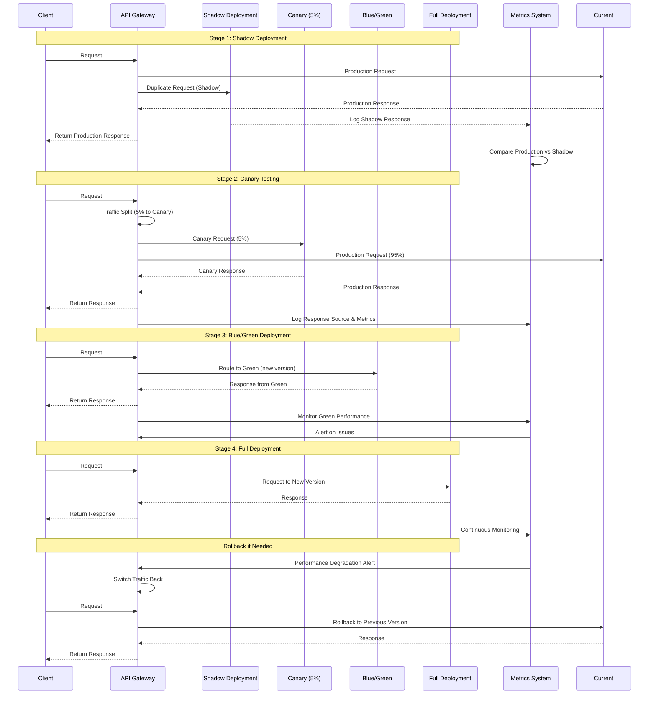
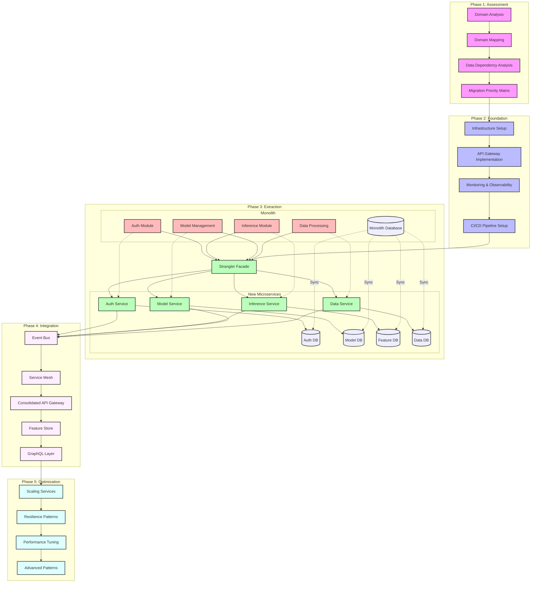

# 🚀 OPEA Microservices Architecture: Advanced Deep Dive Notes

## 📋 Table of Contents

1. [🏗️ Modern Domain-Driven Architecture](#1️⃣-modern-domain-driven-architecture)
2. [🗄️ Polyglot Persistence Strategies](#2️⃣-polyglot-persistence-strategies)
3. [📈 Advanced Scaling Patterns](#3️⃣-advanced-scaling-patterns)
4. [📝 Event Sourcing & CQRS](#4️⃣-event-sourcing--cqrs)
5. [📊 Advanced Monitoring & Observability](#5️⃣-advanced-monitoring--observability)
6. [⚡ Performance Optimization](#6️⃣-performance-optimization)
7. [🛡️ Resilience Patterns](#7️⃣-resilience-patterns)
8. [🔐 Security in Depth](#8️⃣-security-in-depth)
9. [🌐 API Gateway Patterns](#9️⃣-api-gateway-patterns)
10. [🚢 Deployment Strategies](#1️⃣0️⃣-deployment-strategies)
11. [⚠️ Anti-patterns & Lessons Learned](#1️⃣1️⃣-anti-patterns--lessons-learned)

---

## 1️⃣ Modern Domain-Driven Architecture

### 🧩 Strategic Domain Decomposition

OPEA's domain boundaries are carefully structured around business capabilities rather than technical functions:

- **🧠 Model Registry & Governance**: Version control, lineage tracking, approval workflows
- **🔢 Feature Store**: Feature computation, storage, versioning, and serving
- **⚙️ Inference Engine**: Model serving, batching, and optimized runtime environments
- **🔬 Training Orchestration**: Experiment tracking, hyperparameter optimization
- **🔄 Data Pipeline Management**: ETL, validation, transformation services
- **📡 Monitoring & Observability**: Model drift, data drift, prediction explanations

> 💡 **Key Insight**: Domain boundaries in AI systems often cross technical and business domains, requiring careful consideration of both data scientists' workflows and operational concerns.

### 🗺️ Context Maps for AI Platforms

| Bounded Context  | Upstream Contexts      | Downstream Contexts               | Shared Language                    |
| ---------------- | ---------------------- | --------------------------------- | ---------------------------------- |
| Model Registry   | Training Orchestration | Inference Engine                  | Model versions, artifacts, metrics |
| Feature Store    | Data Pipeline          | Training Orchestration, Inference | Feature definitions, schemas       |
| Inference Engine | Model Registry         | Applications, Monitoring          | Prediction requests, batching      |

### ❌ Anti-patterns to Avoid

- **Monolithic ML Pipeline**: Treating model training and inference as a single domain leads to tight coupling and deployment challenges
- **Tech-Focused Boundaries**: Organizing services by technology (e.g., "Python Services") rather than business capabilities
- **Over-stretching Domains**: Making domains too broad, reducing their focus and cohesiveness

---

## 2️⃣ Polyglot Persistence Strategies

### 📊 Data Store Selection Framework

OPEA matches specialized data stores to specific data needs:

| Data Type               | Typical Requirements                | Recommended Stores           | Example Use Case                          |
| ----------------------- | ----------------------------------- | ---------------------------- | ----------------------------------------- |
| 🔍 Embeddings & Vectors | Similarity search, high-dimensional | Pinecone, Weaviate, pgvector | Semantic search, recommendations          |
| ⏱️ Time Series          | High write throughput, aggregation  | TimescaleDB, InfluxDB        | Model performance metrics, drift analysis |
| 📦 Model Artifacts      | Versioning, large binary storage    | Object storage + metadata DB | Storing model weights, transformers       |
| 🔑 Operational Data     | ACID, relational queries            | PostgreSQL, MySQL            | User accounts, permissions                |
| 🧪 Experiment Results   | Flexible schema, query performance  | MongoDB, DocumentDB          | Training runs, hyperparameter searches    |

### Polyglot Persistence Strategy



### 🔄 Data Consistency Patterns

**Event Sourcing for Model Lineage**:

- Store all changes to model training as sequence of immutable events
- Reconstruct model state for any point in time
- Enable full reproducibility and auditing of model development

**CQRS for Training/Inference Separation**:

- Separate write operations (training) from read operations (inference)
- Optimize each path independently for performance
- Use materialized views for specialized query needs

### 📈 Real-world Success Story

A financial services AI platform moved from monolithic PostgreSQL to specialized stores:

- TimescaleDB for model performance metrics (10B+ data points)
- MongoDB for experiment tracking (flexible schema)
- PostgreSQL with pgvector for embeddings (similarity search)
- **Results**: 65% lower query latency, 3x more historical metrics, simplified schema management

---

## 3️⃣ Advanced Scaling Patterns

### 🏗️ Multi-Tier Serving Architecture

OPEA implements a tiered architecture for inference workloads:

```
API Gateway ➡️ Orchestrator ➡️ GPU Workers
     ⬇️            ⬇️              ⬇️
Authentication   Request Queue   Model Cache
```

**Key Components**:

- **🛂 API Gateway**: Request validation, authentication, rate limiting
- **🎭 Orchestrator**: Request routing, batching coordination, worker management
- **🖥️ GPU Workers**: Specialized nodes with optimized inference containers
- **⏳ Request Queue**: Provides backpressure and enables smart batching
- **💾 Model Cache**: Stores frequently accessed models in memory/GPU

### 🔧 Resource Optimization Techniques

| Technique                 | Description                           | Trade-offs                         |
| ------------------------- | ------------------------------------- | ---------------------------------- |
| 🔢 Quantization           | Reduce precision (FP32→FP16→INT8)     | Accuracy vs. Throughput            |
| 🤝 GPU Memory Sharing     | Multiple models share same GPU        | Isolation vs. Utilization          |
| 🧠 Knowledge Distillation | Smaller models learn from larger ones | Development Effort vs. Performance |
| 📦 Request Batching       | Combining multiple inference requests | Latency vs. Throughput             |
| ✂️ Model Pruning          | Remove unnecessary weights/neurons    | Accuracy vs. Resource Usage        |

### 🧪 Case Study: Vision AI Optimization

A computer vision platform implemented dynamic batching with a 50ms threshold:

- 8.3x throughput improvement on NVIDIA T4 GPUs
- Only 42ms increase in p95 latency
- 73% reduction in GPU infrastructure costs

### ⚓ Advanced Kubernetes Patterns

- **🎯 Node Pool Specialization**: GPU-specific, memory-optimized, and cost-optimized pools
- **🧲 Custom Scheduling**: Model-aware affinity rules, co-location strategies
- **📊 Autoscaling Strategies**: Predictive scaling, multi-metric scaling
- **🏷️ Resource Labeling**: Clear workload tagging for optimal placement



---

## 4️⃣ Event Sourcing & CQRS

### 📜 Event Sourcing for Model Lineage

Event sourcing provides a natural fit for AI pipelines where tracking provenance is critical.

**Key Event Types in AI Workflows**:

- **📊 Dataset Events**: `DatasetCreated`, `DatasetVersioned`, `FeatureAdded`
- **🏋️ Training Events**: `TrainingStarted`, `EpochCompleted`, `ModelCheckpointed`
- **🧮 Evaluation Events**: `MetricsComputed`, `ModelCompared`, `ModelPromoted`
- **🚀 Deployment Events**: `ModelDeployed`, `InferenceConfigUpdated`

**Benefits for AI Systems**:

- Complete model lineage for reproducibility
- Audit trail for regulated industries
- Ability to reconstruct training process
- Simplified debugging of model behavior

### 🔀 CQRS for Optimized Data Access

Command Query Responsibility Segregation separates training (write) and inference (read) operations:

**Command Side (Training)**:

- Focus on capturing all training events
- Optimized for write-heavy operations
- Ensure transactional consistency of training state

**Query Side (Inference)**:

- Optimized read models for inference patterns
- Denormalized views for specific use cases
- Materialized views for fast access to model artifacts

**Implementation Considerations**:

- Event consistency guarantees (eventual vs. strong)
- Replay capability for new projection types
- Snapshotting for performance optimization
- Version tracking across events

### Event Sourcing and CQRS Architecture



### 🏭 Event Processing Architecture

```
Dataset Events → Training Events → Evaluation Events
       ⬇️              ⬇️               ⬇️
            Event Store/Message Bus
                    ⬇️
       Event Processing & Projections
       ⬇️           ⬇️           ⬇️
Model Registry   Training     Experiment
    View         Metrics      Comparison
```

---

## 5️⃣ Advanced Monitoring & Observability

### 📏 Multi-Dimensional Monitoring Framework

ML systems require monitoring beyond traditional application metrics, spanning multiple domains:

| Layer             | Focus                | Key Metrics                            | Tools                         |
| ----------------- | -------------------- | -------------------------------------- | ----------------------------- |
| 🖥️ Infrastructure | Resource utilization | GPU utilization, memory consumption    | Prometheus, Grafana           |
| 🔄 Application    | Service health       | Request rate, error rate, latency      | OpenTelemetry, Jaeger         |
| 🧠 ML-Specific    | Model health         | Prediction drift, feature distribution | Custom exporters, TensorBoard |
| 💼 Business       | Value delivery       | Conversion impact, accuracy ROI        | Business dashboards           |

**Multi-Dimensional Monitoring:**



### 📡 ML-Specific Monitoring Requirements

1. **📊 Data Quality Monitoring**

   - Feature value distribution changes
   - Missing value rates
   - Cardinality shifts in categorical features

2. **🎯 Model Performance Monitoring**

   - Prediction distribution shifts
   - Ground truth vs. predictions (if available)
   - Confidence/uncertainty metrics

3. **⚙️ Operational ML Metrics**
   - Model loading time
   - Inference latency per model version
   - Cache hit/miss rates
   - Batch efficiency

### 🔍 Drift Detection Strategies

**Types of Drift**:

- **🧠 Concept Drift**: Change in relationship between features and target
- **📊 Feature Drift**: Change in statistical properties of features
- **🎯 Prediction Drift**: Change in model output distribution
- **🌊 Upstream Data Drift**: Changes in data before feature transformation

**Detection Methods**:

- Statistical tests (KS test, Chi-squared)
- Distribution distance metrics (KL divergence, JS distance)
- Population stability index (PSI)
- Adversarial validation techniques

### 📈 SLOs and Error Budgets

OPEA implements Service Level Objectives (SLOs) based on observed metrics:

| Service   | Metric        | SLO Target | Error Budget           |
| --------- | ------------- | ---------- | ---------------------- |
| Gateway   | Availability  | 99.95%     | 0.05% (21.9 min/month) |
| Gateway   | Latency (p95) | < 250ms    | 5% can exceed          |
| Inference | Availability  | 99.9%      | 0.1% (43.8 min/month)  |
| Inference | Latency (p95) | < 2s       | 5% can exceed          |

---

## 6️⃣ Performance Optimization

### ⚡ Inference Optimization Techniques

Serving large models efficiently requires multiple optimization techniques across the stack:

**Model-Level Optimizations**:

- 🔢 Quantization (FP32 → FP16 → INT8)
- ✂️ Pruning (removing unnecessary weights)
- 🧠 Knowledge distillation (teacher-student models)
- 🔄 Model compilation (ONNX, TensorRT)

**Serving Optimizations**:

- 📦 Dynamic batching with time thresholds
- 💾 Caching frequent requests
- 🗝️ KV-cache optimization for transformers
- 📲 Token streaming for LLMs

**Hardware-Specific Optimizations**:

- 🎛️ GPU kernel tuning
- 🧮 Tensor core utilization
- 🔄 Mixed precision inference
- 📊 Memory bandwidth optimization

### 🗂️ Performance Comparison Matrix

| Technique           | Throughput Gain | Latency Impact          | Implementation Complexity |
| ------------------- | --------------- | ----------------------- | ------------------------- |
| Quantization (FP16) | 1.5-2x          | Minimal                 | Low                       |
| Quantization (INT8) | 3-4x            | Potential accuracy drop | Medium                    |
| Batching (batch=16) | 8-12x           | Increased latency       | Low                       |
| Distillation        | 2-10x           | Model-dependent         | High                      |
| ONNX/TensorRT       | 1.5-3x          | None                    | Medium                    |

### 🏗️ Tiered Serving Architecture

Large-scale AI platforms benefit from tiered serving architectures that balance performance, cost, and flexibility:

**Architecture Layers**:

1. **🚦 Routing Layer**: Request classification, prioritization
2. **💾 Caching Layer**: Response caching, token caching
3. **🎭 Orchestration Layer**: Batching, model assignment
4. **⚙️ Execution Layer**: GPU-optimized containers

**Specialized Handling by Request Type**:

- **🏎️ High-volume, low-latency**: Heavily cached, quantized models
- **🎯 Complex, accuracy-critical**: Full-precision models with less batching
- **🧩 Low-volume, specialized**: On-demand loading with warm-up strategies

### 🏆 Case Study: Enterprise LLM Platform

An enterprise LLM platform implemented a tiered serving approach:

- Edge cache for identical requests (30% hit rate)
- Semantic cache for similar requests (additional 15% offload)
- Dynamic quantization based on request priority
- Memory sharing across small adapter models
- **Result**: 70% cost reduction while meeting SLAs

---

## 7️⃣ Resilience Patterns

### 🚧 Failure Modes in AI Systems

AI microservices face unique failure scenarios beyond traditional systems:

**Common Failure Modes**:

- **💾 Resource Exhaustion**: GPU memory, CUDA context limits
- **🔄 Model Loading Failures**: Version incompatibility, corruption
- **⏱️ Inference Timeout**: Unexpected computational complexity
- **📦 Batch Processing Errors**: Heterogeneous input handling

**Cascade Failure Scenarios**:

- Feature store unavailability affecting inference services
- Model registry overload affecting multiple dependent services
- Training pipeline failures affecting model availability

### 🛡️ Resilience Pattern Implementation

**Circuit Breaker Pattern**:

- Prevents overwhelming failing dependencies
- Tracks error rates and stops requests when thresholds exceeded
- Particularly important for model registry and feature store dependencies

**Bulkhead Pattern**:

- Isolates resources for different workload types
- Separate connection pools for critical vs. non-critical operations
- Resource quotas for different model types

**Fallback Strategies**:

- Cached responses for temporarily unavailable services
- Simpler model versions when primary models unavailable
- Progressive degradation based on available components

**Resilience Patterns**:



### 🔄 Resilience Architecture Flow

```
Client Request → Circuit Breaker → Primary Model
       ↓              ↓
Fallback Strategy → Cached Response
       ↓
Degraded Operation → Simplified Model
```

### 🧪 Case Study: Critical NLP Service Resilience

A production NLP service implemented multi-layered resilience:

- Circuit breakers with custom thresholds per model endpoint
- Fallback to cached embeddings when feature extraction failed
- Progressive response quality degradation
- **Result**: 99.99% availability despite multiple upstream service disruptions

---

## 8️⃣ Security in Depth

### 🛡️ Zero Trust Architecture Implementation

OPEA implements zero trust principles where no entity is inherently trusted, regardless of location:

**Service-to-Service Authentication**:

- 🔒 mTLS (Mutual TLS) for service identity verification
- 🎫 Kubernetes service accounts with JWT tokens
- 🔑 Identity federation across platforms

**Authorization Patterns and Policy Enforcement**:

- 👮 Role-Based Access Control (RBAC) for service-level permissions
- 📜 Open Policy Agent for context-aware authorization
- 🚦 API Gateway policy enforcement

**Secrets Management**:

- 🗄️ HashiCorp Vault for centralized secrets storage
- 🔄 Automated rotation of credentials
- 🎭 Dynamic secrets for service identities

**Zero Trust Security Architecture**:



### 🔐 mTLS Configuration and Certificate Management

**Certificate Authority Setup**:

- Internal PKI for service certificates
- Automated certificate issuance via cert-manager
- Rotation before expiration

**Certificate Monitoring**:

- Track certificate lifetimes
- Alert on approaching expiration
- Automate renewal process

### 🧱 Network Policy Design

**Ingress/Egress Control**:

- Default deny policies as baseline
- Explicit allowance for required communication
- Service-specific ingress/egress rules

**Service Mesh Security**:

- End-to-end encryption for service traffic
- JWT validation at mesh level
- Fine-grained traffic policies

---

## 9️⃣ API Gateway Patterns

### 🚪 AI-Specific Gateway Requirements

API gateways for AI platforms have specialized requirements beyond traditional applications:

**Key Gateway Functions**:

- Model-specific rate limiting and quotas
- Request transformation between formats
- Request routing based on model version/size
- Response streaming for generative models
- Request prioritization for SLA management

**Implementation Considerations**:

- Token-based rate limiting for generative models
- GPU-aware routing decisions
- Payload size handling for large inputs/outputs
- Response streaming support (SSE, WebSockets)

### 🔄 A/B Testing and Progressive Rollout

Enterprise AI platforms require sophisticated deployment patterns to manage risk:

**Deployment Progression**:

1. **👻 Shadow Deployment**: New model processes requests but responses aren't returned
2. **🐦 Canary Testing**: Small percentage of traffic routed to new model
3. **🧪 A/B Testing**: Controlled experiment with metrics collection
4. **📈 Progressive Rollout**: Gradual traffic increase to new version

**Shadow Deployment Architecture**:

```
Client Request → Primary Model → Response to Client
      ↓
Shadow Model (Evaluation Only) → Comparison Metrics
```

### 💬 Advanced Communication Protocols

**Synchronous Communication (REST/gRPC)**:

- Real-time operations like authentication & inference
- Bidirectional streaming for progressive responses
- Protocol Buffers for efficient serialization

**Asynchronous Communication (Kafka)**:

- Non-blocking operations like training & logging
- Event-driven processing for scalability
- Stream processing for continuous data flows

---

## 1️⃣0️⃣ Deployment Strategies

### 🚢 Progressive Deployment for ML Models

```
Shadow Deployment → Canary Testing → Blue/Green Deployment → Full Deployment
        ↓                  ↓                   ↓                    ↓
Compare Predictions   User Feedback       Quick Rollback      Continuous Monitoring
```



---

**Shadow Deployment**:

- New model runs alongside production
- Outputs compared but not returned to users
- Zero risk to production traffic

**Canary Deployment**:

- Small percentage of real traffic sent to new model
- Gradually increased if metrics look good
- Immediate rollback if issues detected

**Blue/Green Deployment**:

- Two identical environments (Blue = current, Green = new)
- Switch traffic completely when new version validated
- Easy rollback by routing back to blue environment

### 🏭 CI/CD for ML Microservices

ML systems require specialized CI/CD pipelines that handle both code and model artifacts:

**Pipeline Components**:

- Code testing: Unit tests, integration tests
- Model validation: Performance metrics, bias testing
- Deployment automation: Blue/green, canary strategies
- Monitoring setup: Drift detection, performance tracking

**ML-Specific Pipeline Challenges**:

- Large artifact management
- Environment reproducibility
- Data dependencies
- Non-deterministic test outcomes

### ☁️ Multi-cluster Deployment Strategies

**Federation vs. Independent Clusters**:

- Federated Control Plane: Single logical control plane across clusters
- Independent Clusters: Separate control planes with synchronized configuration
- Hybrid Approach: Critical services replicated, specialized services in dedicated clusters

**Global Load Balancing Approaches**:

- DNS-Based Load Balancing: Round-robin DNS with health checks
- Global Load Balancer: Cloud provider load balancers with health/latency routing
- Service Mesh: Istio/Linkerd for cross-cluster traffic management

---

## 1️⃣1️⃣ Anti-patterns & Lessons Learned

### ⚠️ Common Anti-patterns

| Anti-pattern                   | Description                                                 | Better Approach                                                        |
| ------------------------------ | ----------------------------------------------------------- | ---------------------------------------------------------------------- |
| 🏗️ Monolithic ML Pipeline      | Combining data prep, training, evaluation in single service | Decompose into specialized microservices with clear interfaces         |
| ⏱️ Synchronous Model Training  | Blocking API calls for long-running training jobs           | Event-driven architecture with async training and notifications        |
| 🔗 Direct Database Coupling    | Services directly accessing other services' databases       | API-based integration with well-defined contracts                      |
| 📦 "One Size Fits All" Storage | Using same database for all data types                      | Polyglot persistence with specialized stores for different data types  |
| 🧙‍♂️ Manual Model Deployment     | Engineers manually copying model artifacts                  | CI/CD pipelines with automated testing and deployment                  |
| ⚖️ Homogeneous Scaling         | Scaling all components at same rate                         | Independent scaling based on component-specific metrics                |
| 🔍 Lack of Observability       | No visibility into model performance in production          | Comprehensive monitoring at infrastructure, application, and ML levels |

### 🧰 Architecture Evolution Patterns

**From Monolith to Microservices Migration Path**:

1. **Stage 1**: Modularize monolith with clear internal boundaries
2. **Stage 2**: Extract stateless services first (inference API, preprocessing)
3. **Stage 3**: Implement API Gateway for routing and backward compatibility
4. **Stage 4**: Extract stateful components with their own data stores
5. **Stage 5**: Replace direct calls with event-driven communication

**From Batch to Real-time Evolution**:

1. **Stage 1**: Periodic batch processing with scheduled jobs
2. **Stage 2**: Implement message queues for asynchronous processing
3. **Stage 3**: Develop real-time processing alongside batch jobs
4. **Stage 4**: Introduce event streaming for continuous data flow
5. **Stage 5**: Implement lambda architecture with both batch and real-time

### 📝 Real-world Lessons Learned

1. **Start with coarser-grained services** - Begin with larger service boundaries and refine over time
2. **Invest early in observability** - Comprehensive monitoring is essential for understanding system behavior
3. **Consider operational complexity** - Technology choices should account for operational burden and team capabilities
4. **Define clear service ownership** - Each service needs clear ownership with defined responsibilities
5. **Validate scaling assumptions early** - Test scaling characteristics before committing to architectural decisions
6. **Plan for cross-cutting concerns** - Authentication, logging, and monitoring should be addressed consistently
7. **Focus on failure modes** - Design explicitly for different failure scenarios

### 🏆 Case Studies: Success Stories

**Multi-tenant ML Platform**:

- Problem: Resource contention affecting tenant experience
- Solution: Resource quotas, dedicated node pools, predictive autoscaling
- Result: 99.9% SLA achievement, 40% cost reduction, 3x performance improvement

**Financial AI Platform**:

- Problem: 4-hour outage due to region-wide incident
- Solution: Active-active multi-region deployment, automated failover
- Result: RTO reduced from hours to minutes, 99.995% availability

---

## 1️⃣2️⃣ Practical Decision Frameworks

### 🔀 Microservice Boundary Decision Tree

When deciding whether to split or merge microservices in OPEA:

```
Is the component independently deployable?
├── YES → Does it have its own data storage needs?
│         ├── YES → Does it scale independently?
│         │         ├── YES → Create separate microservice
│         │         └── NO → Consider team boundaries and ownership
│         └── NO → Can data be accessed via API without tight coupling?
│                  ├── YES → Create separate microservice
│                  └── NO → Keep as part of existing service
└── NO → Keep as part of existing service
```

### 📊 Technology Selection Matrix

| Requirement       | Technology Options           | Decision Factors                                |
| ----------------- | ---------------------------- | ----------------------------------------------- |
| 🔍 Vector Search  | Pinecone, Weaviate, pgvector | Scale, budget, integration complexity           |
| 🔄 Message Bus    | Kafka, RabbitMQ, NATS        | Volume, guaranteed delivery needs, latency      |
| 🗄️ Object Storage | S3, GCS, MinIO               | Cloud provider, data sovereignty, cost          |
| 📝 API Approach   | REST, gRPC, GraphQL          | Client needs, performance, developer experience |
| 🚦 Service Mesh   | Istio, Linkerd, None         | Scale, security needs, operational complexity   |

### 🧩 When to Use Event Sourcing vs. Traditional Storage

```
Does your use case require complete history and auditability?
├── YES → Is temporal query capability important?
│         ├── YES → Is rebuild/replay capability needed?
│         │         ├── YES → Use Event Sourcing
│         │         └── NO → Consider time-series database
│         └── NO → Consider append-only logs with snapshots
└── NO → Is complex state transition tracking important?
          ├── YES → Consider CQRS without full Event Sourcing
          └── NO → Use traditional database with audit logs
```

## 1️⃣3️⃣ Migration Strategies

### 🔄 Migrating from Monolithic AI Systems

**Phased Migration Approach**:

1. **🔍 Assessment Phase**:

   - Map existing functionality to potential microservice boundaries
   - Identify coupling points and data dependencies
   - Prioritize migration targets based on business value and technical debt

2. **🏗️ Foundation Phase**:

   - Implement API gateway and service mesh infrastructure
   - Establish common monitoring and observability
   - Create initial CI/CD pipelines and deployment standards

3. **🧩 Extraction Phase**:

   - Start with stateless services (transformations, predictions)
   - Then move to stateful services with their own databases
   - Use the strangler pattern to gradually redirect traffic

4. **🔗 Integration Phase**:

   - Implement event-driven communication between new microservices
   - Maintain backward compatibility with legacy services
   - Gradually deprecate legacy endpoints

**Migration Strategy from Monolith to Microservices**:



### 📈 Legacy Coexistence Patterns

**Techniques for managing hybrid architectures during migration**:

1. **🌉 API Gateway Facade**:

   - Route requests to both monolithic and microservice components
   - Unify authentication and logging across old and new
   - Hide migration complexity from clients

2. **📦 Data Synchronization**:

   - Implement dual-write patterns for transitional period
   - Use change data capture (CDC) from monolith databases
   - Maintain consistency while moving to new data stores

3. **🧪 Parallel Run Validation**:
   - Run old and new systems simultaneously
   - Compare outputs to ensure functional equivalence
   - Measure performance differences to quantify improvements

### 📋 Migration Checklist for Services

Before migrating each component to microservices:

- [ ] Define service boundaries and responsibilities
- [ ] Identify all external dependencies
- [ ] Design database migration strategy
- [ ] Implement service-specific monitoring
- [ ] Create automated deployment pipeline
- [ ] Develop rollback procedures
- [ ] Establish performance baselines
- [ ] Plan for traffic cutover approach

## 1️⃣4️⃣ Cost Analysis & Resource Planning

### 💰 Cost Components in OPEA Microservices

| Component        | Cost Drivers                   | Optimization Strategies               |
| ---------------- | ------------------------------ | ------------------------------------- |
| 🖥️ Compute       | GPU usage, inference volume    | Right-sizing, autoscaling, batching   |
| 🗄️ Storage       | Model artifacts, training data | Tiered storage, lifecycle policies    |
| 🔄 Data Transfer | Inter-service communication    | Service co-location, data compression |
| 💾 Databases     | Query volume, data growth      | Read replicas, sharding, caching      |
| 🛠️ Operational   | Monitoring, management         | Automation, self-healing systems      |

### 📊 Cost vs. Performance Tradeoffs

**For Model Serving**:

- Bigger/more accurate models → Higher costs
- Lower latency requirements → Higher costs
- More redundancy → Higher costs
- Higher cache hit rates → Lower costs

**Real-world Example**: A typical OPEA deployment serving 1M daily inferences:

- Development environment: $2-5K/month
- Production environment: $10-30K/month
- Enterprise multi-region: $30-100K+/month

### 🧮 TCO Calculator Framework

Factors to consider when estimating Total Cost of Ownership:

1. **💻 Infrastructure Costs**:

   - Compute (CPU, GPU, memory)
   - Storage (object, block, database)
   - Networking (data transfer, load balancers)

2. **👥 Human Resource Costs**:

   - Development effort (initial and ongoing)
   - Operations and monitoring
   - Incident response

3. **⏱️ Time Value Factors**:

   - Time-to-market advantage
   - Opportunity cost of downtime
   - Technical debt accumulation/reduction

4. **📉 Risk Adjustments**:
   - Vendor lock-in risks
   - Scaling uncertainty buffer
   - Technology obsolescence

## 1️⃣5️⃣ Team Structure Alignment

### 👥 Conway's Law and Microservice Design

"Organizations design systems that mirror their communication structure."

**Implications for OPEA**:

- Team structure should align with microservice boundaries
- Communication patterns between teams influence system architecture
- Reshaping teams may be necessary to support desired architecture

Team Structure Alignment, showing how Conway's Law manifests by aligning team structures with service boundariesTeam Structure Alignment, showing how Conway's Law manifests by aligning team structures with service boundaries:

```mermaid
flowchart TB
    subgraph "Organization"
        CTO[CTO / Technical Leadership]
    end

    subgraph "Platform Teams"
        MLOps[MLOps Platform Team]
        DataPlatform[Data Platform Team]
        InfraPlatform[Infrastructure Platform Team]
        SecOps[Security Operations Team]
    end

    subgraph "Stream-Aligned Teams"
        ModelTeam[Model Management Team]
        InferenceTeam[Inference Platform Team]
        DataProcessingTeam[Data Processing Team]
        APITeam[API & Integration Team]
    end

    subgraph "Enabling Teams"
        DataScience[Data Science Enablement]
        DevXp[Developer Experience]
        QA[Quality Assurance]
    end

    subgraph "Complicated-Subsystem Teams"
        VectorSearch[Vector Search Team]
        DistributedTraining[Distributed Training Team]
    end

    CTO --> MLOps
    CTO --> DataPlatform
    CTO --> InfraPlatform
    CTO --> SecOps

    MLOps --> ModelTeam
    MLOps --> InferenceTeam
    MLOps --> DistributedTraining

    DataPlatform --> DataProcessingTeam
    DataPlatform --> VectorSearch

    InfraPlatform --> APITeam
    InfraPlatform --> InferenceTeam

    DataScience --> ModelTeam
    DataScience --> DataProcessingTeam
    DataScience --> DistributedTraining

    DevXp --> ModelTeam
    DevXp --> InferenceTeam
    DevXp --> DataProcessingTeam
    DevXp --> APITeam

    QA --> ModelTeam
    QA --> InferenceTeam
    QA --> DataProcessingTeam
    QA --> APITeam

    SecOps --> ModelTeam
    SecOps --> InferenceTeam
    SecOps --> DataProcessingTeam
    SecOps --> APITeam

    VectorSearch --> InferenceTeam
    DistributedTraining --> ModelTeam

    subgraph "Microservices"
        MSModelRegistry[Model Registry Service]
        MSModelTraining[Model Training Service]
        MSInference[Inference Service]
        MSFeatureStore[Feature Store Service]
        MSDataPipeline[Data Pipeline Service]
        MSAPIGateway[API Gateway Service]
        MSIdentity[Identity Service]
        MSMonitoring[Monitoring Service]
    end

    ModelTeam --- MSModelRegistry
    ModelTeam --- MSModelTraining

    InferenceTeam --- MSInference
    InferenceTeam --- MSFeatureStore

    DataProcessingTeam --- MSDataPipeline
    DataProcessingTeam --- MSFeatureStore

    APITeam --- MSAPIGateway
    APITeam --- MSIdentity

    MLOps --- MSMonitoring

    classDef org fill:#f9f,stroke:#333,stroke-width:2px
    classDef platform fill:#bbf,stroke:#333,stroke-width:2px
    classDef stream fill:#bfb,stroke:#333,stroke-width:2px
    classDef enabling fill:#fbb,stroke:#333,stroke-width:2px
    classDef complex fill:#eef,stroke:#333,stroke-width:2px
    classDef microservice fill:#fef,stroke:#333,stroke-width:2px

    class CTO org
    class MLOps,DataPlatform,InfraPlatform,SecOps platform
    class ModelTeam,InferenceTeam,DataProcessingTeam,APITeam stream
    class DataScience,DevXp,QA enabling
    class VectorSearch,DistributedTraining complex
    class MSModelRegistry,MSModelTraining,MSInference,MSFeatureStore,MSDataPipeline,MSAPIGateway,MSIdentity,MSMonitoring microservice
```



### 🏗️ Team Topologies for AI Microservices

**Stream-Aligned Teams**:

- Focused on specific business capability or domain
- End-to-end ownership of services in their domain
- Examples: Model Management Team, Inference Platform Team

**Platform Teams**:

- Create self-service capabilities for stream-aligned teams
- Provide infrastructure, tooling, and best practices
- Examples: MLOps Platform Team, Data Platform Team

**Enabling Teams**:

- Support other teams with specialized knowledge
- Help bridge capability gaps across the organization
- Examples: Data Science Enablement, Security Enablement

**Complicated Subsystem Teams**:

- Focus on specific complex components
- Shield others from complexity through well-defined interfaces
- Examples: Vector Search Team, High-Performance Inference Team

### 📝 Service Ownership Model

**Clear ownership matrix for each microservice**:

| Responsibility    | Primary          | Secondary     | Consulted          | Informed      |
| ----------------- | ---------------- | ------------- | ------------------ | ------------- |
| Architecture      | Tech Lead        | Team Lead     | Architecture Board | All Engineers |
| Development       | Feature Team     | Platform Team | UX Team            | Stakeholders  |
| Deployment        | DevOps           | Feature Team  | Security           | Management    |
| Monitoring        | SRE Team         | Feature Team  | -                  | Management    |
| Incident Response | On-call Engineer | Feature Team  | Security           | Stakeholders  |

## 1️⃣6️⃣ Regulatory & Compliance Considerations

### 🔒 How Microservices Support Compliance

**Benefits for regulated industries**:

1. **📋 Audit Trails**:

   - Event sourcing provides complete history
   - Service boundaries clarify data access
   - Immutable logs simplify compliance evidence

2. **🔍 Model Explainability**:

   - Dedicated services for explainability
   - Clear lineage from data to prediction
   - Isolation of interpretability components

3. **🔐 Data Protection**:
   - Granular access controls at service boundaries
   - Encryption between services
   - Simplified data residency implementation

### 🌐 Regional Deployment for Data Sovereignty

**Strategies for managing global compliance requirements**:

1. **🗺️ Geographic Isolation**:

   - Deploy service clusters in specific regions
   - Use regional data stores
   - Implement data transfer controls

2. **🏛️ Regulatory Annotations**:

   - Tag data with regulatory requirements
   - Propagate compliance metadata across services
   - Automate validation of data handling

3. **📊 Compliance Reporting**:
   - Automated evidence collection
   - Service-specific compliance dashboards
   - Continuous control monitoring

### ⚖️ GDPR, CCPA, and AI Regulations

**Design patterns for emerging regulatory frameworks**:

1. **🔄 Right to be Forgotten**:

   - Service-specific data deletion processes
   - Cross-service orchestration for complete erasure
   - Evidence collection for compliance verification

2. **👁️ Transparency Requirements**:

   - Metadata services tracking model training
   - Dedicated services for model cards and documentation
   - Automated impact assessment workflows

3. **🛑 Prohibited Use Prevention**:
   - Multi-layered usage validation
   - Granular permissions at service boundaries
   - Proactive monitoring and alerting

## 1️⃣7️⃣ Operational Runbooks

### 🔄 Scaling Procedures

**Vertical Scaling of Inference Services**:

1. Monitor GPU memory utilization and throughput metrics
2. Identify bottlenecked services using distributed tracing
3. Update deployment configuration with new resource limits
4. Apply changes using rolling update strategy
5. Verify performance metrics post-scaling

**Horizontal Scaling for Traffic Spikes**:

1. Update HPA configuration with new min/max replicas
2. Ensure sufficient node capacity is available
3. Monitor scaling events and resource utilization
4. Adjust batch size and queue depth if needed
5. Validate latency metrics remain within SLOs

### 🚨 Incident Response

**Model Performance Degradation**:

1. Identify affected models through monitoring alerts
2. Investigate drift patterns in input features
3. Evaluate recent model or data changes
4. Roll back to previous model version if necessary
5. Implement temporary fallback strategies
6. Conduct root cause analysis

**Service Failure Recovery**:

1. Identify failed component through monitoring
2. Check dependent services for cascading failures
3. Implement circuit breaking if not already triggered
4. Restore service using automated deployment
5. Verify data consistency post-recovery
6. Document incident and improve detection/prevention

### 🔄 Backup and Disaster Recovery

**Regular Backup Procedure**:

1. Snapshot databases at defined intervals
2. Export model registry metadata
3. Back up configuration repositories
4. Verify backup integrity through restore testing
5. Maintain backup history according to retention policy

**Regional Failover Process**:

1. Detect regional failure through monitoring
2. Execute traffic redirection to secondary region
3. Verify service health in secondary region
4. Update DNS or load balancer configuration
5. Notify stakeholders of failover event
6. Monitor performance in failover region
7. Plan recovery of primary region

## 1️⃣8️⃣ Integration Patterns

### 🔌 Enterprise System Integration

**Connecting OPEA to existing enterprise systems**:

1. **🔄 API Gateway Integration**:

   - Expose standardized APIs for enterprise consumers
   - Implement transformations for legacy system compatibility
   - Provide throttling and SLAs for enterprise workloads

2. **📦 Data Pipeline Integration**:

   - Connect to enterprise data lakes and warehouses
   - Implement CDC (Change Data Capture) for database integration
   - Support batch and streaming ingestion patterns

3. **🔑 Identity Integration**:
   - Integrate with enterprise IAM systems
   - Support SAML, OIDC, and Active Directory
   - Implement role mapping between systems

### 🔄 API Versioning and Compatibility

**Strategies for maintaining stable interfaces**:

1. **📝 Semantic Versioning**:

   - Major.Minor.Patch format
   - Breaking changes only in major versions
   - Clear deprecation policies and timelines

2. **🔍 API Evolution Techniques**:

   - Add optional fields instead of changing existing ones
   - Support multiple API versions simultaneously
   - Use feature flags for gradual capability rollout

3. **📊 Compatibility Testing**:
   - Consumer-driven contract tests
   - Automated API regression testing
   - Performance comparison across versions

### 🌉 Legacy System Coexistence

**Patterns for hybrid environments**:

1. **🔄 Anti-Corruption Layer**:

   - Isolate legacy system complexities
   - Translate between modern and legacy concepts
   - Shield microservices from legacy constraints

2. **🔌 Strangler Pattern**:

   - Gradually replace legacy functionality
   - Route increasing traffic percentages to new services
   - Maintain backward compatibility during transition

3. **📦 Data Synchronization**:
   - Bidirectional data replication
   - Event-based synchronization
   - Conflict resolution strategies

## 1️⃣9️⃣ Resource Requirements

### 🖥️ Hardware Specifications by Service Type

| Service Type             | Recommended Specs                              | Scaling Considerations                                       |
| ------------------------ | ---------------------------------------------- | ------------------------------------------------------------ |
| 🧠 Large Model Inference | GPU: A100/H100, Memory: 80GB+, Storage: SSD    | Scale horizontally for throughput, vertically for model size |
| 🔍 Vector Search         | CPU: 16+ cores, Memory: 64GB+, Storage: SSD    | Memory is the primary constraint, scale with data size       |
| ⚙️ Data Processing       | CPU: 16+ cores, Memory: 32GB+, Storage: SSD    | CPU and I/O are primary constraints                          |
| 🚪 API Gateway           | CPU: 8+ cores, Memory: 16GB+, Network: 10Gbps+ | Network capacity is often the limiting factor                |
| 💾 Feature Store         | CPU: 8+ cores, Memory: 32GB+, Storage: SSD     | Balance between memory and storage is critical               |

### 📈 Capacity Planning Guidelines

**Estimating resource needs based on workload**:

1. **🧮 Inference Capacity**:

   - Single A100 GPU: ~100-500 req/sec (depends on model)
   - Memory per model: Varies from 500MB (small) to 80GB+ (large)
   - Plan for 2-3x peak capacity for reliability

2. **🗄️ Storage Sizing**:

   - Model artifacts: 500MB - 500GB per model
   - Training data: 10GB - 10TB+ depending on domain
   - Inference logs: ~1KB per request

3. **🔄 Network Requirements**:
   - Inter-service bandwidth: 1-10Gbps
   - External API bandwidth: Calculate based on payload size × req/sec
   - Consider data locality to minimize transfer

### 🌱 Environment Specifications

**Sizing different environments appropriately**:

| Environment        | Purpose                           | Typical Sizing                                 | Cost Optimization                        |
| ------------------ | --------------------------------- | ---------------------------------------------- | ---------------------------------------- |
| 💻 Development     | Individual development            | Minimal resources, CPU-only for most tasks     | Use spot instances, auto-shutdown        |
| 🧪 Testing         | Integration & performance testing | Representative of production but smaller scale | Ephemeral environments, scheduled uptime |
| 🔍 Staging         | Pre-production validation         | Near-production scale for critical components  | Scaled-down replicas where possible      |
| 🚀 Production      | Live workloads                    | Full scale with redundancy                     | Autoscaling, reserved instances          |
| 🧪 Experimentation | ML research                       | Flexible GPU resources                         | Spot instances, job scheduling           |

## 2️⃣0️⃣ Future Trends & Evolution

### 🔮 Emerging AI Infrastructure Patterns

**Serverless AI**:

- Function-as-a-Service for inference endpoints
- Pay-per-prediction pricing models
- Zero management overhead for scaling
- Challenges: Cold start latency, limited customization

**AI at the Edge**:

- Microservices deployed closer to data sources
- Reduced latency and bandwidth requirements
- Privacy benefits for sensitive data
- Challenges: Resource constraints, deployment complexity

**Hybrid Cloud/On-Premise**:

- Data gravity driving deployment location decisions
- Regulatory requirements influencing architecture
- Cost optimization across deployment options
- Challenges: Consistent operations across environments

### 🧩 Multimodal and Foundation Models

**Architecture implications of next-gen AI**:

1. **📊 Resource Requirements**:

   - Larger GPUs with more memory
   - Distributed inference across multiple nodes
   - Tiered serving for different capability levels

2. **🔄 Adaptation Patterns**:

   - Parameter-efficient fine-tuning services
   - Specialized adapter microservices
   - Compositional architecture for combining capabilities

3. **🔌 Integration Challenges**:
   - Managing multiple specialized models
   - Orchestrating complex multi-step workflows
   - Balancing specialization and general capabilities

### 🚀 Autonomous Operations

**Self-healing and self-optimizing systems**:

1. **🔍 Intelligent Monitoring**:

   - AI-powered anomaly detection
   - Automatic root cause analysis
   - Predictive failure detection

2. **🔄 Autonomous Scaling**:

   - ML-based workload prediction
   - Proactive resource allocation
   - Self-adjusting batch sizes and caching strategies

3. **⚙️ Continuous Optimization**:
   - Automated performance tuning
   - Self-adjusting configuration parameters
   - Intelligent traffic routing and load balancing

## 🔑 Key Takeaways

1. **📊 Domain Boundaries Matter**: AI systems require specialized domain decomposition that considers both technical and business boundaries.

2. **🗄️ Polyglot Persistence is Essential**: Different AI data types require specialized storage solutions optimized for their access patterns.

3. **📚 Event Sourcing Enables Lineage**: Event-based architectures naturally capture the model development and deployment lifecycle.

4. **⚖️ Tiered Scaling is Required**: Different components of AI systems have vastly different resource needs and scaling characteristics.

5. **📈 ML-Specific Monitoring is Critical**: Standard application metrics must be extended with ML-specific concerns like drift detection.

6. **🛡️ Resilience Requires Layered Defenses**: AI systems need multiple fallback strategies to maintain service during component failures.

7. **🚢 Progressive Deployment Reduces Risk**: AI models benefit from progressive deployment strategies like shadow deployment and canary testing.

8. **🖥️ Infrastructure Must Be Specialized**: GPU and specialized hardware require different management approaches than standard cloud resources.

9. **⚠️ Anti-patterns are Common**: Many organizations struggle with monolithic ML pipelines, insufficient observability, and manual deployments.

10. **🔄 Evolution Over Revolution**: Most successful AI architectures evolve incrementally based on specific pain points rather than complete rewrites.

---

_Made by Ramsi K. – Part of the GenAI Bootcamp 2025 repository._
