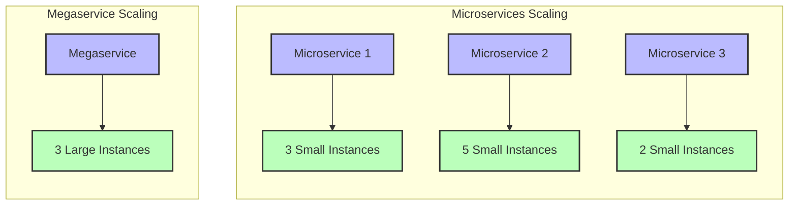

# **Beginner's Guide to Megaservices in OPEA**

## **📌 Index**

1. 🔹 [What are Megaservices?](#1️⃣-what-are-megaservices)
2. 🍽️ [Megaservices vs. Microservices: The Restaurant Analogy](#2️⃣-megaservices-vs-microservices-the-restaurant-analogy)
3. 🤔 [When Megaservices Make Sense](#3️⃣-when-megaservices-make-sense)
4. 🚀 [Basic Examples of Megaservices in OPEA](#4️⃣-basic-examples-of-megaservices-in-opea)
5. 🔄 [Resource Allocation and Scaling](#5️⃣-resource-allocation-and-scaling)
6. 🏗️ [Simple Implementation Patterns](#6️⃣-simple-implementation-patterns)
7. 🎮 [Managing Complexity](#7️⃣-managing-complexity)
8. 🤯 [Common Misconceptions About Megaservices](#8️⃣-common-misconceptions-about-megaservices)
9. 📚 [Glossary of Megaservices Terms](#glossary-of-megaservices-terms)

---

## **1️⃣ What are Megaservices?**

Think of megaservices like a multi-talented professional who handles several related responsibilities:

✅ Instead of splitting functions into many small services (**microservices**), megaservices **combine related functionalities**.  
✅ A megaservice **handles multiple related business capabilities** in a single deployment unit.  
✅ They have **internal modularity** but are deployed and scaled as a single unit.  
✅ They aim to **reduce operational complexity** by minimizing the number of separate services.

---

## **2️⃣ Megaservices vs. Microservices: The Restaurant Analogy**

### 🍽️ **Microservices Architecture (Specialized Kitchen Staff)**

- **Host takes orders**, different chefs cook different dishes, **servers deliver food**, and **cashier handles payment**.
- **Pros**: More efficient specialization, one absent worker doesn't shut down the whole restaurant.
- **Cons**: Requires coordination, communication overhead.

### 🍽️ **Megaservices Architecture (Food Truck or Small Restaurant)**

- **A few versatile chefs** handle multiple stations - one manages appetizers and salads, another handles main courses, and a third manages desserts and beverages.
- **Pros**: Less coordination overhead, fewer staff to manage, streamlined operations.
- **Cons**: Each chef needs broader skills, temporary overload at one station affects multiple menu items.

---

## **3️⃣ When Megaservices Make Sense**

### **Ideal Scenarios for Megaservices**

1. **🧑‍💻 Smaller Teams**

   - When you have fewer developers who need to work across multiple areas
   - When team communication is already strong and efficient

2. **🔗 Tightly Coupled Functionality**

   - When business functions naturally share a lot of code or data
   - When operations typically span multiple related functions

3. **🚀 Early-Stage Projects**

   - When the domain boundaries aren't yet clear
   - When requirements are rapidly evolving

4. **💰 Resource Constraints**

   - When you need to maximize hardware utilization
   - When operational overhead of multiple services is too costly

5. **🔄 Simpler Workflows**
   - When processes don't require complex orchestration
   - When transactions need to span related functions

---

## **4️⃣ Basic Examples of Megaservices in OPEA**

### **Example 1: AI Model Management Megaservice**

In a microservices approach, you might have separate services for:

- Model registry
- Model versioning
- Model deployment
- Model monitoring

As a megaservice, these are combined into a single **Model Lifecycle Management Service** that handles the entire model lifecycle internally.

### **Example 2: Data Processing Megaservice**

Instead of separating:

- Data ingestion
- Data transformation
- Feature extraction
- Feature storage

A **Data Processing Megaservice** handles the entire data pipeline within a single deployable unit.

```mermaid
flowchart TB
    subgraph "Microservices Approach"
        direction TB
        DataIngestion[Data Ingestion Service]
        DataTransformation[Data Transformation Service]
        FeatureExtraction[Feature Extraction Service]
        FeatureStorage[Feature Storage Service]

        DataIngestion --> DataTransformation
        DataTransformation --> FeatureExtraction
        FeatureExtraction --> FeatureStorage
    end

    subgraph "Megaservice Approach"
        direction TB
        subgraph "Data Processing Megaservice"
            MIngestion[Ingestion Module]
            MTransformation[Transformation Module]
            MExtraction[Feature Extraction Module]
            MStorage[Storage Module]

            MIngestion --> MTransformation
            MTransformation --> MExtraction
            MExtraction --> MStorage
        end
    end

    classDef microservice fill:#bbf,stroke:#333,stroke-width:2px
    classDef megaservice fill:#fbf,stroke:#333,stroke-width:2px
    classDef module fill:#bfb,stroke:#333,stroke-width:2px

    class DataIngestion,DataTransformation,FeatureExtraction,FeatureStorage microservice
    class "Data Processing Megaservice" megaservice
    class MIngestion,MTransformation,MExtraction,MStorage module
```

---

## **5️⃣ Resource Allocation and Scaling**

### **How Megaservices Scale Differently**

1. **🔼 Vertical Scaling vs. Horizontal Scaling**

   - Megaservices often rely more on **vertical scaling** (bigger machines)
   - Must scale the entire service even if only one function needs more resources
   - Resource allocation must account for peak demands across all included functions

2. **🔄 Resource Sharing Benefits**
   - Shared memory space can reduce overall memory footprint
   - Eliminates duplicate data loading across services
   - More efficient resource utilization for uneven workloads



### **Kubernetes Resource Considerations**

- **📊 Request & Limits**: Megaservices need carefully tuned resource requests and limits
- **🧮 CPU & Memory**: Need to account for the sum of all contained functionalities
- **🔄 Autoscaling**: Uses different triggers than microservice autoscaling

---

## **6️⃣ Simple Implementation Patterns**

### **Internal Structure Models**

1. **📂 Module-Based Architecture**
   - Organize code into clearly defined internal modules
   - Each module has well-defined responsibilities
   - Share common utilities and infrastructure code

```python
# Example structure of a Model Management Megaservice
class ModelManagementService:
    def __init__(self):
        self.registry_module = ModelRegistryModule()
        self.versioning_module = VersioningModule()
        self.deployment_module = DeploymentModule()
        self.monitoring_module = MonitoringModule()

    def register_model(self, model_data):
        # Internal coordination between modules
        model_id = self.registry_module.create_model(model_data)
        version_id = self.versioning_module.create_initial_version(model_id)
        return {"model_id": model_id, "version_id": version_id}

    def deploy_model(self, model_id, version_id, environment):
        # Check model exists
        model = self.registry_module.get_model(model_id)
        if not model:
            raise ModelNotFoundException()

        # Check version exists
        version = self.versioning_module.get_version(model_id, version_id)
        if not version:
            raise VersionNotFoundException()

        # Deploy and set up monitoring
        deployment_id = self.deployment_module.deploy(model_id, version_id, environment)
        self.monitoring_module.initialize_monitoring(deployment_id)

        return {"deployment_id": deployment_id}
```

2. **🔄 Internal Workflow Orchestration**
   - Define clear workflows across internal modules
   - Maintain transaction boundaries
   - Implement internal retry and error handling

---

## **7️⃣ Managing Complexity**

### **Keeping Megaservices Manageable**

1. **📝 Clear Internal Boundaries**

   - Well-defined interfaces between internal modules
   - Modular code organization with minimal dependencies
   - Clear ownership of different sections within the team

2. **🧪 Internal Testing Strategies**

   - Unit tests for individual modules
   - Integration tests for module interactions
   - End-to-end tests for complete service functionality

3. **📊 Monitoring Internal Operations**

   - Track metrics for individual modules
   - Measure internal request flows
   - Profile resource usage by module

4. **📦 Ensuring Maintainability**
   - Regular refactoring to maintain clean boundaries
   - Consistent coding standards
   - Comprehensive documentation of internal structures

---

## **8️⃣ Common Misconceptions About Megaservices**

#### **1: "Megaservices are just poorly designed monoliths"**

**Reality**: Well-designed megaservices have clear internal modularity and boundaries - they're intentionally grouped related functionality, not a result of neglecting architecture.

#### **2: "Megaservices can't scale effectively"**

**Reality**: Megaservices scale differently than microservices, but can be scaled effectively with the right strategies, particularly vertical scaling and careful resource allocation.

#### **3: "Megaservices always have poor fault isolation"**

**Reality**: While they don't have the physical isolation of microservices, well-designed megaservices can implement logical fault isolation through bulkheads, circuit breakers, and modular error handling.

#### **4: "Megaservices always lead to slower development"**

**Reality**: For smaller teams working on related functionality, megaservices can actually accelerate development by reducing coordination overhead and simplifying the development environment.

#### **5: "Megaservices are always harder to maintain"**

**Reality**: For tightly coupled domains, maintaining a single megaservice can be easier than coordinating changes across multiple microservices with complex dependencies.

#### **6: "You should always choose either microservices or megaservices"**

**Reality**: Many successful systems use a hybrid approach, with some components implemented as microservices and others as megaservices, based on their specific characteristics.

---

## **Glossary of Megaservices Terms**

| Term                  | Definition                                                                            |
| --------------------- | ------------------------------------------------------------------------------------- |
| **Megaservice**       | A larger service that combines multiple related functions in a single deployment unit |
| **Internal Module**   | A logically separated component within a megaservice with its own responsibilities    |
| **Vertical Scaling**  | Adding more resources (CPU, memory) to a single instance                              |
| **Module Boundary**   | The interface between different functional modules within a megaservice               |
| **Logical Isolation** | Separating functionality through code organization rather than physical separation    |

---

_Made by Ramsi K. – Part of the GenAI Bootcamp 2025 repository._
