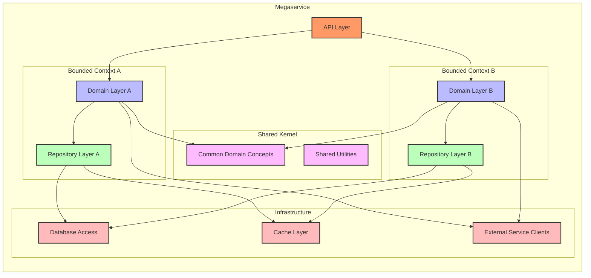
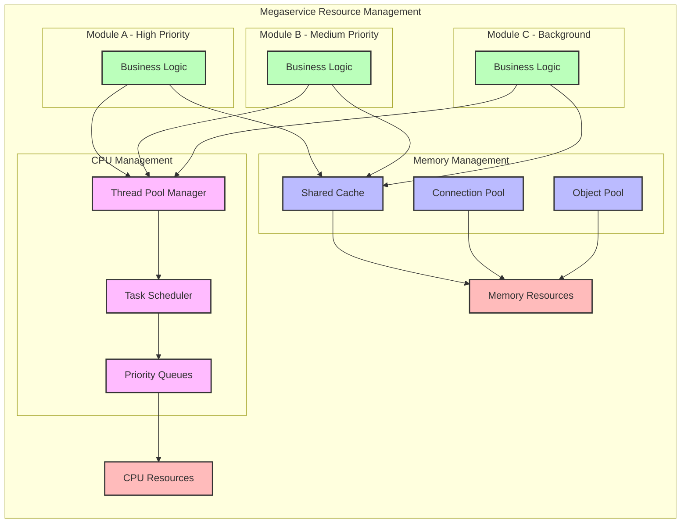
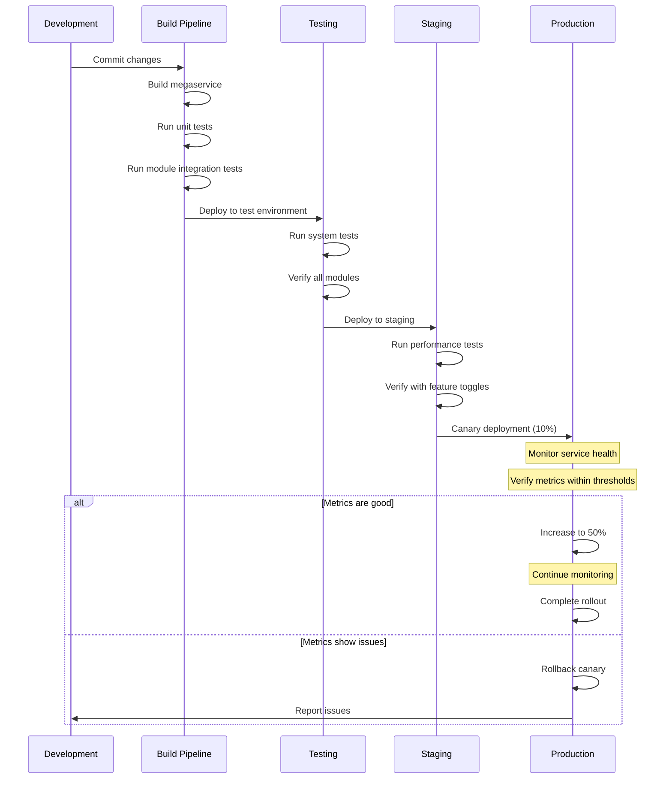
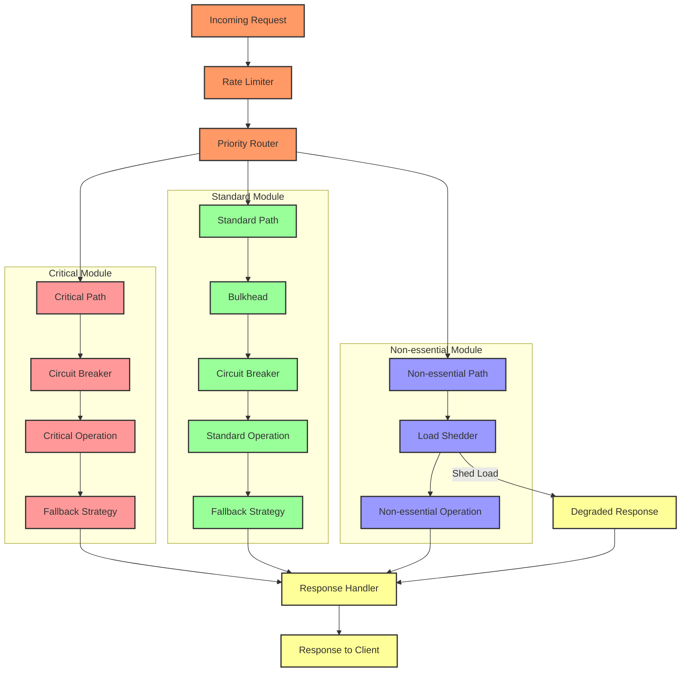

# **Megaservices in OPEA: Advanced Deep Dive**

## **📌 Index**

1. 🔹 [Advanced Megaservice Architecture Patterns](#1️⃣-advanced-megaservice-architecture-patterns)
2. 🔄 [Internal Communication Strategies](#2️⃣-internal-communication-strategies)
3. ⚡ [Performance Optimization for Megaservices](#3️⃣-performance-optimization-for-megaservices)
4. 🔍 [Monitoring and Debugging Megaservices](#4️⃣-monitoring-and-debugging-megaservices)
5. 🚀 [Deployment Strategies](#5️⃣-deployment-strategies)
6. 🧠 [State Management](#6️⃣-state-management-within-megaservices)
7. 🛡️ [Resilience Patterns for Megaservices](#7️⃣-resilience-patterns-for-megaservices)
8. 🔐 [Security Considerations](#8️⃣-security-considerations)
9. 📈 [Scaling Megaservices in Production](#9️⃣-scaling-megaservices-in-production)

---

## **1️⃣ Advanced Megaservice Architecture Patterns**

### **🧩 Domain-Driven Design Within Megaservices**

Even in a megaservice, we can use domain-driven design to organize our code:

- **📋 Bounded Contexts** → Clear conceptual boundaries between different parts
- **🔄 Context Mapping** → Define how different parts of the system relate
- **🏗️ Aggregates** → Group related objects that should change together



### **🏗️ Modular Monolith Patterns**

Advanced megaservices often use these patterns to stay organized:

1. **📦 Module Isolation**

   - Keep modules separate with clear APIs between them
   - Hide implementation details inside each module
   - Minimize dependencies between modules

2. **🧩 Shared Kernel**

   - Create carefully designed shared components
   - Keep common utilities minimal and stable
   - Control access to shared code

3. **📢 Internal Event Bus**
   - Use events to communicate between modules
   - Reduce direct dependencies
   - Support workflows that cross module boundaries

### **🧪 Feature Toggles and Experimentation**

Megaservices need good feature management:

1. **🚦 Feature Flags**

   - Turn features on/off without redeployment
   - Control features at module level
   - Support gradual rollout

2. **🔬 Experimentation**

   - Run A/B tests within the megaservice
   - Compare different implementations
   - Collect metrics to make data-driven decisions

3. **⚙️ Configuration Management**
   - Manage settings consistently
   - Support different environments
   - Update configuration at runtime when needed

---

## **2️⃣ Internal Communication Strategies**

### **🔄 In-Process Communication**

Megaservices benefit from efficient in-process communication:

1. **📞 Direct Function Calls**

   - Fastest, simplest approach
   - Easy to debug and trace
   - Can create tight coupling if overused

2. **🧩 Mediator Pattern**

   - Routes requests through a central handler
   - Reduces direct dependencies
   - Helps with cross-cutting concerns like logging

3. **📝 Command and Query Separation**
   - Split operations that change state from ones that read data
   - Makes responsibilities clearer
   - Easier to test and maintain

```python
# Simple example of mediator pattern in a megaservice
class Mediator:
    def __init__(self):
        self.handlers = {}

    def register(self, message_type, handler):
        self.handlers[message_type] = handler

    def send(self, message):
        handler = self.handlers.get(type(message))
        if handler:
            return handler.handle(message)
        else:
            raise Exception(f"No handler for {type(message)}")

# Usage in a megaservice
mediator = Mediator()
mediator.register(CreateModelCommand, create_model_handler)
mediator.register(DeployModelCommand, deploy_model_handler)

# When handling a request
result = mediator.send(CreateModelCommand(name="New Model", type="classification"))
```

### **🔄 Internal Workflow Orchestration**

For complex processes spanning multiple modules:

1. **📊 Saga Pattern**

   - Break complex workflows into steps
   - Define compensation actions for failures
   - Track progress of long-running operations

2. **🎭 Process Manager**

   - Coordinate activities across modules
   - Maintain workflow state
   - Handle timeouts and retries

3. **📝 Event Sourcing for Workflows**
   - Record all workflow steps as events
   - Rebuild workflow state when needed
   - Create audit trail automatically

### **Communication Pattern Comparison**

| Pattern               | Coupling    | Performance | Traceability | Complexity |
| --------------------- | ----------- | ----------- | ------------ | ---------- |
| Direct Function Calls | High        | Excellent   | Good         | Low        |
| Mediator Pattern      | Medium      | Very Good   | Very Good    | Medium     |
| Event-Based           | Low         | Good        | Challenging  | High       |
| Shared Database       | High (Data) | Good        | Mixed        | Medium     |

---

## **3️⃣ Performance Optimization for Megaservices**

### **🧠 Memory Management Strategies**

Effective memory use is critical:

1. **💾 Shared Resources**

   - Use common caches across modules
   - Pool database connections
   - Share expensive resources

2. **🧹 Resource Cleanup**

   - Close connections properly
   - Release memory when done
   - Watch for memory leaks

3. **📊 Memory Profiling**
   - Use tools to track memory usage
   - Identify memory-intensive operations
   - Fix memory leaks early

### **⚡ Computational Efficiency**

Making your code faster:

1. **🧵 Parallel Processing**

   - Split work among multiple threads
   - Process independent operations simultaneously
   - Use thread pools effectively

2. **🧮 Efficient Algorithms**

   - Choose the right data structures
   - Optimize frequently used operations
   - Cache expensive calculations

3. **⏳ Resource Throttling**
   - Limit concurrent operations
   - Implement backpressure when overloaded
   - Prioritize important operations



### **🔄 Database Optimization**

Making database access faster:

1. **🔌 Connection Management**

   - Share database connections
   - Monitor connection usage
   - Set appropriate timeouts

2. **📝 Query Optimization**

   - Write efficient queries
   - Use indexes effectively
   - Batch operations when possible

3. **📊 Transaction Management**
   - Keep transactions short
   - Avoid deadlocks
   - Use appropriate isolation levels

---

## **4️⃣ Monitoring and Debugging Megaservices**

### **📊 Internal Metrics Collection**

Getting visibility into megaservice operations:

1. **📏 Module-Level Metrics**

   - Track each module separately
   - Measure request rates and times
   - Monitor error rates

2. **🎯 Internal Service Objectives**

   - Define performance targets for each module
   - Set error budgets
   - Alert when thresholds are crossed

3. **📈 Metrics Dashboards**
   - Create visual displays of service health
   - Show connections between metrics
   - Track trends over time

### **📝 Structured Logging**

Creating useful logs:

1. **🔍 Context in Logs**

   - Include request IDs in all logs
   - Add user and tenant information
   - Track operations across modules

2. **📊 Log Levels**

   - Use appropriate severity levels
   - Adjust log detail dynamically
   - Sample high-volume logs

3. **📚 Log Processing**
   - Centralize logs from all modules
   - Make logs searchable
   - Analyze patterns and trends

### **🔍 Distributed Tracing**

Following requests through the system:

1. **🧵 Trace Propagation**

   - Track requests across module boundaries
   - Measure time spent in each module
   - Identify dependencies between operations

2. **⏱️ Performance Analysis**

   - Find slowest operations
   - Identify bottlenecks
   - Correlate with resource usage

3. **🚨 Anomaly Detection**
   - Know what's normal
   - Alert on unusual patterns
   - Find root causes of problems

### **🔧 Debugging Strategies**

Fixing problems effectively:

1. **💻 Development Support**

   - Run individual modules locally
   - Mock dependencies
   - Create reproducible test cases

2. **🔍 Production Debugging**

   - Safe ways to gather information
   - Tools to analyze running services
   - Post-mortem investigation methods

3. **🧪 Chaos Testing**
   - Deliberately cause failures
   - Test recovery mechanisms
   - Verify resilience

---

## **5️⃣ Deployment Strategies**

### **🚢 Continuous Deployment**

Safely deploying megaservices:

1. **🔄 Build Pipeline**

   - Test all modules together
   - Verify integrations
   - Track versions carefully

2. **📦 Deployment Units**

   - Deploy the entire service as one unit
   - Manage configurations consistently
   - Version your deployments

3. **🗄️ Database Changes**
   - Coordinate schema updates
   - Maintain backward compatibility
   - Test migrations thoroughly

### **🔄 Safe Release Patterns**

Reducing deployment risks:

1. **🐦 Canary Deployments**

   - Deploy to a small subset of users first
   - Monitor for issues
   - Roll out gradually if all is well

2. **🚦 Feature Toggles**

   - Deploy code without activating features
   - Turn on features gradually
   - Turn off features if problems arise

3. **🔄 Blue/Green Deployments**
   - Maintain two identical environments
   - Test new version fully
   - Switch traffic all at once



### **⚙️ Configuration Management**

Handling complex settings:

1. **📝 Config Hierarchy**

   - Global settings for all modules
   - Module-specific settings
   - Environment-specific overrides

2. **🔄 Dynamic Config**

   - Update settings without restarting
   - Control feature flags
   - Validate configuration changes

3. **🔐 Secrets Management**
   - Secure storage for sensitive info
   - Automatic credential rotation
   - Limited access to secrets

### **📋 Rollback Strategies**

Recovering from problems:

1. **🗄️ Database Considerations**

   - Plan for backward compatibility
   - Consider data migration impacts
   - Test rollback scenarios

2. **📊 State Handling**

   - Manage persistent state during rollbacks
   - Ensure compatibility between versions
   - Resolve state inconsistencies

3. **🔄 Coordinated Rollbacks**
   - Roll back all components together
   - Verify system health after rollback
   - Learn from incidents

---

## **6️⃣ State Management Within Megaservices**

### **🧠 Shared State Approaches**

Managing data across modules:

1. **💾 In-Memory State**

   - Thread-safe data structures
   - Clear read/write patterns
   - Memory-efficient representations

2. **🗄️ Database State**

   - Well-designed schemas
   - Appropriate transaction boundaries
   - Clear ownership of data

3. **📊 Distributed State**
   - Effective caching strategies
   - Handling eventual consistency
   - Resolving conflicts

### **🔄 State Transitions and Workflows**

Managing complex processes:

1. **🗂️ State Machines**

   - Define possible states
   - Control valid transitions
   - Persist state changes

2. **📝 Event Sourcing**

   - Store events instead of current state
   - Rebuild state from event history
   - Enable audit and temporal queries

3. **📊 CQRS (Command Query Responsibility Segregation)**
   - Separate models for updates and queries
   - Optimize each for its purpose
   - Manage consistency between models

```python
# Simple state machine example
class ModelDeploymentStateMachine:
    # States
    CREATED = "CREATED"
    VALIDATING = "VALIDATING"
    PACKAGING = "PACKAGING"
    DEPLOYING = "DEPLOYING"
    TESTING = "TESTING"
    ACTIVE = "ACTIVE"
    FAILED = "FAILED"

    # Valid transitions from each state
    TRANSITIONS = {
        CREATED: [VALIDATING],
        VALIDATING: [PACKAGING, FAILED],
        PACKAGING: [DEPLOYING, FAILED],
        DEPLOYING: [TESTING, FAILED],
        TESTING: [ACTIVE, FAILED],
        ACTIVE: [],  # Terminal state
        FAILED: []   # Terminal state
    }

    def __init__(self):
        self.current_state = self.CREATED
        self.history = [self.CREATED]

    def transition_to(self, new_state):
        if new_state in self.TRANSITIONS[self.current_state]:
            self.current_state = new_state
            self.history.append(new_state)
            return True
        return False

    def get_current_state(self):
        return self.current_state

    def get_history(self):
        return self.history
```

---

## **7️⃣ Resilience Patterns for Megaservices**

### **🛡️ Internal Fault Isolation**

Preventing failures from spreading:

1. **💪 Bulkhead Pattern**

   - Separate resources for different modules
   - Prevent one module from consuming all resources
   - Maintain functionality of critical modules

2. **🔄 Circuit Breaker Pattern**

   - Detect when operations are failing
   - Stop calling failing operations
   - Automatically retry after timeout

3. **⏱️ Timeout Management**
   - Set appropriate timeouts for all operations
   - Handle timeouts gracefully
   - Prevent blocked threads

### **🔄 Graceful Degradation**

Maintaining service when components fail:

1. **📉 Feature Reduction**

   - Identify non-critical features
   - Disable features when under stress
   - Maintain core functionality

2. **🔄 Fallback Strategies**

   - Define alternatives for each operation
   - Cached responses as fallbacks
   - Simplified processing modes

3. **⚖️ Load Shedding**
   - Reject low-priority requests when overloaded
   - Protect critical operations
   - Recover gradually



### **🔄 Recovery Patterns**

Getting back to normal after failures:

1. **🔄 Self-Healing Mechanisms**

   - Automatic restart of failed components
   - Recovery of corrupted state
   - Reconciliation of inconsistencies

2. **🔍 Health Monitoring**

   - Continuous checks of all modules
   - Proactive detection of degradation
   - Self-diagnostic capabilities

3. **📊 Chaos Engineering**
   - Regular testing of failure scenarios
   - Verification of recovery mechanisms
   - Improvement based on findings

---

## **8️⃣ Security Considerations**

### **🔐 Internal Security Boundaries**

Securing modules within a megaservice:

1. **🧱 Defense in Depth**

   - Multiple layers of security
   - Protection at each module boundary
   - Principle of least privilege

2. **🔒 Authentication and Authorization**

   - Consistent identity across modules
   - Role-based access control
   - Fine-grained permissions

3. **🔍 Auditing and Logging**
   - Comprehensive security logging
   - Tracking actions across modules
   - Tamper-evident logs

### **🛡️ Securing Sensitive Data**

Protecting important information:

1. **🔐 Encryption Strategies**

   - Data encryption at rest
   - Secure transmission between modules
   - Key management

2. **🏷️ Data Classification**

   - Identify sensitive data
   - Apply appropriate controls
   - Control data flow

3. **📊 Privacy Controls**
   - Data minimization
   - Purpose limitation
   - Retention policies

### **🔍 Vulnerability Management**

Staying ahead of security issues:

1. **🧪 Security Testing**

   - Regular vulnerability scanning
   - Penetration testing
   - Code security reviews

2. **🔄 Dependency Management**

   - Tracking third-party libraries
   - Vulnerability monitoring
   - Update policies

3. **📝 Security by Design**
   - Threat modeling
   - Secure coding practices
   - Security requirements

---

## **9️⃣ Scaling Megaservices in Production**

### **📈 Vertical Scaling Strategies**

Making individual instances more powerful:

1. **💾 Memory Optimization**

   - Efficient data structures
   - Garbage collection tuning
   - Memory utilization monitoring

2. **⚡ CPU Optimization**

   - Thread pool tuning
   - Workload distribution
   - Profiling and optimization

3. **🗄️ I/O Optimization**
   - Efficient disk usage
   - Network optimization
   - Asynchronous I/O

### **🔄 Horizontal Scaling Challenges**

Running multiple instances:

1. **📊 Instance Coordination**

   - Consistent configuration
   - Shared state management
   - Traffic distribution

2. **🔄 Database Scaling**

   - Connection pooling
   - Read/write separation
   - Sharding considerations

3. **📝 Deployment Complexity**
   - Rolling updates
   - Version compatibility
   - Configuration management

### **⚖️ Hybrid Scaling Approaches**

Getting the best of both worlds:

1. **🎯 Targeted Resource Allocation**

   - Identify bottlenecks
   - Apply resources where needed
   - Balance cost and performance

2. **🧩 Service Decomposition**

   - Extract frequently scaling components
   - Maintain integration points
   - Evolve architecture based on scaling needs

3. **☁️ Cloud-Native Optimizations**
   - Auto-scaling rules
   - Resource right-sizing
   - Cost optimization

---

## **🔑 Key Takeaways**

1. **🏗️ Internal Architecture Matters** - Even within a megaservice, good design is essential.

2. **🔄 Efficient Communication** - Choose the right patterns for module interaction.

3. **⚙️ Resource Management** - Optimize memory and CPU usage across modules.

4. **🔍 Comprehensive Monitoring** - Track performance at the module level.

5. **🚀 Safe Deployment** - Use feature toggles and canary releases to reduce risk.

6. **🧠 State Management** - Carefully design how state is shared and managed.

7. **🛡️ Resilience Patterns** - Implement bulkheads, circuit breakers, and fallbacks.

8. **🔐 Internal Security** - Don't neglect security boundaries between modules.

9. **📈 Scaling Strategy** - Balance vertical and horizontal scaling approaches.

10. **🔄 Continuous Improvement** - Monitor, learn, and adapt your megaservice design.

---

_Made by Ramsi K. – Part of the GenAI Bootcamp 2025 repository._
