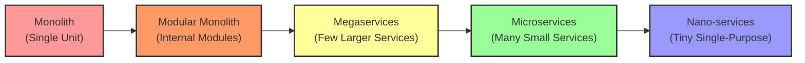
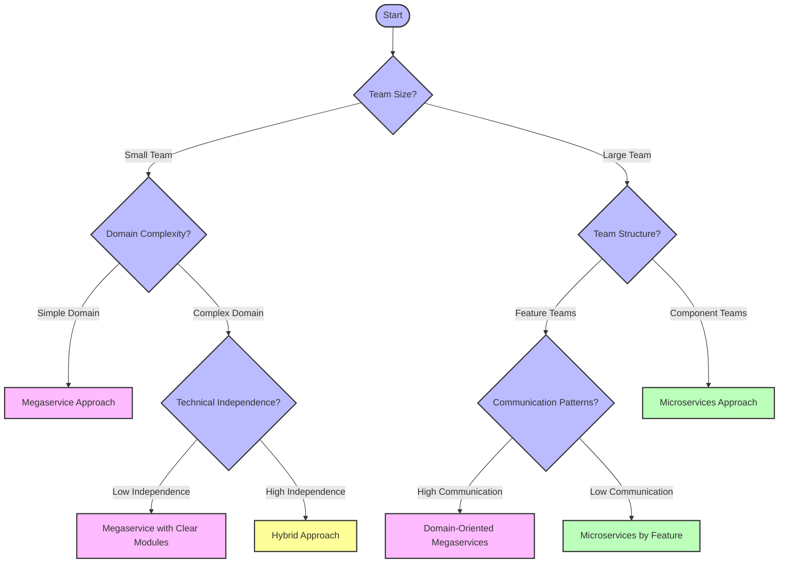
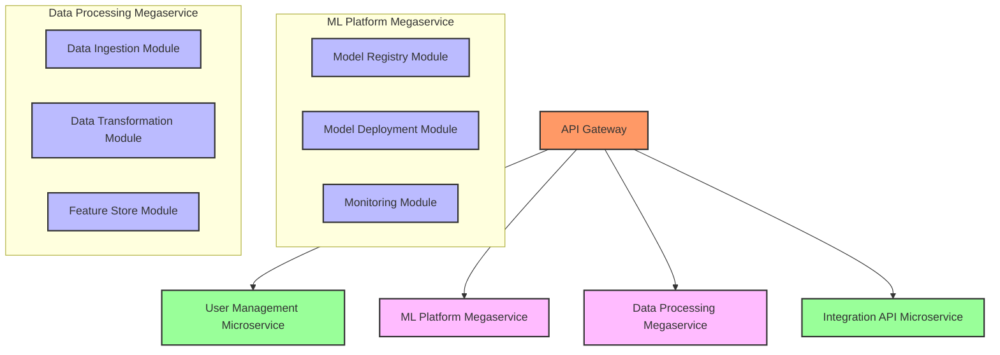
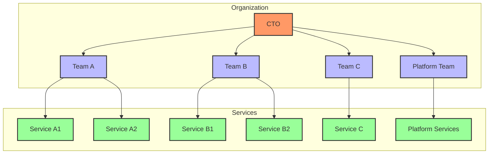
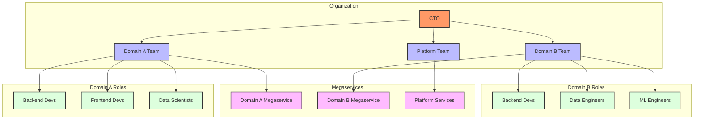
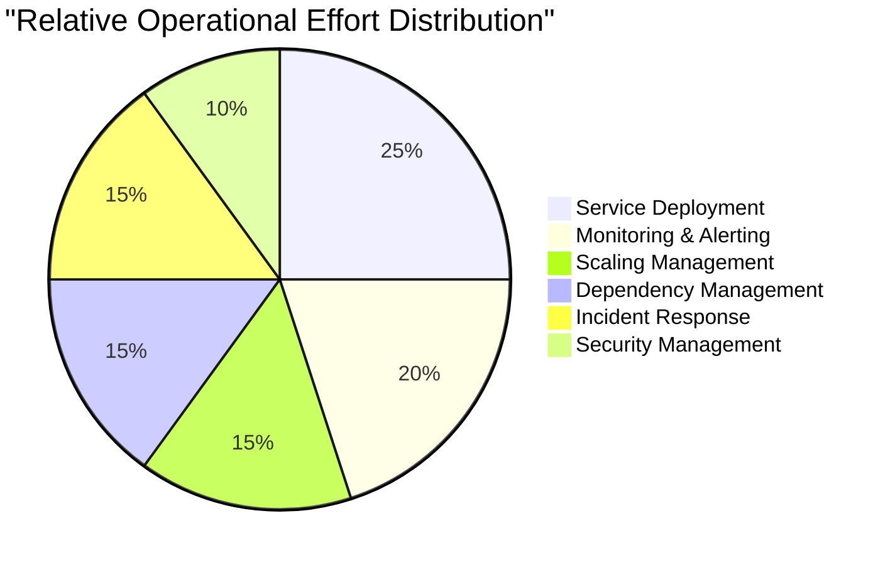

# **Microservices vs. Megaservices in OPEA: A Comparison**

## **📌 Index**

1. 🔹 [Understanding the Spectrum](#1️⃣-understanding-the-spectrum)
2. 📊 [Side-by-Side Comparison](#2️⃣-side-by-side-comparison)
3. 🌎 [Real-World OPEA Case Studies](#3️⃣-real-world-opea-case-studies)
4. 🧠 [Decision Framework](#4️⃣-decision-framework)
5. 🤝 [Hybrid Implementation Approaches](#5️⃣-hybrid-implementation-approaches)
6. 🔄 [Migration Paths](#6️⃣-migration-paths)
7. 👥 [Team Organization Considerations](#7️⃣-team-organization-considerations)
8. 💰 [Cost and Resource Implications](#8️⃣-cost-and-resource-implications)
9. 📈 [Future Considerations](#9️⃣-future-considerations)

---

## **1️⃣ Understanding the Spectrum**

The choice between microservices and megaservices isn't binary – it's a spectrum with many options in between.

### **🔄 The Architecture Continuum**



### **🧩 Different Ways to Slice a System**

- **👉 By Domain** → Business capabilities (e.g., user management, model training)
- **👉 By Technical Layer** → Horizontal slicing (e.g., frontend, API, data layer)
- **👉 By Team Structure** → Conway's Law: system reflects organizational structure

### **🏆 No One-Size-Fits-All Solution**

- **🔄 Context Matters** → Project size, team, constraints, requirements
- **⚖️ Trade-offs** → Every architecture choice involves compromises
- **🔄 Evolution** → Systems often move along the spectrum over time

---

## **2️⃣ Side-by-Side Comparison**

### **📊 Key Characteristics Comparison**

| Characteristic             | Microservices                                | Megaservices                                       |
| -------------------------- | -------------------------------------------- | -------------------------------------------------- |
| **Deployment Unit**        | Small, single-purpose services               | Larger services with multiple related capabilities |
| **Team Alignment**         | One team owns one or more microservices      | Multiple teams may collaborate on a megaservice    |
| **Development Speed**      | Fast for small changes within a service      | Faster for changes spanning related capabilities   |
| **Operational Complexity** | Higher (many services to manage)             | Lower (fewer services to manage)                   |
| **Resource Utilization**   | Less efficient (more overhead)               | More efficient (shared resources)                  |
| **Fault Isolation**        | Strong (service boundary = failure boundary) | Weaker (failures may affect multiple capabilities) |
| **Scaling Granularity**    | Fine-grained (scale individual services)     | Coarse-grained (scale entire megaservice)          |
| **Communication**          | Network-based (HTTP, gRPC, messaging)        | Mostly in-process function calls                   |
| **Deployment Frequency**   | Can be very high for individual services     | Typically lower, as more coordination required     |
| **Technology Diversity**   | Can use different tech stacks per service    | Generally consistent tech stack within service     |

### **📈 Performance Characteristics**

| Aspect                | Microservices                                | Megaservices                                  |
| --------------------- | -------------------------------------------- | --------------------------------------------- |
| **Latency**           | Higher (network hops between services)       | Lower (in-process communication)              |
| **Throughput**        | May be lower due to serialization overhead   | Generally higher within service boundaries    |
| **Resource Overhead** | Higher (multiple service instances, proxies) | Lower (shared resources, less duplication)    |
| **Startup Time**      | Independent service startup (can be faster)  | Entire service must start (generally slower)  |
| **Memory Footprint**  | Higher total footprint across all services   | Lower total footprint due to shared resources |

### **💻 Development Experience**

| Aspect                        | Microservices                                   | Megaservices                                           |
| ----------------------------- | ----------------------------------------------- | ------------------------------------------------------ |
| **Local Development**         | Challenging (need to run multiple services)     | Simpler (run single service locally)                   |
| **Testing**                   | Unit testing easier, integration testing harder | Unit testing more complex, integration testing simpler |
| **Debugging**                 | More difficult across service boundaries        | Easier within service boundaries                       |
| **Code Organization**         | Clear service boundaries                        | Requires disciplined internal structure                |
| **Onboarding New Developers** | Steeper learning curve                          | Gentler learning curve for initial contributions       |

### **🔄 Operational Considerations**

| Aspect                    | Microservices                                 | Megaservices                                              |
| ------------------------- | --------------------------------------------- | --------------------------------------------------------- |
| **Deployment Complexity** | Higher (coordinating multiple services)       | Lower (fewer deployment units)                            |
| **Monitoring**            | More complex (distributed tracing needed)     | Simpler (mostly within service boundaries)                |
| **Failure Modes**         | More isolated failures                        | Broader impact when failures occur                        |
| **Resource Allocation**   | Fine-grained control                          | Coarser-grained allocation                                |
| **Scaling**               | Can scale individual services based on demand | Must scale entire service, even if only one part needs it |

---

## **3️⃣ Real-World OPEA Case Studies**

### **🏢 Enterprise Financial Services Company**

**Context:**

- Large enterprise with strong security requirements
- Limited DevOps resources
- Complex AI model governance needs

**Decision: Megaservice Approach**

**Implementation:**

- Created an "AI Platform Megaservice" combining:
  - Model Registry
  - Model Deployment
  - Inference API
  - Monitoring

**Results:**

- 40% faster deployment compared to initial microservices approach
- Reduced operational overhead
- Simplified security compliance
- Easier to manage with small DevOps team

**Key Learning:** Sometimes less is more - simpler architecture reduced cognitive load and operational burden.

### **🚀 High-Scale Recommendation System**

**Context:**

- Consumer tech company
- Extremely high throughput requirements
- Different scaling needs for different components
- Multiple specialized teams

**Decision: Microservices Approach**

**Implementation:**

- Feature extraction microservice
- Model inference microservice
- Personalization microservice
- Content filtering microservice
- Recommendation serving microservice

**Results:**

- Independent scaling saved 30% in infrastructure costs
- Teams could release on independent schedules
- Performance optimizations could be targeted precisely
- Successfully handled 20x traffic spikes

**Key Learning:** When individual components have very different resource needs, microservices enable efficient scaling.

### **🏥 Healthcare AI Startup**

**Context:**

- Small team (8 developers)
- Complex domain with strict regulatory requirements
- Needed fast iteration cycles

**Decision: Hybrid Approach**

**Implementation:**

- Core data processing as megaservice
- Model training as separate service
- User-facing API as separate service

**Results:**

- Rapid development of new features
- Clear ownership of different system parts
- Compliance requirements easier to implement
- Simplified testing and validation

**Key Learning:** A balanced approach can give benefits of both worlds when tailored to specific needs.

---

## **4️⃣ Decision Framework**

When choosing between microservices and megaservices in OPEA, consider these factors:

### **🧩 Decision Tree**



### **📊 OPEA Architecture Decision Matrix**

| Factor                       | Favors Microservices                                | Favors Megaservices                         |
| ---------------------------- | --------------------------------------------------- | ------------------------------------------- |
| **Team Size**                | Large teams (10+ engineers)                         | Small teams (< 10 engineers)                |
| **Deployment Frequency**     | Need for independent, frequent deployments          | Less frequent, coordinated releases         |
| **Scaling Requirements**     | Different components have different scaling needs   | Uniform scaling across components           |
| **Technology Requirements**  | Need different tech stacks for different parts      | Consistent technology stack works well      |
| **Domain Volatility**        | Well-understood, stable domain boundaries           | Evolving understanding of domain boundaries |
| **Organizational Structure** | Multiple teams with clear responsibility boundaries | Single team or highly collaborative teams   |
| **Performance Sensitivity**  | Can tolerate some network overhead                  | Needs maximum performance and low latency   |
| **Operational Capacity**     | Strong DevOps capabilities available                | Limited DevOps resources                    |

### **⚖️ Key Questions to Ask**

1. **💻 Technical Questions**

   - How will services communicate?
   - What are the performance requirements?
   - How will you handle data consistency?
   - What are your scaling patterns?

2. **👥 Team Questions**

   - How are teams organized?
   - How experienced is your DevOps team?
   - How do teams prefer to collaborate?
   - What's your development workflow?

3. **🏢 Business Questions**
   - How quickly do different parts of the system change?
   - What are the most critical business processes?
   - Are there regulatory considerations?
   - What's your timeline and budget?

---

## **5️⃣ Hybrid Implementation Approaches**

You don't have to choose just one approach. Many OPEA implementations use a mix of patterns.

### **🧩 Domain-Based Hybrid Approach**



### **🏗️ Hybrid Implementation Patterns**

1. **🧠 Domain-Driven Segmentation**

   - Core domains as megaservices
   - Supporting domains as microservices
   - Separation based on business criticality

2. **⚙️ Macro-Micro Architecture**

   - Megaservices for complex, interrelated functionality
   - Microservices for simpler, independent functions
   - API Gateway to present unified interface

3. **🚀 Evolutionary Hybrid**
   - Start with megaservices for faster development
   - Extract high-scale components as microservices
   - Keep evolving based on operational data

### **🔄 Communication Between Approaches**

1. **🔗 API Gateway Pattern**

   - Unified entry point
   - Consistent authentication
   - Manages routing between different service types

2. **📦 Event-Based Integration**

   - Message bus for cross-service communication
   - Decouples different architectural styles
   - Enables consistent event flow

3. **🗄️ Shared Data Access Patterns**
   - Clear data ownership boundaries
   - Access patterns for cross-service data needs
   - Eventual consistency where appropriate

---

## **6️⃣ Migration Paths**

Organizations often need to evolve their architecture over time. Here are common migration paths.

### **🔄 From Monolith to Megaservices**

1. **Step 1: Internal Modularization**

   - Refactor monolith into clear modules
   - Establish clear internal APIs
   - Reduce coupling between modules

2. **Step 2: Shared Nothing Architecture**

   - Ensure modules don't share mutable state
   - Create clear database boundaries
   - Implement internal event messaging

3. **Step 3: Extract Megaservices**
   - Extract related modules into megaservices
   - Migrate one domain at a time
   - Use strangler pattern for gradual migration

```python
# Example: Strangler Pattern Implementation with API Gateway
class APIGateway:
    def __init__(self):
        self.monolith_client = MonolithClient()
        self.megaservice_client = MegaserviceClient()

        # Feature flags for migration
        self.features_migrated = {
            "user_management": False,
            "model_registry": True,  # This feature has been migrated
            "data_processing": False
        }

    def route_request(self, feature, request):
        # Route to new service if feature has been migrated
        if self.features_migrated.get(feature, False):
            return self.megaservice_client.process(feature, request)
        else:
            return self.monolith_client.process(feature, request)
```

### **🔄 From Megaservices to Microservices**

1. **Step 1: Internal Event-Driven Architecture**

   - Implement event-driven communication between modules
   - Reduce direct dependencies between modules
   - Introduce internal message bus

2. **Step 2: Service Mesh Introduction**

   - Deploy service mesh infrastructure
   - Begin routing internal traffic through mesh
   - Establish monitoring and observability

3. **Step 3: Gradual Extraction**
   - Extract highest-value services first
   - Focus on services with unique scaling needs
   - Maintain backward compatibility

### **🔄 From Microservices to Megaservices**

1. **Step 1: Identify Service Clusters**

   - Map service dependencies
   - Identify services that change together
   - Look for communication bottlenecks

2. **Step 2: Introduce Shared Libraries**

   - Create common code libraries
   - Standardize interfaces
   - Reduce duplication

3. **Step 3: Consolidate Services**
   - Merge related services
   - Refactor to internal modules
   - Simplify operational footprint

---

## **7️⃣ Team Organization Considerations**

### **👥 Conway's Law in Action**

> "Organizations which design systems... are constrained to produce designs which are copies of the communication structures of these organizations." - Melvin Conway

This means your team structure will naturally influence your architecture:

- **🧩 Teams with clear boundaries** → Tend toward microservices
- **🤝 Highly collaborative teams** → Often work better with megaservices
- **🏢 Siloed organizations** → May struggle with either approach

### **🏗️ Team Structures for Different Approaches**

#### **Microservices Team Structure**



#### **Megaservices Team Structure**



### **🧠 Ownership Models**

1. **👤 Service Ownership (Microservices)**

   - Teams own entire services
   - Clear boundaries of responsibility
   - "You build it, you run it" philosophy

2. **👥 Domain Ownership (Megaservices)**

   - Teams own business domains
   - Shared responsibility for the megaservice
   - Cross-functional expertise within teams

3. **🤝 Hybrid Ownership**
   - Component teams for specialized services
   - Feature teams for megaservices
   - Platform team for shared infrastructure

### **🎓 Skill Development Considerations**

| Microservices Skills          | Megaservices Skills         |
| ----------------------------- | --------------------------- |
| Service design patterns       | Modular design principles   |
| Distributed systems debugging | Complex system architecture |
| API design                    | Internal component design   |
| DevOps automation             | Resource optimization       |
| Specialized expertise         | Broader knowledge           |

---

## **8️⃣ Cost and Resource Implications**

### **💰 Infrastructure Costs**

| Aspect                            | Microservices                             | Megaservices                        |
| --------------------------------- | ----------------------------------------- | ----------------------------------- |
| **Overall Resource Needs**        | Generally higher (20-30%)                 | Generally lower                     |
| **Scaling Efficiency**            | Better for uneven workloads               | Better for consistent workloads     |
| **Development Environment Costs** | Higher (need to run multiple services)    | Lower (simpler local setup)         |
| **Monitoring & Observability**    | More expensive (need distributed tracing) | Less expensive (simpler monitoring) |
| **Network Costs**                 | Higher (inter-service communication)      | Lower (in-process communication)    |

### **⏱️ Operational Overhead**



The above distribution typically shows higher overall effort for microservices, particularly in deployment, monitoring, and dependency management.

### **💵 Total Cost of Ownership (TCO) Considerations**

1. **🛠️ Development Costs**

   - Microservices: Higher initial development cost, potentially lower ongoing costs
   - Megaservices: Lower initial development cost, potentially higher refactoring costs

2. **🔧 Maintenance Costs**

   - Microservices: More services to maintain, but changes are isolated
   - Megaservices: Fewer services to maintain, but changes may be more complex

3. **🏗️ Infrastructure Costs**

   - Microservices: Higher resource overhead, better scaling granularity
   - Megaservices: Lower resource overhead, less scaling flexibility

4. **👥 Human Resource Costs**
   - Microservices: Need more DevOps expertise, potentially smaller feature teams
   - Megaservices: Need less operational support, potentially more coordination

### **📊 Real-World Cost Example**

For a typical mid-sized OPEA deployment processing 1 million inferences daily:

| Cost Category    | Microservices Approach            | Megaservices Approach                |
| ---------------- | --------------------------------- | ------------------------------------ |
| Infrastructure   | $15,000/month                     | $12,000/month                        |
| DevOps Personnel | 2 full-time                       | 1 full-time                          |
| Development Time | +20% initial development          | +15% refactoring costs               |
| Time to Market   | Slower initial, faster iterations | Faster initial, coordinated releases |

---

## **9️⃣ Future Considerations**

### **🚀 Evolving Technology Landscape**

1. **🧠 AI/ML Specific Considerations**

   - Model size and computational needs growing
   - Specialized hardware requirements (GPUs, TPUs)
   - Data gravity becoming more important

2. **☁️ Cloud Native Evolution**

   - Serverless computing changing deployment models
   - Service mesh technology maturing
   - FinOps practices becoming standard

3. **🔄 Operational Tooling**
   - Kubernetes becoming more accessible
   - Observability tools improving rapidly
   - GitOps practices standardizing deployments

### **📈 Industry Trends to Watch**

- **📊 Right-sizing Services** → Moving from extremes toward pragmatic middle ground
- **🧩 Domain-Driven Decomposition** → Focus on business domains over technical splits
- **🔄 Hybrid Approaches** → Blending architectural styles based on requirements
- **🤖 AI-Assisted Architecture** → Using AI to optimize service boundaries

### **🔮 Making Future-Proof Decisions**

1. **📋 Focus on Principles Over Patterns**

   - Clear separation of concerns
   - Well-defined interfaces
   - Good observability
   - Automated testing

2. **🔄 Design for Evolution**

   - Expect your architecture to change over time
   - Build incremental migration capabilities
   - Document architectural decisions
   - Regular architecture reviews

3. **📊 Measure What Matters**
   - Define key performance indicators
   - Track development velocity
   - Monitor operational metrics
   - Calculate total cost of ownership

---

## **🔑 Key Takeaways**

1. **🧩 No Silver Bullet** - Both approaches have strengths and weaknesses.

2. **📊 Context Matters** - Team size, domain complexity, and scaling needs should drive your decision.

3. **🏗️ Hybrid Approaches** - Many successful OPEA implementations use a mix of both styles.

4. **🔄 Evolution Over Revolution** - Architectures should evolve gradually based on real needs.

5. **👥 Conway's Law** - Team structure and architecture are deeply connected.

6. **💰 Consider Total Cost** - Look beyond infrastructure to include development and operational costs.

7. **🚀 Start Pragmatic** - Begin with simpler approaches and add complexity only when needed.

8. **📈 Measure Success** - Define clear metrics to evaluate your architectural decisions.

9. **🧠 Domain-Driven Design** - Business domain boundaries often make good service boundaries.

10. **🔍 Focus on Observability** - Regardless of approach, invest in monitoring and understanding your system.

---

_Made by Ramsi K. – Part of the GenAI Bootcamp 2025 repository._
