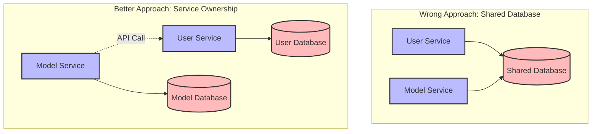
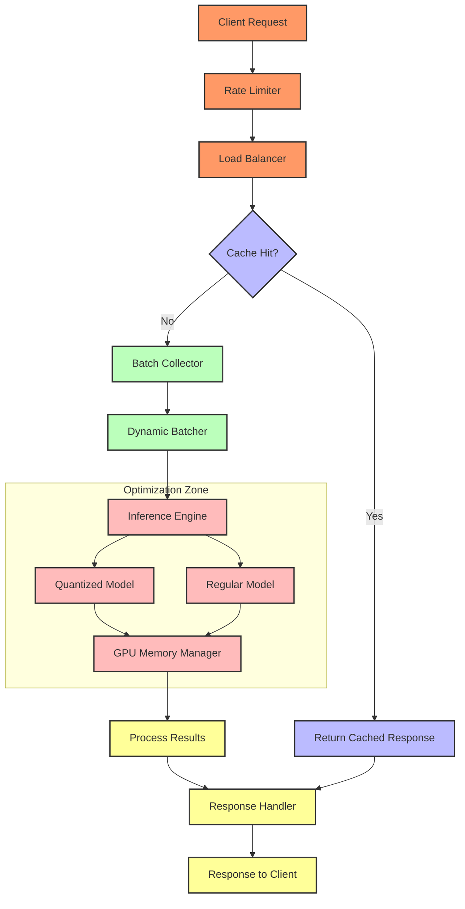
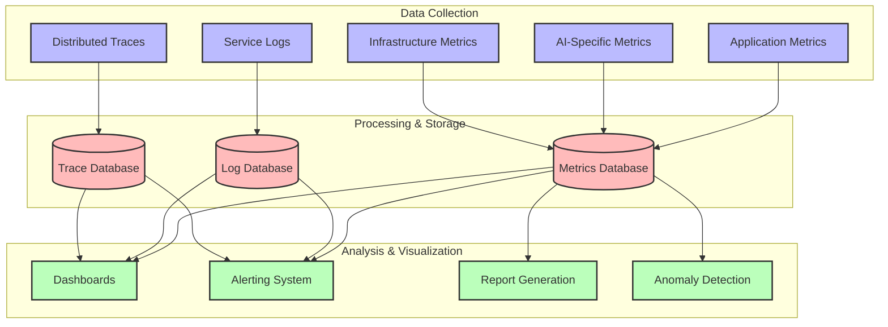
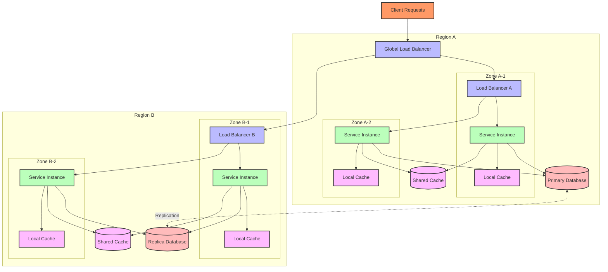
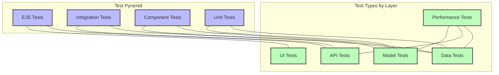
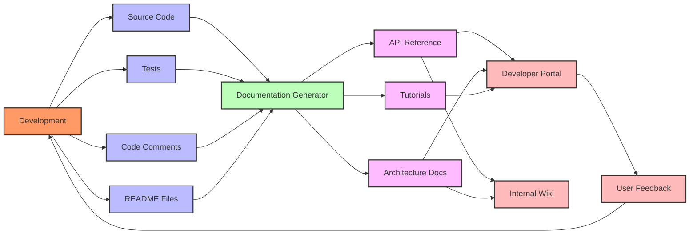

# OPEA: Common Challenges and Best Practices

## **📌 Index**

1. 🚨 [Common Implementation Pitfalls](#1️⃣-common-implementation-pitfalls)
2. 🔐 [Security Best Practices](#2️⃣-security-best-practices)
3. ⚡ [Performance Tuning Guidelines](#3️⃣-performance-tuning-guidelines)
4. 📊 [Monitoring and Observability](#4️⃣-monitoring-and-observability)
5. 📈 [Scaling Strategies](#5️⃣-scaling-strategies)
6. 🔄 [Disaster Recovery and High Availability](#6️⃣-disaster-recovery-and-high-availability)
7. 🔗 [Integration Patterns](#7️⃣-integration-patterns)
8. 🧪 [Testing Approaches](#8️⃣-testing-approaches)
9. 🏗️ [Infrastructure as Code](#9️⃣-infrastructure-as-code)
10. 📝 [Documentation and Knowledge Sharing](#1️⃣0️⃣-documentation-and-knowledge-sharing)

---

## **1️⃣ Common Implementation Pitfalls**

### **⚠️ Architecture Pitfalls**

1. **🏗️ Wrong Service Boundaries**

   - **Problem**: Creating services based on technical layers instead of business domains.
   - **Solution**: Use Domain-Driven Design to identify proper boundaries.
   - **Example**: Splitting into "frontend," "backend," and "database" services instead of "user management," "model training," etc.

2. **🔗 Too Much Coupling**

   - **Problem**: Services have too many dependencies on each other.
   - **Solution**: Use events and asynchronous communication where possible.
   - **Example**: Model Training service directly calling User service APIs instead of subscribing to user events.

3. **📦 Shared Database Anti-pattern**
   - **Problem**: Multiple services sharing the same database.
   - **Solution**: Each service should own its data, use APIs for data access.
   - **Example**: Both User and Model services writing to the same database tables.



### **🛠️ Implementation Pitfalls**

1. **⏱️ Synchronous Hell**

   - **Problem**: Excessive synchronous communication creating long request chains.
   - **Solution**: Use asynchronous communication and circuit breakers.
   - **Impact**: Long request chains can cause cascading failures and increased latency.

2. **📦 Monolithic Thinking**

   - **Problem**: Building microservices that are too large or too small.
   - **Solution**: Focus on business capabilities and team boundaries.
   - **Impact**: Wrong-sized services lead to higher operational complexity.

3. **🧩 API Versioning Issues**
   - **Problem**: Breaking changes in APIs causing service failures.
   - **Solution**: Use semantic versioning and backward compatibility.
   - **Impact**: Service consumers break when providers change interfaces.

### **🔄 Operational Pitfalls**

1. **📊 Insufficient Monitoring**

   - **Problem**: Lack of visibility into service health and interactions.
   - **Solution**: Implement comprehensive monitoring and distributed tracing.
   - **Impact**: Difficulty diagnosing issues in production.

2. **🧹 Configuration Sprawl**

   - **Problem**: Inconsistent configuration across services.
   - **Solution**: Centralized configuration management with version control.
   - **Impact**: Environment inconsistencies and deployment failures.

3. **🔄 Manual Deployment**
   - **Problem**: Relying on manual steps for deployment.
   - **Solution**: Implement CI/CD pipelines and infrastructure as code.
   - **Impact**: Inconsistent environments and error-prone deployments.

### **🧠 AI-Specific Pitfalls**

1. **📊 Poor Data Management**

   - **Problem**: Inadequate data versioning and lineage tracking.
   - **Solution**: Implement data versioning and metadata management.
   - **Impact**: Inability to reproduce model results or trace issues to source data.

2. **🧮 Resource Underestimation**

   - **Problem**: Underestimating GPU/memory needs for AI workloads.
   - **Solution**: Proper benchmarking and overprovisioning initially.
   - **Impact**: Performance issues, failed jobs, and service outages.

3. **🔄 Ignoring Model Lifecycle**
   - **Problem**: Treating model deployment as a one-time event.
   - **Solution**: Implement MLOps practices for continuous model management.
   - **Impact**: Stale models, drift issues, and performance degradation over time.

---

## **2️⃣ Security Best Practices**

### **🔐 Authentication & Authorization**

1. **🔑 Centralized Identity Management**

   - Implement a dedicated identity service
   - Use OAuth 2.0 / OpenID Connect
   - Support API keys for service-to-service communication

2. **🛡️ Zero Trust Architecture**

   - Verify every request regardless of source
   - Implement least privilege access
   - Use service meshes for security policy enforcement

3. **📜 Role-Based Access Control (RBAC)**
   - Define fine-grained roles and permissions
   - Apply to both users and services
   - Control model access based on user roles

```python
# Example: Role-based access in OPEA
class ModelAccessControl:
    def check_access(self, user, model_id, operation):
        # Get user roles
        user_roles = self.identity_service.get_user_roles(user)

        # Get model metadata
        model_metadata = self.model_registry.get_model_metadata(model_id)

        # Check role permissions
        if operation == "INFERENCE" and "MODEL_USER" in user_roles:
            return True
        elif operation == "DEPLOYMENT" and "MODEL_ADMIN" in user_roles:
            return True
        elif operation == "TRAINING" and "DATA_SCIENTIST" in user_roles:
            return True

        # Default deny
        return False
```

### **🔒 Data Security**

1. **🔐 Encryption Strategies**

   - Encrypt data at rest (storage)
   - Encrypt data in transit (TLS/SSL)
   - Consider field-level encryption for sensitive data

2. **🧹 Data Minimization**

   - Only collect necessary data
   - Implement data retention policies
   - Anonymize data where possible

3. **📊 Sensitive Data Handling**
   - Classify data based on sensitivity
   - Apply appropriate controls to each class
   - Monitor data access patterns

### **🛡️ Infrastructure Security**

1. **🔒 Container Security**

   - Use minimal base images
   - Scan for vulnerabilities
   - Implement pod security policies

2. **🔥 Network Security**

   - Implement network policies
   - Use service mesh for mTLS
   - Restrict egress traffic

3. **📝 Secret Management**
   - Use a dedicated secrets manager (HashiCorp Vault, AWS Secrets Manager)
   - Rotate credentials regularly
   - Never store secrets in code or environment variables

### **🔍 Security Monitoring**

1. **🚨 Threat Detection**

   - Monitor for unusual access patterns
   - Implement intrusion detection
   - Log and alert on security events

2. **🔄 Continuous Security Testing**

   - Regular penetration testing
   - Automated vulnerability scanning
   - Security code reviews

3. **📊 Compliance Frameworks**
   - Implement required controls based on industry
   - Regular compliance audits
   - Documentation of security measures

---

## **3️⃣ Performance Tuning Guidelines**

### **⚡ Model Serving Optimization**

1. **🧠 Model Optimization Techniques**

   - Quantization (FP32 → FP16 → INT8)
   - Pruning to reduce model size
   - Knowledge distillation for smaller models
   - Model compilation (ONNX, TensorRT)

2. **📦 Batching Strategies**

   - Dynamic batching for inference
   - Optimal batch sizes for different models
   - Timeout-based batch processing

3. **💾 Caching Layers**
   - Result caching for common queries
   - Feature vector caching
   - Model weight caching



### **🔄 Database Optimization**

1. **📊 Query Optimization**

   - Efficient indexing strategies
   - Query profiling and tuning
   - Read/write splitting

2. **🏎️ Connection Pooling**

   - Properly sized connection pools
   - Connection monitoring
   - Timeout handling

3. **📦 Database Scaling**
   - Horizontal scaling for read-heavy workloads
   - Vertical scaling for write-heavy workloads
   - Sharding strategies for large datasets

### **🔄 Network Optimization**

1. **🔄 API Design**

   - Efficient payload design
   - Pagination for large result sets
   - GraphQL for flexible data fetching

2. **📦 Compression**

   - gzip/deflate for HTTP traffic
   - Protocol Buffers or MessagePack instead of JSON
   - Binary formats for large data transfers

3. **🏎️ Connection Management**
   - Keep-alive connections
   - Connection pooling
   - Backpressure handling

### **💾 Memory Management**

1. **📊 Resource Allocation**

   - Right-sizing containers
   - Memory limits and requests
   - Swap space considerations

2. **🧹 Garbage Collection**

   - GC tuning for different workloads
   - Monitoring GC pauses
   - Memory leak detection

3. **📊 Caching Strategies**
   - In-memory caching
   - Distributed caching (Redis)
   - Cache invalidation strategies

---

## **4️⃣ Monitoring and Observability**

### **📊 Monitoring Framework**

1. **🏗️ Multi-Layer Monitoring**

   - Infrastructure metrics (CPU, memory, disk, network)
   - Application metrics (request rates, errors, latencies)
   - Business metrics (model accuracy, user engagement)
   - AI-specific metrics (inference time, model drift)

2. **🎯 Service Level Objectives (SLOs)**

   - Define clear performance targets
   - Establish error budgets
   - Track SLO compliance over time

3. **🚨 Alerting Strategy**
   - Alert on symptoms, not causes
   - Implement alert severity levels
   - Reduce alert fatigue with proper thresholds

### **🔍 Logging Best Practices**

1. **📝 Structured Logging**

   - Use JSON or similar structured format
   - Include consistent fields (timestamp, service, level, etc.)
   - Add contextual information (request ID, user ID, etc.)

2. **🔄 Log Management**

   - Centralized log collection
   - Log retention policies
   - Search and analysis capabilities

3. **📊 Log Levels**
   - Appropriate use of DEBUG, INFO, WARN, ERROR
   - Sampling high-volume logs
   - Dynamic log level adjustment

```python
# Example: Structured logging in OPEA
def log_inference_request(model_id, user_id, request_data, correlation_id):
    logger.info({
        "event": "inference_request",
        "model_id": model_id,
        "user_id": user_id,
        "input_shape": str(request_data.shape),
        "correlation_id": correlation_id,
        "timestamp": datetime.utcnow().isoformat(),
        "service": "inference-service"
    })
```

### **🔄 Distributed Tracing**

1. **🔍 Trace Propagation**

   - Consistent trace ID across service boundaries
   - Span creation for each operation
   - Baggage propagation for context

2. **📊 Visualization and Analysis**

   - Service dependency maps
   - Critical path analysis
   - Performance bottleneck identification

3. **🧩 Integration with Logging and Metrics**
   - Correlate traces with logs
   - Connect traces to metrics
   - End-to-end request visualization

### **📈 Model Performance Monitoring**

1. **🔄 Drift Detection**

   - Feature drift monitoring
   - Prediction drift monitoring
   - Concept drift detection

2. **📊 Model Metrics**

   - Accuracy, precision, recall tracking
   - Latency and throughput
   - Resource utilization

3. **🔍 Explainability Tools**
   - Feature importance tracking
   - Output interpretation
   - Decision explanation capabilities



---

## **5️⃣ Scaling Strategies**

### **📈 Kubernetes Scaling Strategies**

1. **🔄 Horizontal Pod Autoscaler (HPA)**

   - CPU/Memory-based scaling
   - Custom metrics scaling
   - Event-driven scaling

2. **🏗️ Node Autoscaling**

   - Cluster Autoscaler for node provisioning
   - Node pool strategies for different workloads
   - Spot instances for cost optimization

3. **🏋️ Resource Management**
   - Appropriate resource requests and limits
   - Quality of Service (QoS) classes
   - Pod Priority and Preemption

```yaml
# Example: HPA configuration for OPEA inference service
apiVersion: autoscaling/v2
kind: HorizontalPodAutoscaler
metadata:
  name: inference-service-hpa
spec:
  scaleTargetRef:
    apiVersion: apps/v1
    kind: Deployment
    name: inference-service
  minReplicas: 3
  maxReplicas: 20
  metrics:
    - type: Resource
      resource:
        name: cpu
        target:
          type: Utilization
          averageUtilization: 70
    - type: Pods
      pods:
        metric:
          name: inference_requests_per_second
        target:
          type: AverageValue
          averageValue: 100
```

### **🧠 AI-Specific Scaling**

1. **🔢 GPU Optimization**

   - Multi-model serving on single GPU
   - GPU sharing strategies
   - GPU memory optimization

2. **📊 Inference Scaling**

   - Stateless design for easy scaling
   - Workload-aware scaling
   - Priority-based scheduling

3. **🏋️ Training Workload Management**
   - Batch job scaling
   - Preemptible training jobs
   - Distributed training coordination

### **📊 Database Scaling**

1. **🔄 Read Replicas**

   - Scaling for read-heavy workloads
   - Cross-region replicas for global deployments
   - Read/write splitting

2. **🧩 Sharding Strategies**

   - Horizontal partitioning of data
   - Consistent hashing
   - Tenant-based sharding

3. **📦 NoSQL Scaling Patterns**
   - Eventual consistency models
   - Partition key design
   - Scale-out approaches

### **🌐 Global Scaling Considerations**

1. **🗺️ Multi-Region Deployment**

   - Geographic distribution
   - Data residency requirements
   - Global load balancing

2. **🔄 Content Distribution**

   - CDN for static assets
   - Edge caching
   - Model deployment at the edge

3. **⏱️ Latency Optimization**
   - Region-aware routing
   - Replica proximity
   - Asynchronous processing where possible

---

## **6️⃣ Disaster Recovery and High Availability**

### **🛡️ High Availability Architectures**

1. **🔄 Multi-Zone Deployment**

   - Distribute across availability zones
   - Zone-aware routing
   - Automatic failover between zones

2. **🏗️ Redundancy Patterns**

   - N+1 redundancy for critical components
   - No single points of failure
   - Load balancer redundancy

3. **🔄 Stateless Design**
   - Minimize stateful components
   - Externalize state when necessary
   - Session replication for stateful services



### **🔄 Disaster Recovery Planning**

1. **📊 Recovery Objectives**

   - Define Recovery Time Objective (RTO)
   - Define Recovery Point Objective (RPO)
   - SLA commitments for different services

2. **📋 Backup Strategies**

   - Regular data backups
   - Model artifact backups
   - Configuration backups

3. **🔄 Disaster Recovery Testing**
   - Regular DR drills
   - Automated recovery testing
   - Documentation of recovery procedures

### **🧯 Failure Mode Analysis**

1. **🔍 Chaos Engineering**

   - Controlled failure injection
   - Recovery verification
   - Resilience improvement

2. **📊 Failure Mode Assessment**

   - Identify single points of failure
   - Assess impact of component failures
   - Plan mitigation strategies

3. **🚨 Incident Response Planning**
   - Clear incident classification
   - Response team roles and responsibilities
   - Communication templates and channels

### **🔄 Data Consistency in Distributed Systems**

1. **⚖️ Consistency Models**

   - Strong consistency vs. eventual consistency
   - CAP theorem trade-offs
   - Appropriate consistency for different data types

2. **📊 Data Replication**

   - Synchronous vs. asynchronous replication
   - Multi-region considerations
   - Conflict resolution strategies

3. **🧮 Transaction Management**
   - Distributed transactions
   - Saga pattern for complex workflows
   - Compensation mechanisms for failures

---

## **7️⃣ Integration Patterns**

### **🔗 API-Based Integration**

1. **📋 API Design Principles**

   - RESTful design best practices
   - OpenAPI/Swagger specification
   - Versioning strategy

2. **🔄 API Gateway Patterns**

   - Request routing
   - Authentication and authorization
   - Rate limiting and throttling

3. **🧪 API Testing and Monitoring**
   - Contract testing
   - Performance testing
   - Availability monitoring

```python
# Example: API Gateway route configuration in OPEA
routes = [
    {
        "path": "/api/v1/models",
        "service": "model-registry-service",
        "methods": ["GET", "POST"],
        "auth_required": True,
        "rate_limit": 100  # requests per minute
    },
    {
        "path": "/api/v1/models/{model_id}/inference",
        "service": "inference-service",
        "methods": ["POST"],
        "auth_required": True,
        "rate_limit": 1000,  # requests per minute
        "timeout": 30  # seconds
    },
    {
        "path": "/api/v1/data",
        "service": "data-processing-service",
        "methods": ["GET", "POST", "PUT"],
        "auth_required": True,
        "rate_limit": 50  # requests per minute
    }
]
```

### **📦 Event-Driven Integration**

1. **🔄 Message Brokers**

   - Kafka, RabbitMQ, NATS
   - Topic design strategies
   - Dead-letter queues

2. **📋 Event Schemas**

   - Schema registry
   - Schema evolution
   - Backward/forward compatibility

3. **🔄 Event Patterns**
   - Publish/Subscribe
   - Event sourcing
   - Command Query Responsibility Segregation (CQRS)

### **🧩 Integration with Enterprise Systems**

1. **🔗 Legacy System Integration**

   - Anti-corruption layers
   - API adapters
   - Batch integration

2. **🔄 Data Integration**

   - ETL/ELT processes
   - Change Data Capture (CDC)
   - Data lake integration

3. **🧪 Integration Testing**
   - Service virtualization
   - Integration test environments
   - End-to-end testing

### **☁️ Cloud Service Integration**

1. **🔗 Cloud Provider Services**

   - Managed Kubernetes integration
   - Cloud storage integration
   - Identity and Access Management (IAM)

2. **🔄 Multi-Cloud Strategies**

   - Cloud-agnostic design
   - Service abstraction layers
   - Data transfer considerations

3. **🛡️ Third-Party Service Integration**
   - API clients and SDKs
   - Credential management
   - Circuit breakers and fallbacks

---

## **8️⃣ Testing Approaches**

### **🧪 Test Pyramid for OPEA**

1. **📚 Unit Testing**

   - Component isolation
   - Mocking dependencies
   - High code coverage

2. **🔗 Integration Testing**

   - Service interaction verification
   - API contract validation
   - Database interaction testing

3. **🌐 End-to-End Testing**
   - Complete workflow validation
   - User journey simulations
   - Production-like environment testing



### **🧠 AI-Specific Testing**

1. **🔄 Model Validation**

   - Accuracy and performance metrics
   - Fairness and bias testing
   - Robustness testing

2. **📊 Data Testing**

   - Data quality validation
   - Schema validation
   - Distribution shift detection

3. **⚙️ Pipeline Testing**
   - Data transformation verification
   - Pipeline component testing
   - End-to-end pipeline validation

### **🚀 Performance Testing**

1. **⏱️ Load Testing**

   - Throughput measurement
   - Scalability verification
   - Bottleneck identification

2. **🧮 Stress Testing**

   - System behavior under extreme load
   - Recovery from overload
   - Resource exhaustion handling

3. **📊 Benchmarking**
   - Performance baselines
   - Regression detection
   - Comparative analysis of optimizations

### **🔄 Continuous Testing**

1. **🔄 CI/CD Integration**

   - Automated test execution
   - Quality gates
   - Test result reporting

2. **🧪 Test Environment Management**

   - Consistent test environments
   - On-demand provisioning
   - Data management for testing

3. **📈 Test Coverage and Metrics**
   - Code coverage tracking
   - Test execution metrics
   - Quality trending

---

## **9️⃣ Infrastructure as Code**

### **🏗️ IaC Fundamentals**

1. **📝 Declarative Infrastructure**

   - Infrastructure specified as code
   - Version-controlled definitions
   - Reproducible environments

2. **🔄 Tools and Approaches**

   - Terraform for cloud resources
   - Kubernetes YAML or Helm for containerized workloads
   - Ansible for configuration management

3. **🧩 Modular Design**
   - Reusable modules
   - Environment-specific configurations
   - Dependency management

```hcl
# Example: Terraform module for OPEA infrastructure
module "opea_cluster" {
  source = "./modules/kubernetes-cluster"

  cluster_name = "opea-${var.environment}"
  region = var.region
  node_pools = [
    {
      name = "cpu-pool"
      machine_type = "n2-standard-4"
      min_count = 3
      max_count = 10
      auto_scaling = true
    },
    {
      name = "gpu-pool"
      machine_type = "n1-standard-8"
      accelerator_type = "nvidia-tesla-t4"
      accelerator_count = 1
      min_count = 2
      max_count = 8
      auto_scaling = true
    }
  ]

  tags = {
    Environment = var.environment
    Application = "OPEA"
    ManagedBy = "Terraform"
  }
}
```

### **📦 Kubernetes Resource Management**

1. **🧩 Helm Charts**

   - Package management for Kubernetes
   - Template-based configuration
   - Release management

2. **📋 Custom Resources**

   - Extending Kubernetes API
   - Operators for complex applications
   - Custom resource definitions (CRDs)

3. **🔄 GitOps Workflows**
   - Git as single source of truth
   - Pull-based deployment
   - Automated synchronization

### **🔐 Security as Code**

1. **🛡️ Policy as Code**

   - Infrastructure policies defined as code
   - Automated compliance checking
   - Security guardrails

2. **🔒 Secret Management**

   - HashiCorp Vault, AWS Secrets Manager
   - Dynamic secrets
   - Secret rotation

3. **🧪 Security Testing**
   - Infrastructure scanning
   - Compliance validation
   - Penetration testing automation

### **🔄 Infrastructure Lifecycle Management**

1. **🧠 State Management**

   - Infrastructure state tracking
   - State file security
   - State consistency

2. **🔄 Continuous Infrastructure**

   - Infrastructure CI/CD pipelines
   - Testing infrastructure changes
   - Rolling back infrastructure

3. **📊 Drift Detection**
   - Identifying manual changes
   - Remediation workflows
   - Compliance enforcement

---

## **1️⃣0️⃣ Documentation and Knowledge Sharing**

### **📚 Documentation Strategies**

1. **📋 Documentation as Code**

   - Markdown in source repositories
   - Automated documentation generation
   - Version control for documentation

2. **🏗️ Documentation Structure**

   - Architecture documentation
   - API reference documentation
   - Operational runbooks
   - User guides and tutorials

3. **🔄 Living Documentation**
   - Regular updates as code changes
   - Automated testing of documentation examples
   - Feedback mechanisms



### **👥 Knowledge Sharing Practices**

1. **🎓 Onboarding Processes**

   - Structured learning path
   - Hands-on training exercises
   - Mentorship programs

2. **👩‍💻 Collaborative Development**

   - Pair programming
   - Code reviews
   - Architecture decision records (ADRs)

3. **🧩 Community Building**
   - Internal tech talks
   - Contribution guidelines
   - Cross-team collaboration events

### **🗂️ Information Architecture**

1. **🔍 Discoverability**

   - Central knowledge hub
   - Search functionality
   - Categorization and tagging

2. **📊 Documentation Metrics**

   - Documentation coverage
   - Usage analytics
   - User satisfaction

3. **🔄 Maintenance Strategy**
   - Documentation ownership
   - Review cycles
   - Deprecation process

### **🌐 External Communication**

1. **🧑‍🤝‍🧑 User Community**

   - User forums and discussion groups
   - Feature request processes
   - Beta testing programs

2. **📢 Release Communication**

   - Release notes
   - Changelog management
   - Deprecation notices

3. **📚 Educational Resources**
   - Tutorials and guides
   - Training materials
   - Sample applications

---

## **🔑 Key Takeaways**

1. **🏗️ Architecture Matters** - Carefully design service boundaries based on business domains, not technical layers.

2. **🔐 Security by Design** - Implement security at all levels, from infrastructure to application code.

3. **⚡ Performance Optimization** - Use appropriate techniques for each component, from model serving to database access.

4. **📊 Comprehensive Monitoring** - Implement multi-layer monitoring covering infrastructure, application, and AI-specific metrics.

5. **📈 Smart Scaling** - Utilize Kubernetes features for efficient resource allocation and automatic scaling.

6. **🛡️ Resilience Planning** - Design for failure with redundancy, disaster recovery, and high availability patterns.

7. **🔗 Clean Integration** - Use well-defined APIs and events for service communication with appropriate patterns.

8. **🧪 Thorough Testing** - Implement the test pyramid with special attention to AI-specific testing needs.

9. **🏗️ Infrastructure as Code** - Manage all infrastructure through code for consistency and reproducibility.

10. **📚 Living Documentation** - Maintain up-to-date documentation integrated with your development process.

---

_Made by Ramsi K. – Part of the GenAI Bootcamp 2025 repository._
