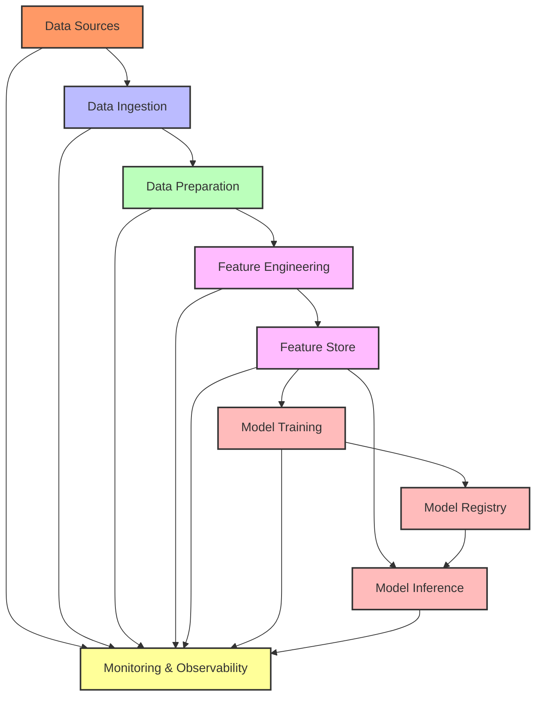
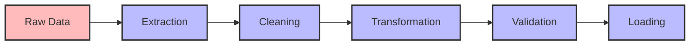
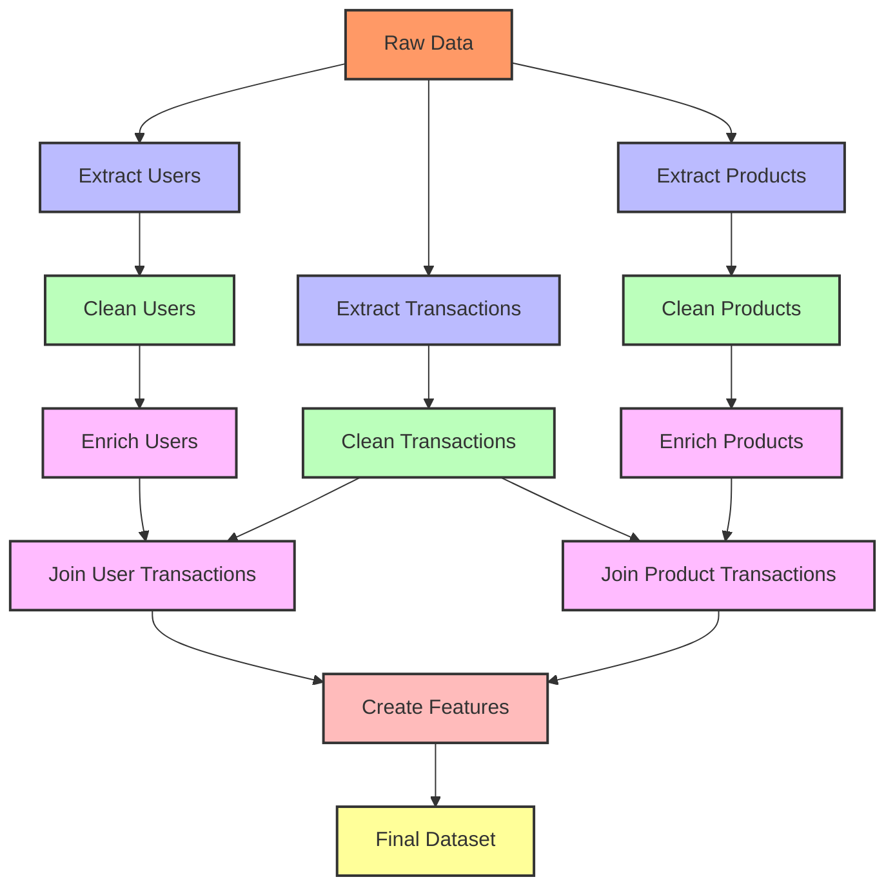
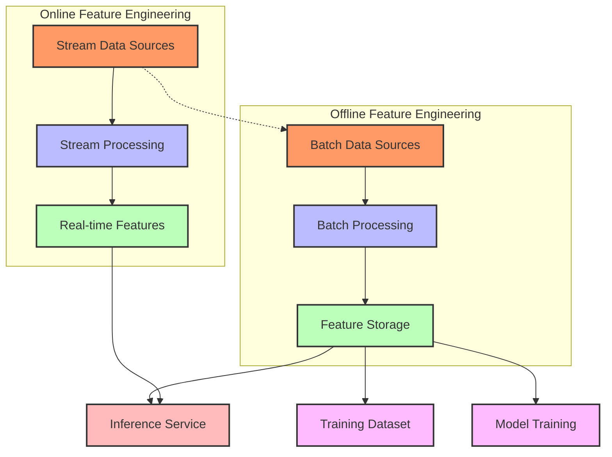
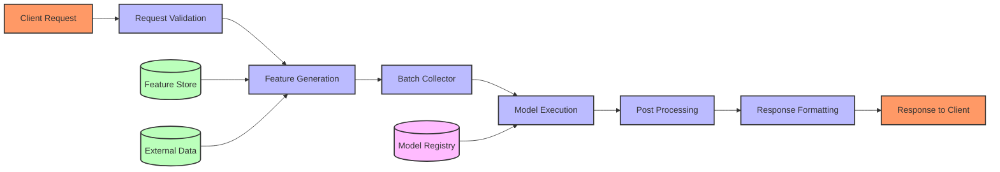
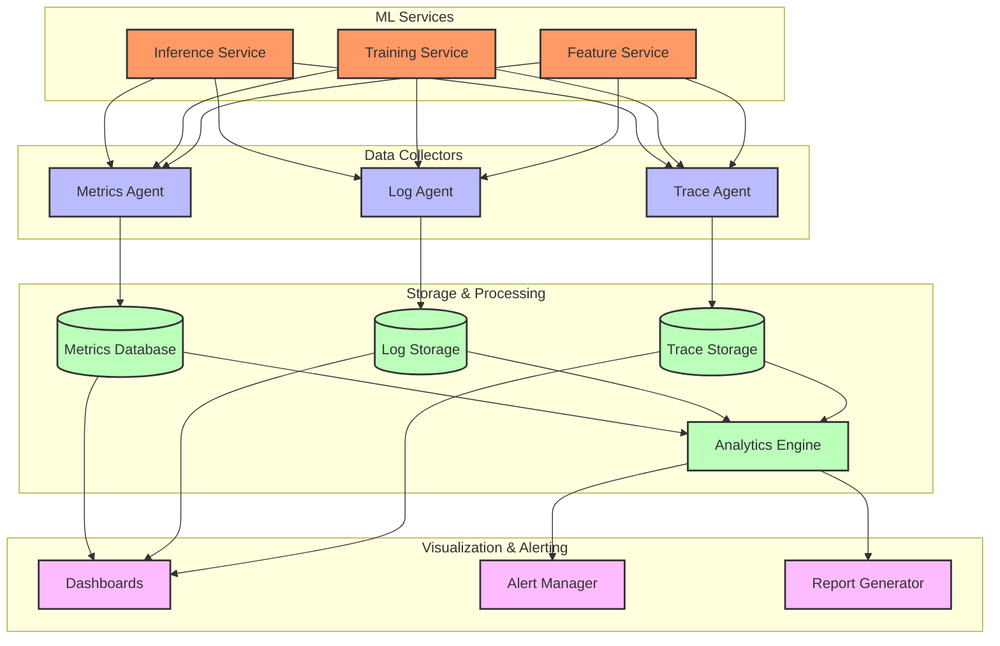
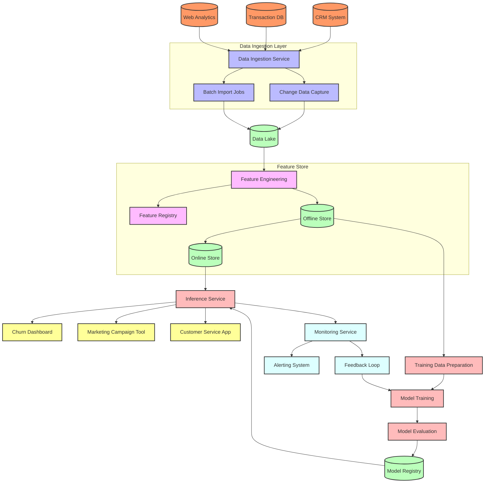

# Data Flow Patterns in OPEA Systems

## **📌 Index**

1. 🔹 [Understanding Data Flow in OPEA](#1️⃣-understanding-data-flow-in-opea)
2. 📊 [Data Ingestion Patterns](#2️⃣-data-ingestion-patterns)
3. 🔄 [Data Transformation Patterns](#3️⃣-data-transformation-patterns)
4. 🧮 [Feature Engineering Patterns](#4️⃣-feature-engineering-patterns)
5. 💾 [Feature Store Patterns](#5️⃣-feature-store-patterns)
6. 🧠 [Model Training Data Flows](#6️⃣-model-training-data-flows)
7. 📈 [Inference Data Flows](#7️⃣-inference-data-flows)
8. 📉 [Monitoring Data Flows](#8️⃣-monitoring-data-flows)
9. 📚 [Data Governance Patterns](#9️⃣-data-governance-patterns)
10. 🔄 [End-to-End Example Flows](#1️⃣0️⃣-end-to-end-example-flows)

---

## **1️⃣ Understanding Data Flow in OPEA**

### **🧩 Core Data Flow Components**

Data in OPEA systems follows several key paths through different components:

- **🔄 Data Sources** → Raw data from databases, streams, files, APIs
- **📥 Data Ingestion** → Bringing data into the system
- **🧹 Data Preparation** → Cleaning, normalization, transformation
- **🏷️ Feature Engineering** → Creating features for AI models
- **💾 Feature Store** → Storing and serving features
- **🧠 Model Training** → Using features to train models
- **📊 Model Inference** → Using models and features to make predictions
- **📈 Monitoring** → Tracking data and model performance



### **🔄 Data Flow Principles in OPEA**

1. **🔍 Data Lineage**

   - Tracking data from source to consumption
   - Understanding data transformations
   - Providing audit trails

2. **🔐 Data Security**

   - Securing data in transit and at rest
   - Implementing access controls
   - Managing sensitive data

3. **⚡ Performance Considerations**

   - Throughput requirements
   - Latency constraints
   - Resource utilization

4. **📊 Data Quality**
   - Validation at each step
   - Handling schema evolution
   - Detecting anomalies

### **🧩 Common Data Flow Architectures**

1. **📦 Batch Processing**

   - Processing data in defined chunks
   - Scheduled execution
   - Resource-efficient but higher latency

2. **⚡ Stream Processing**

   - Real-time data processing
   - Event-driven architecture
   - Lower latency but more complex

3. **🔄 Lambda Architecture**

   - Combining batch and streaming
   - Speed layer for real-time
   - Batch layer for correctness

4. **🏗️ Kappa Architecture**
   - Stream processing for everything
   - Reprocessing streams when needed
   - Simplified but requires robust streaming

---

## **2️⃣ Data Ingestion Patterns**

### **📥 Batch Ingestion Patterns**

1. **📋 Periodic Extract**

   - Scheduled extraction from source systems
   - Full or incremental data loads
   - ETL or ELT processing

2. **📁 File-Based Ingestion**

   - Uploading files to object storage
   - File format conversion (CSV, JSON, Parquet)
   - Metadata extraction

3. **🗄️ Database Dumps**
   - Direct database exports
   - Logical or physical backups
   - Schema migration handling

```python
# Example: Simple batch ingestion in OPEA
def batch_ingest_from_database(config):
    """Ingest data from source database on a schedule."""
    # Connect to source database
    source_conn = create_db_connection(
        host=config.source_host,
        user=config.source_user,
        password=config.source_password,
        database=config.source_db
    )

    # Extract data with SQL query
    query = f"SELECT * FROM {config.source_table} WHERE updated_at > %s"
    last_run_time = get_last_successful_run_time()
    data = execute_query(source_conn, query, [last_run_time])

    # Write to destination (could be file, database, message queue)
    destination = get_destination_client(config.destination_type)
    destination.write(
        data=data,
        destination=config.destination_location,
        partition_by=config.partition_columns
    )

    # Record metadata about the ingestion
    record_ingestion_metadata(
        source=config.source_table,
        destination=config.destination_location,
        record_count=len(data),
        start_time=last_run_time,
        end_time=current_time()
    )
```

### **⚡ Streaming Ingestion Patterns**

1. **📊 Change Data Capture (CDC)**

   - Capturing database changes in real-time
   - Reading database transaction logs
   - Streaming changes to consumers

2. **📢 Event Sourcing**

   - Capturing domain events
   - Publishing events to message broker
   - Consuming events for processing

3. **🌐 API-Based Ingestion**
   - Real-time data from external APIs
   - Webhook processing
   - Service-to-service communication

### **🧩 Hybrid Ingestion Patterns**

1. **🔄 Micro-Batch Processing**

   - Small, frequent batch processes
   - Balancing latency and throughput
   - Simplified error handling

2. **📊 Queue-Based Buffering**

   - Buffering events in message queues
   - Processing in small batches
   - Handling backpressure

3. **🔍 Priority-Based Ingestion**
   - Different paths for different data priorities
   - Fast path for critical data
   - Batch processing for non-critical data

---

## **3️⃣ Data Transformation Patterns**

### **🧹 Data Cleaning Patterns**

1. **🔄 Standardization**

   - Converting to consistent formats
   - Normalizing values
   - Handling missing values

2. **🔍 Deduplication**

   - Identifying duplicate records
   - Merging or filtering duplicates
   - Maintaining data integrity

3. **🧮 Validation**
   - Schema validation
   - Business rule validation
   - Statistical validation

### **🔄 Transformation Architectures**

1. **🏭 Pipeline Architecture**
   - Linear sequence of transformations
   - Clearly defined stages
   - Simple to understand and monitor



2. **🌐 DAG-Based Transformation**
   - Directed Acyclic Graph of operations
   - Complex dependencies
   - Parallel processing opportunities



3. **🔄 Functional Transformation**
   - Composable transformation functions
   - Immutable intermediate results
   - Easier testing and reproducibility

### **🔍 Transformation Execution Models**

1. **🏃‍♀️ Push vs. Pull**

   - Push: Source initiates data flow
   - Pull: Destination requests data
   - Hybrid approaches

2. **⚙️ Execution Engines**

   - Apache Spark for large-scale processing
   - Dask for Python-native parallel computing
   - Custom processing engines

3. **🏢 Execution Environments**
   - In-cluster processing
   - Serverless functions
   - Dedicated transformation services

---

## **4️⃣ Feature Engineering Patterns**

### **🧮 Feature Types and Approaches**

1. **📊 Numerical Features**

   - Scaling (normalization, standardization)
   - Binning (equal-width, equal-frequency)
   - Mathematical transformations (log, polynomial)

2. **🏷️ Categorical Features**

   - Encoding (one-hot, target, label)
   - Embedding generation
   - Handling high-cardinality features

3. **📅 Temporal Features**

   - Time-based aggregations (rolling windows)
   - Calendar-based features (day of week, holidays)
   - Sequence-based features

4. **📍 Spatial Features**
   - Geospatial transformations
   - Proximity calculations
   - Region-based aggregations

### **⚙️ Feature Engineering Architectures**

1. **🔄 Online vs. Offline Engineering**
   - Offline: Pre-computed during training
   - Online: Computed during inference
   - Hybrid: Combining both approaches



2. **🧩 Feature Pipeline Architecture**

   - Feature selection and filtering
   - Feature transformation
   - Feature validation

3. **📚 Feature Store Architecture**
   - Feature registry and metadata
   - Feature serving API
   - Historical feature storage

### **🧠 Feature Computation Strategies**

1. **⚡ On-Demand Computation**

   - Computing features when needed
   - Minimal storage requirements
   - Higher computation cost

2. **📦 Pre-Computation**

   - Computing features ahead of time
   - Higher storage requirements
   - Lower computation cost

3. **🔄 Hybrid Computation**
   - Pre-computing expensive features
   - Computing simple features on-demand
   - Balancing storage and computation

### **🔄 Feature Evolution Handling**

1. **📝 Schema Evolution**

   - Adding or removing features
   - Changing feature types
   - Backward compatibility

2. **🏷️ Feature Versioning**

   - Tracking feature definitions
   - Version-controlled transformations
   - Compatibility between versions

3. **🧪 A/B Testing Features**
   - Testing new feature definitions
   - Comparing feature performance
   - Gradual feature rollout

---

## **5️⃣ Feature Store Patterns**

### **💾 Feature Store Architecture**

1. **🏗️ Core Components**

   - Feature registry (metadata management)
   - Offline store (batch access)
   - Online store (low-latency access)
   - Feature serving API

2. **🔄 Data Flow**

   - Writer flows (populating the store)
   - Reader flows (consuming features)
   - Consistency management

3. **📚 Feature Organization**
   - Feature groups/namespaces
   - Entity-based organization
   - Feature dependencies

```mermaid
flowchart TB
    subgraph "Feature Engineering"
        BatchEngine[Batch Feature Engine]
        StreamEngine[Streaming Feature Engine]
    end

    subgraph "Feature Store"
        Registry[Feature Registry & Metadata]

        subgraph "Storage"
            OfflineStore[(Offline Store)]
            OnlineStore[(Online Store)]
        end

        subgraph "Serving"
            BatchAPI[Batch Serving API]
            OnlineAPI[Online Serving API]
        end
    end

    BatchEngine --> Registry
    BatchEngine --> OfflineStore

    StreamEngine --> Registry
    StreamEngine --> OnlineStore

    Registry --- OfflineStore
    Registry --- OnlineStore
    Registry --- BatchAPI
    Registry --- OnlineAPI

    OfflineStore --> OnlineStore
    OfflineStore --> BatchAPI
    OnlineStore --> OnlineAPI

    BatchAPI --> TrainingService[Model Training]
    OnlineAPI --> InferenceService[Model Inference]

    classDef engine fill:#f96,stroke:#333,stroke-width:2px
    classDef registry fill:#bbf,stroke:#333,stroke-width:2px
    classDef store fill:#bfb,stroke:#333,stroke-width:2px
    classDef api fill:#fbf,stroke:#333,stroke-width:2px
    classDef service fill:#fbb,stroke:#333,stroke-width:2px

    class BatchEngine,StreamEngine engine
    class Registry registry
    class OfflineStore,OnlineStore store
    class BatchAPI,OnlineAPI api
    class TrainingService,InferenceService service
```



### **⚙️ Feature Serving Patterns**

1. **⚡ Low-Latency Serving**

   - In-memory databases (Redis)
   - Key-value stores
   - Caching strategies

2. **📊 Batch Serving**

   - Point-in-time correct feature retrieval
   - Training data generation
   - Parallel retrieval

3. **📈 Streaming Serving**
   - Real-time feature updates
   - Stream processing integration
   - Event-driven architecture

### **🔄 Feature Store Implementation Patterns**

1. **🌌 Centralized vs. Federated**

   - Single store vs. multiple specialized stores
   - Cross-team access patterns
   - Governance considerations

2. **🧩 Build vs. Buy**

   - Custom implementation
   - Open-source options (Feast, Hopsworks)
   - Commercial services

3. **🏗️ Storage Backends**
   - Offline store options (S3, HDFS, BigQuery)
   - Online store options (Redis, DynamoDB, Cassandra)
   - Hybrid storage approaches

### **🧠 Advanced Feature Store Patterns**

1. **🔄 Time-Travel Capabilities**

   - Historical feature retrieval
   - Point-in-time consistency
   - Reproduction of training datasets

2. **🔍 Feature Monitoring**

   - Feature statistics tracking
   - Drift detection
   - Schema validation

3. **📊 Feature Discovery**
   - Feature search capabilities
   - Feature recommendation
   - Documentation and metadata

---

## **6️⃣ Model Training Data Flows**

### **🧮 Training Data Preparation**

1. **📋 Dataset Creation**

   - Feature selection and combination
   - Label creation
   - Train/validation/test splitting

2. **⚖️ Handling Imbalanced Data**

   - Undersampling/oversampling
   - Synthetic data generation (SMOTE)
   - Class weighting

3. **🔄 Data Augmentation**
   - Creating variations of training examples
   - Domain-specific transformations
   - Improving model generalization

```python
# Example: Training data preparation in OPEA
def prepare_training_dataset(feature_store, feature_list, entity_ids, start_date, end_date):
    """Prepare a training dataset from the feature store."""
    # Create feature view with selected features
    feature_view = feature_store.get_feature_view(
        features=feature_list,
        name="training_view"
    )

    # Get historical features for entities in time range
    training_data = feature_view.get_historical_features(
        entity_ids=entity_ids,
        start_time=start_date,
        end_time=end_date
    )

    # Create labels (could come from separate source)
    labels = get_labels_for_entities(entity_ids, start_date, end_date)

    # Join features with labels
    training_dataset = training_data.join(labels, on="entity_id")

    # Split into train, validation, test
    train, validation, test = split_dataset(
        training_dataset,
        ratios=[0.7, 0.15, 0.15],
        stratify_by="label"
    )

    # Log dataset metadata
    log_dataset_metadata(
        dataset_name=f"training_dataset_{start_date}_{end_date}",
        feature_list=feature_list,
        entity_count=len(entity_ids),
        train_samples=len(train),
        validation_samples=len(validation),
        test_samples=len(test),
        label_distribution=get_label_distribution(training_dataset)
    )

    return train, validation, test
```

### **🧠 Training Workflow Patterns**

1. **🔄 Basic Training Flow**

   - Data preparation
   - Model configuration
   - Model training
   - Model evaluation
   - Model registration

2. **🔍 Hyperparameter Optimization**

   - Grid search
   - Random search
   - Bayesian optimization
   - Multi-objective optimization

3. **🤖 AutoML Workflows**
   - Automated feature selection
   - Architecture search
   - Hyperparameter tuning
   - Ensemble creation

### **🏗️ Distributed Training Patterns**

1. **🧩 Data Parallelism**

   - Dividing data across workers
   - Parameter synchronization
   - Aggregation strategies

2. **🔄 Model Parallelism**

   - Dividing model across workers
   - Pipelining
   - Memory optimization

3. **🏢 Multi-Node Training**
   - Cluster configuration
   - Network optimization
   - Fault tolerance

### **📊 Training Metadata Capture**

1. **📝 Experiment Tracking**

   - Logging parameters and configurations
   - Tracking metrics
   - Artifact management

2. **🔍 Model Lineage**

   - Data provenance
   - Code versioning
   - Environment capture

3. **🔄 Reproducibility Guarantees**
   - Fixed random seeds
   - Environment isolation
   - Deterministic operations

---

## **7️⃣ Inference Data Flows**

### **🔄 Inference Pipeline Architecture**

1. **🏗️ Key Components**

   - Input validation and preprocessing
   - Feature retrieval/computation
   - Model loading and execution
   - Postprocessing and response formatting

2. **⏱️ Latency Considerations**

   - Request batching
   - Parallel processing
   - Caching strategies

3. **📊 Throughput Optimization**
   - Resource allocation
   - Load balancing
   - Queue management



### **🧩 Inference Deployment Patterns**

1. **🏭 Server-Based Inference**

   - REST API endpoints
   - gRPC services
   - GraphQL resolvers

2. **☁️ Serverless Inference**

   - Function-as-a-Service
   - Event-driven execution
   - Auto-scaling

3. **🔄 Batch Inference**
   - Scheduled execution
   - Bulk processing
   - Asynchronous results

### **🧠 Model Serving Strategies**

1. **📦 Model Loading**

   - Dynamic loading
   - Versioning
   - A/B testing

2. **📊 Multi-Model Serving**

   - Model ensembles
   - Model cascades
   - Routing between models

3. **🔄 Specialized Hardware**
   - GPU acceleration
   - TPU/NPU utilization
   - FPGA deployment

### **⚡ Online Inference Patterns**

1. **🔄 Synchronous vs. Asynchronous**

   - Request-response pattern
   - Callback mechanism
   - Polling for results

2. **📦 Batch Processing**

   - Dynamic batching
   - Micro-batching
   - Priority-based batching

3. **🚀 Response Streaming**
   - Incremental results
   - Progressive enhancement
   - Server-sent events

### **🔍 Feature Lookup Patterns**

1. **🔄 Just-in-Time Features**

   - On-demand feature computation
   - Real-time feature engineering
   - Feature caching

2. **📦 Pre-Computed Features**

   - Feature store integration
   - Key-based lookup
   - Feature joins

3. **🧩 Hybrid Approach**
   - Pre-compute expensive features
   - Compute simple transformations on-the-fly
   - Feature freshness balancing

---

## **8️⃣ Monitoring Data Flows**

### **📊 Data Collection Architecture**

1. **🧮 Metrics Collection**

   - System metrics (CPU, memory, disk)
   - Application metrics (requests, errors, latency)
   - Business metrics (accuracy, conversions)

2. **📝 Logging Architecture**

   - Structured logging
   - Log aggregation
   - Log storage and indexing

3. **🔍 Tracing Implementation**
   - Distributed tracing
   - Context propagation
   - Trace sampling



### **🔍 ML-Specific Monitoring**

1. **🧮 Model Performance Monitoring**

   - Accuracy metrics
   - Confidence scores
   - Error analysis

2. **📊 Data Drift Detection**

   - Feature drift
   - Concept drift
   - Prediction drift

3. **⚙️ Resource Utilization**
   - Inference latency
   - GPU utilization
   - Memory consumption

### **🚨 Alerting and Notification Patterns**

1. **📈 Threshold-Based Alerts**

   - Static thresholds
   - Dynamic thresholds
   - Composite conditions

2. **🔍 Anomaly Detection**

   - Statistical outliers
   - Forecasting-based anomalies
   - Pattern recognition

3. **🔄 Alert Management**
   - Alert grouping
   - Alert routing
   - Alert suppression

### **📊 Feedback Loop Patterns**

1. **🔄 Ground Truth Collection**

   - User feedback integration
   - Delayed labels
   - Human-in-the-loop systems

2. **📉 Model Performance Evaluation**

   - Continuous evaluation
   - A/B testing results
   - Business impact assessment

3. **🔁 Automated Remediation**
   - Self-healing systems
   - Model retraining triggers
   - Feature recalculation

---

## **9️⃣ Data Governance Patterns**

### **🔐 Data Security and Privacy**

1. **🔒 Data Protection**

   - Encryption (at rest and in transit)
   - Access control
   - Data masking and anonymization

2. **🔍 Audit Trails**

   - Data access logging
   - Change tracking
   - Compliance reporting

3. **📝 Consent Management**
   - User consent tracking
   - Purpose limitation
   - Data subject rights management

### **📊 Data Quality Management**

1. **🧹 Data Validation**

   - Schema validation
   - Business rule validation
   - Statistical validation

2. **🔍 Data Profiling**

   - Distribution analysis
   - Completeness checking
   - Anomaly detection

3. **🧮 Data Quality Metrics**
   - Accuracy metrics
   - Completeness metrics
   - Consistency metrics

```python
# Example: Data quality validation in OPEA
def validate_data_quality(dataframe, validation_rules):
    """Validate data quality based on defined rules."""
    validation_results = []

    for rule in validation_rules:
        rule_type = rule["type"]
        column = rule.get("column")

        if rule_type == "not_null":
            # Check for null values in column
            null_count = dataframe[column].isnull().sum()
            passed = null_count == 0
            validation_results.append({
                "rule": f"{column} should not contain nulls",
                "passed": passed,
                "details": f"Found {null_count} null values"
            })

        elif rule_type == "unique":
            # Check for uniqueness in column
            unique_count = dataframe[column].nunique()
            total_count = len(dataframe)
            passed = unique_count == total_count
            validation_results.append({
                "rule": f"{column} should contain unique values",
                "passed": passed,
                "details": f"Found {total_count - unique_count} duplicate values"
            })

        elif rule_type == "range":
            # Check if values are within specified range
            min_val = rule["min"]
            max_val = rule["max"]
            out_of_range = dataframe[
                (dataframe[column] < min_val) | (dataframe[column] > max_val)
            ].shape[0]
            passed = out_of_range == 0
            validation_results.append({
                "rule": f"{column} should be between {min_val} and {max_val}",
                "passed": passed,
                "details": f"Found {out_of_range} values outside range"
            })

    # Log validation results
    log_validation_results(validation_results)

    # Return overall pass/fail and details
    passed_all = all(result["passed"] for result in validation_results)
    return passed_all, validation_results
```

### **📝 Metadata Management**

1. **📚 Data Catalogs**

   - Dataset registration
   - Schema documentation
   - Semantic annotations

2. **🔄 Data Lineage**

   - Source tracking
   - Transformation documentation
   - Impact analysis

3. **📋 Business Glossary**
   - Term definitions
   - Domain hierarchies
   - Metadata standardization

### **🏛️ Regulatory Compliance**

1. **🔍 Compliance Frameworks**

   - GDPR, CCPA, HIPAA implementation
   - Industry-specific regulations
   - Internal policies

2. **📊 Compliance Monitoring**

   - Automated compliance checks
   - Compliance reporting
   - Remediation workflows

3. **📝 Documentation and Evidence**
   - Policy documentation
   - Compliance evidence collection
   - Audit preparation

---

## **1️⃣0️⃣ End-to-End Example Flows**

### **🔄 Customer Churn Prediction**

This example shows the complete data flow for a customer churn prediction system:



Key aspects of this flow:

1. **📥 Data Ingestion**

   - Batch imports from CRM system
   - Real-time transaction data via CDC
   - Web analytics data for user behavior

2. **🧮 Feature Engineering**

   - Customer profile features (demographics, tenure)
   - Transaction pattern features (frequency, recency, monetary value)
   - Engagement features (website activity, support interactions)

3. **🧠 Model Training**

   - Regular retraining based on new data
   - A/B testing different model approaches
   - Model validation against historical data

4. **📊 Inference**

   - Daily batch predictions for all customers
   - Real-time scoring for active customers
   - Explanation of churn factors

5. **🔍 Monitoring and Feedback**
   - Tracking prediction accuracy
   - Monitoring feature drift
   - Collecting actual churn outcomes for retraining

### **📊 Fraud Detection System**

This example illustrates a real-time fraud detection system:

1. **⚡ Real-time Transaction Flow**

   - Transaction events streamed from payment system
   - Enrichment with account and merchant data
   - Feature calculation (transaction patterns, anomaly scores)
   - Real-time model inference
   - Decision routing (approve, deny, review)

2. **🧠 Model Improvement Loop**

   - Manual review outcomes collected
   - Regular model retraining with confirmed cases
   - Active learning for ambiguous transactions
   - Champion/challenger model testing

3. **📈 Monitoring and Alerting**
   - False positive/negative tracking
   - Model performance by transaction type
   - Alert on significant performance changes
   - Rule adjustment based on emerging patterns

### **🔄 Recommendation Engine**

This example shows a hybrid batch/real-time recommendation system:

1. **📦 Offline Processing**

   - User behavior data collection
   - Product catalog processing
   - Item embedding generation
   - Pre-computed similarity matrices
   - Batch recommendations for known user segments

2. **⚡ Online Personalization**

   - Session context integration
   - Real-time behavior incorporation
   - Personalized ranking and filtering
   - A/B testing different recommendation strategies

3. **📊 Feedback and Optimization**
   - Click-through rate tracking
   - Conversion measurement
   - Diversity and coverage metrics
   - Automated optimization of recommendation parameters

---

## **🔑 Key Takeaways**

1. **🏗️ Design for Your Data Scale** - Choose appropriate patterns based on your data volume, velocity, and variety.

2. **🔄 Balance Batch and Streaming** - Most real-world systems benefit from both approaches working together.

3. **📊 Invest in Data Quality** - Clean, well-structured data is essential for reliable AI systems.

4. **🧠 Feature Engineering Matters** - Good features often matter more than model complexity.

5. **💾 Consider Feature Stores** - They provide consistency between training and inference.

6. **📈 Monitor Everything** - Track data flows, model performance, and system health continuously.

7. **🔍 Maintain Lineage** - Understanding data provenance is critical for debugging and compliance.

8. **⚡ Optimize Critical Paths** - Focus performance tuning on the most important data flows.

9. **🔄 Design for Evolution** - Data needs and models will change; build systems that can adapt.

10. **📚 Document Data Flows** - Clear documentation helps teams understand and maintain complex systems.

---

_Made by Ramsi K. – Part of the GenAI Bootcamp 2025 repository._#
