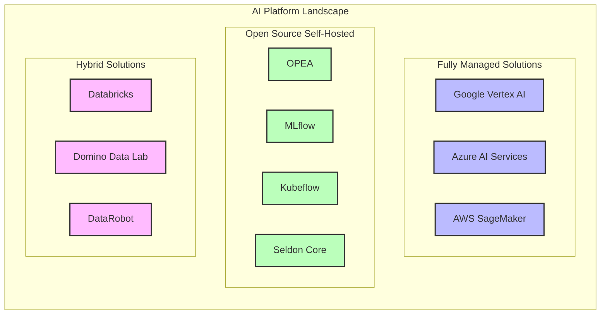
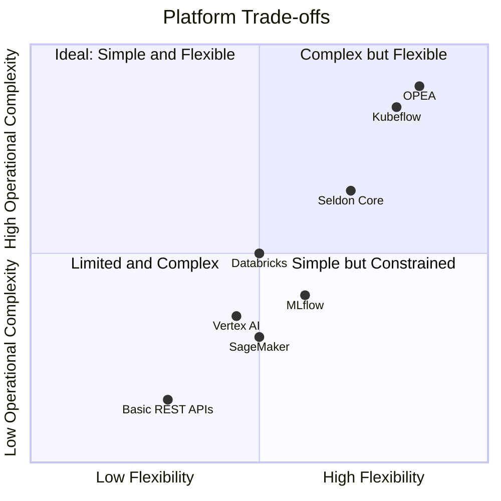
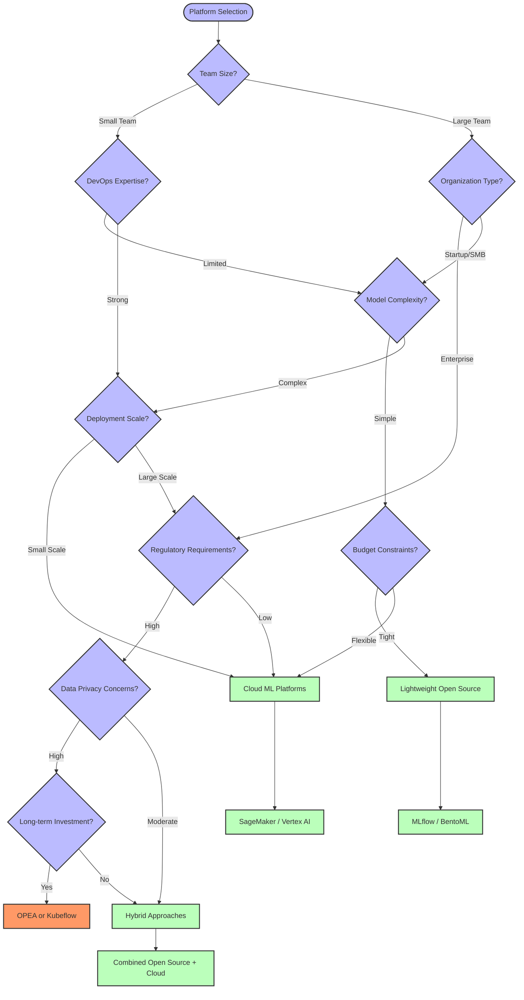

# **OPEA Ecosystem and Alternatives**

## **📌 Index**

1. 🌐 [OPEA in the AI Platform Landscape](#1️⃣-opea-in-the-ai-platform-landscape)
2. 🔄 [Key Alternatives to OPEA](#2️⃣-key-alternatives-to-opea)
3. 📊 [Comparative Analysis](#3️⃣-comparative-analysis)
4. 🔄 [Migration Considerations](#4️⃣-migration-considerations)
5. 🧩 [Integration Possibilities](#5️⃣-integration-possibilities)
6. 🚀 [Use Case Fit Analysis](#6️⃣-use-case-fit-analysis)
7. 🏢 [Organizational Considerations](#7️⃣-organizational-considerations)
8. 📈 [Future Trends and Evolution](#8️⃣-future-trends-and-evolution)

---

## **1️⃣ OPEA in the AI Platform Landscape**

### **🧩 Positioning in the Ecosystem**

OPEA (Open Platform for Enterprise AI) positions itself as an **open-source, self-hosted AI deployment framework** with the following key characteristics:

- **🏢 Enterprise-focused**: Designed for organizations that need to run AI workloads at scale
- **🔒 Privacy-centric**: Emphasizes keeping data within organizational boundaries
- **🧩 Modular**: Component-based architecture for flexibility and customization
- **☁️ Infrastructure-agnostic**: Can run on-premises or in cloud environments
- **🔄 Multi-model**: Supports diverse models and AI services



### **🔍 OPEA's Core Differentiators**

OPEA attempts to differentiate itself through:

1. **🔄 End-to-end capability**: Covering the full AI lifecycle from development to production
2. **🏗️ Kubernetes-native**: Deep integration with Kubernetes for orchestration
3. **🧠 AI-specific optimizations**: Specialized for AI/ML workloads rather than general applications
4. **🧩 Flexible architecture**: Supporting both microservices and megaservices approaches
5. **🏢 Enterprise governance**: Built-in monitoring, logging, and compliance features

### **⚖️ Market Position**

OPEA occupies a specific niche in the market:

- **👉 Between** fully managed cloud platforms and basic open-source tools
- **👉 Targeting** organizations that need control but don't want to build from scratch
- **👉 Competing** with other open-source AI platforms and infrastructure tools
- **👉 Challenging** proprietary enterprise AI platforms with an open approach

---

## **2️⃣ Key Alternatives to OPEA**

### **🧩 Open Source Alternatives**

1. **☸️ Kubeflow**

   - **Description**: Kubernetes-native machine learning platform
   - **Strengths**: Strong community, comprehensive pipeline support, notebook integration
   - **Weaknesses**: Complex to set up, steep learning curve
   - **Ideal for**: Organizations already invested in Kubernetes ecosystem

2. **🚀 MLflow**

   - **Description**: Platform for ML lifecycle management
   - **Strengths**: Simple to use, excellent experiment tracking, model registry
   - **Weaknesses**: Less robust deployment capabilities, limited scalability
   - **Ideal for**: Data science teams, research organizations, smaller deployments

3. **☸️ Seldon Core**

   - **Description**: Kubernetes-native serving platform for ML models
   - **Strengths**: Excellent deployment options, A/B testing, canary deployments
   - **Weaknesses**: Focused primarily on model serving, not complete lifecycle
   - **Ideal for**: Organizations focusing on deployment rather than training

4. **🐧 Ray**
   - **Description**: Distributed computing framework for ML
   - **Strengths**: Excellent scaling, Python-native, strong performance
   - **Weaknesses**: Less enterprise features, requires additional components for full MLOps
   - **Ideal for**: Data scientists and ML engineers who prioritize performance

### **☁️ Cloud Provider Solutions**

1. **🔵 Amazon SageMaker**

   - **Description**: AWS's fully managed ML platform
   - **Strengths**: Tight AWS integration, simplified deployment, managed infrastructure
   - **Weaknesses**: Vendor lock-in, can be expensive at scale
   - **Ideal for**: AWS customers wanting simplified ML workflows

2. **🟢 Google Vertex AI**

   - **Description**: Google Cloud's unified ML platform
   - **Strengths**: AutoML capabilities, TPU access, integrated with Google's AI offerings
   - **Weaknesses**: GCP-specific, complex pricing
   - **Ideal for**: Organizations using Google Cloud and wanting access to cutting-edge AI

3. **🔷 Azure Machine Learning**
   - **Description**: Microsoft's end-to-end ML platform
   - **Strengths**: Strong enterprise integration, comprehensive monitoring, responsible AI tools
   - **Weaknesses**: Complex for beginners, tight Microsoft ecosystem coupling
   - **Ideal for**: Organizations in the Microsoft ecosystem

### **🏢 Enterprise Platforms**

1. **🔶 Databricks**

   - **Description**: Unified analytics platform built on Spark
   - **Strengths**: Excellent data processing capabilities, collaborative notebooks, MLflow integration
   - **Weaknesses**: Can be expensive, primarily designed for Spark workloads
   - **Ideal for**: Organizations with large-scale data processing and ML needs

2. **🟣 Domino Data Lab**

   - **Description**: Enterprise MLOps platform
   - **Strengths**: Strong governance, reproducibility, collaboration features
   - **Weaknesses**: Enterprise pricing, complex for simple use cases
   - **Ideal for**: Large enterprises with governance requirements

3. **🔴 DataRobot**
   - **Description**: Automated machine learning platform
   - **Strengths**: AutoML capabilities, model deployment, monitoring
   - **Weaknesses**: Less flexibility for custom ML workflows, expensive
   - **Ideal for**: Businesses wanting to accelerate ML development with less technical expertise

---

## **3️⃣ Comparative Analysis**

### **📊 Feature Comparison**

| Feature                    | OPEA                   | Kubeflow               | MLflow                 | SageMaker          | Vertex AI          |
| -------------------------- | ---------------------- | ---------------------- | ---------------------- | ------------------ | ------------------ |
| **Deployment Model**       | Self-hosted            | Self-hosted            | Self/Managed           | Managed            | Managed            |
| **Hosting Options**        | On-prem/Cloud          | On-prem/Cloud          | On-prem/Cloud          | AWS only           | GCP only           |
| **Kubernetes Native**      | ✅ Strong              | ✅ Strong              | ❌ Limited             | ⚠️ Partial         | ⚠️ Partial         |
| **Setup Complexity**       | 🔴 High                | 🔴 High                | 🟢 Low                 | 🟢 Low             | 🟢 Low             |
| **Maintenance Effort**     | 🔴 High                | 🔴 High                | 🟡 Medium              | 🟢 Low             | 🟢 Low             |
| **Microservices Support**  | ✅ Strong              | ✅ Strong              | ❌ Limited             | ⚠️ Partial         | ⚠️ Partial         |
| **Megaservices Support**   | ✅ Strong              | ❌ Limited             | ❌ Limited             | ❌ Limited         | ❌ Limited         |
| **Model Tracking**         | ⚠️ Partial             | ⚠️ Partial             | ✅ Strong              | ✅ Strong          | ✅ Strong          |
| **Experiment Tracking**    | ⚠️ Partial             | ✅ Strong              | ✅ Strong              | ✅ Strong          | ✅ Strong          |
| **Model Serving**          | ✅ Strong              | ✅ Strong              | ⚠️ Partial             | ✅ Strong          | ✅ Strong          |
| **Pipeline Orchestration** | ✅ Strong              | ✅ Strong              | ⚠️ Partial             | ✅ Strong          | ✅ Strong          |
| **Cost**                   | 💰 Infrastructure only | 💰 Infrastructure only | 💰 Infrastructure only | 💰💰💰 Pay per use | 💰💰💰 Pay per use |
| **Governance Features**    | ✅ Strong              | ⚠️ Partial             | ❌ Limited             | ✅ Strong          | ✅ Strong          |
| **Community Support**      | 🟡 Medium              | 🟢 Strong              | 🟢 Strong              | 🟡 Medium          | 🟡 Medium          |

### **⚖️ Architectural Trade-offs**



### **💰 Cost Considerations**

1. **🏗️ Infrastructure Costs**

   - **OPEA & Open Source**: Pay only for infrastructure (servers, storage, etc.)
   - **Cloud Solutions**: Pay for infrastructure plus platform fees
   - **Enterprise Platforms**: Typically high licensing costs plus infrastructure

2. **👥 Operational Costs**

   - **OPEA & Kubeflow**: Higher operational overhead requiring specialized skills
   - **Managed Services**: Lower operational costs but less flexibility
   - **Hybrid Platforms**: Balance between operational cost and control

3. **⏱️ Time-to-Value**
   - **OPEA**: Longer initial setup time, but potentially more tailored solution
   - **SageMaker/Vertex**: Faster startup, standardized workflows
   - **MLflow**: Quick to start but may require additional tooling for production

---

## **4️⃣ Migration Considerations**

### **🔄 Migrating To OPEA**

1. **🏗️ From Basic REST APIs**

   - **Challenges**: Container migration, orchestration setup, API redesign
   - **Benefits**: Better scaling, improved separation of concerns
   - **Approach**: Containerize services first, add OPEA components incrementally

2. **☁️ From Cloud Platforms**

   - **Challenges**: Loss of managed services, need to rebuild integrations
   - **Benefits**: Reduced vendor lock-in, potentially lower costs
   - **Approach**: Start with core models, maintain hybrid approach during transition

3. **🧩 From Other Open Source Tools**
   - **Challenges**: Different architectural patterns, reorganizing components
   - **Benefits**: Potential for standardization, better enterprise features
   - **Approach**: Map existing components to OPEA equivalents, migrate incrementally

### **🔄 Migrating From OPEA**

1. **☁️ To Cloud Platforms**

   - **Challenges**: Vendor-specific adjustments, potential loss of custom features
   - **Benefits**: Reduced operational overhead, access to managed services
   - **Approach**: Start with non-critical workloads, adapt to platform patterns

2. **🧩 To Simpler Open Source Tools**

   - **Challenges**: Potential loss of enterprise features, need to split megaservices
   - **Benefits**: Simplified architecture, broader community support
   - **Approach**: Extract core functionality first, simplify architecture gradually

3. **🏭 To In-House Solutions**
   - **Challenges**: Need to rebuild core functionality, integration complexity
   - **Benefits**: Highly tailored to specific needs, potentially simpler
   - **Approach**: Identify essential components, build replacements gradually

### **📋 Migration Checklist**

```mermaid
flowchart TD
    Start([Start Migration Assessment]) --> Inventory[Inventory Current Components]
    Inventory --> DataMap[Map Data Flows]
    DataMap --> DepMap[Identify Dependencies]
    DepMap --> Priorities[Set Migration Priorities]
    Priorities --> POC[Create Proof of Concept]
    POC --> Evaluate[Evaluate Results]

    Evaluate -->|Proceed| Plan[Detailed Migration Plan]
    Evaluate -->|Revise| POC

    Plan --> Train[Team Training]
    Plan --> TestEnv[Set Up Test Environment]

    Train --> MigrateDev[Migrate Development Environment]
    TestEnv --> MigrateDev
    MigrateDev --> TestDev[Test Development Environment]

    TestDev -->|Pass| MigrateStage[Migrate Staging Environment]
    TestDev -->|Fail| FixDev[Fix Issues]
    FixDev --> TestDev

    MigrateStage --> TestStage[Test Staging Environment]
    TestStage -->|Pass| MigrateProd[Migrate Production]
    TestStage -->|Fail| FixStage[Fix Issues]
    FixStage --> TestStage

    MigrateProd --> TestProd[Verify Production]
    TestProd -->|Pass| Decommission[Decommission Old System]
    TestProd -->|Fail| Rollback[Roll Back to Previous System]

    Rollback --> FixProd[Address Issues]
    FixProd --> MigrateProd

    Decommission --> Optimize[Optimize New Environment]
    Optimize --> End([Migration Complete])

    classDef start fill:#f96,stroke:#333,stroke-width:2px
    classDef process fill:#bbf,stroke:#333,stroke-width:2px
    classDef decision fill:#bfb,stroke:#333,stroke-width:2px
    classDef end fill:#fbb,stroke:#333,stroke-width:2px

    class Start,End start
    class Inventory,DataMap,DepMap,Priorities,Plan,Train,TestEnv,MigrateDev,MigrateStage,MigrateProd,Decommission,Optimize,FixDev,FixStage,FixProd,Rollback process
    class POC,Evaluate,TestDev,TestStage,TestProd decision
```

---

## **5️⃣ Integration Possibilities**

### **🧩 Integrating with Enterprise Systems**

1. **🗄️ Data Warehouses & Lakes**

   - **Tools**: Snowflake, BigQuery, Databricks
   - **Integration Points**: Data ingestion, feature extraction
   - **Challenges**: Data volume, authentication, performance

2. **🏢 Enterprise Resource Planning (ERP)**

   - **Tools**: SAP, Oracle, Microsoft Dynamics
   - **Integration Points**: Business process augmentation, prediction services
   - **Challenges**: Legacy systems, complex data models, real-time requirements

3. **👥 Customer Relationship Management (CRM)**
   - **Tools**: Salesforce, Dynamics 365, HubSpot
   - **Integration Points**: Customer insights, recommendation engines
   - **Challenges**: API limitations, data synchronization

### **🔗 Integration with Data Science Tools**

1. **📓 Notebook Environments**

   - **Tools**: Jupyter, Databricks, Colab
   - **Integration Points**: Model development, experimentation
   - **Challenges**: Production deployment gap, environment consistency

2. **🧪 Experiment Tracking**

   - **Tools**: MLflow, Weights & Biases, Neptune
   - **Integration Points**: Metrics tracking, artifact management
   - **Challenges**: Consistent tracking across environments

3. **📊 Visualization Tools**
   - **Tools**: Tableau, Power BI, Looker
   - **Integration Points**: Model output visualization, monitoring dashboards
   - **Challenges**: Real-time data, complex model explanations

### **☁️ Hybrid Cloud Integration**

1. **🌐 Multi-Cloud Deployments**

   - **Scenario**: Running OPEA across multiple cloud providers
   - **Benefits**: Avoiding vendor lock-in, optimizing for cost/performance
   - **Challenges**: Networking complexity, consistent security

2. **🏢 On-Premises with Cloud Bursting**

   - **Scenario**: Core on-premises deployment with cloud scaling
   - **Benefits**: Data sovereignty with flexible resources
   - **Challenges**: Network latency, hybrid authentication

3. **🔐 Edge-to-Cloud Deployments**
   - **Scenario**: Edge inference with cloud training
   - **Benefits**: Low-latency inference, centralized management
   - **Challenges**: Model synchronization, limited edge resources

---

## **6️⃣ Use Case Fit Analysis**

### **✅ Ideal Use Cases for OPEA**

1. **🏢 Large Enterprise AI Deployment**

   - **Scenario**: Multiple AI models serving various business units
   - **Why OPEA Fits**: Governance features, scalability, deployment flexibility
   - **Example**: Financial services company with models for fraud detection, customer segmentation, and risk assessment

2. **🔒 Highly Regulated Industries**

   - **Scenario**: Industries with strict data privacy and governance requirements
   - **Why OPEA Fits**: On-premises deployment, audit trails, access controls
   - **Example**: Healthcare organization deploying clinical decision support models

3. **🧩 Heterogeneous AI Ecosystem**
   - **Scenario**: Mix of model types, serving patterns, and compute requirements
   - **Why OPEA Fits**: Support for diverse deployment patterns, resource optimization
   - **Example**: Retail company with recommendation engines, forecasting models, and image recognition

### **⚠️ Questionable Use Cases for OPEA**

1. **🚀 Early-Stage Startups**

   - **Scenario**: Small team, rapid iteration, limited DevOps resources
   - **Why OPEA May Not Fit**: Overhead of setup and maintenance, steep learning curve
   - **Better Alternative**: MLflow or cloud-managed services

2. **🧪 Research & Experimentation**

   - **Scenario**: Emphasis on model development rather than production deployment
   - **Why OPEA May Not Fit**: Heavyweight for experimental workloads, complex setup
   - **Better Alternative**: Notebook-based environments with lightweight tracking

3. **🔍 Simple Model Deployment**
   - **Scenario**: Single model or simple pipeline with basic requirements
   - **Why OPEA May Not Fit**: Architectural overkill, unnecessary complexity
   - **Better Alternative**: Simpler deployment frameworks (FastAPI, BentoML)

### **📊 Decision Framework**

When deciding whether to use OPEA or alternatives, consider these factors:



---

_Made by Ramsi K. – Part of the GenAI Bootcamp 2025 repository._
