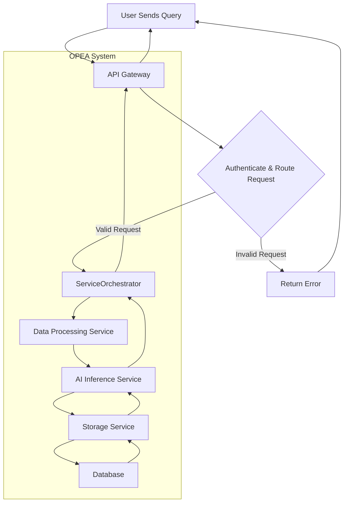
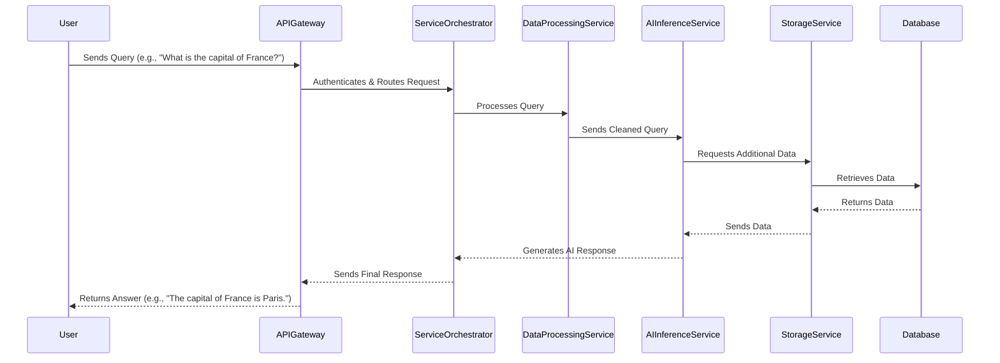

# **OPEA High-Level Workflow**

## 📌 Index

1. 🔹 [End-to-End Data Flow](#1-end-to-end-data-flow)
2. 🏗️ [Component Interactions](#2-component-interactions)
3. 🔄 [Step-by-Step Task Execution](#3-step-by-step-task-execution)
4. 🚀 [Real-World Usage Example](#4-real-world-usage-example)
5. ⚙️ [Key Components & Their Roles](#5-key-components--their-roles)

---

## **1. End-to-End Data Flow**

### **How Requests Move Through OPEA**

1️⃣ **User Request** → A user sends a request (e.g., AI-powered Q&A system).  
2️⃣ **API Gateway** → Handles authentication, authorization, and request routing.  
3️⃣ **ServiceOrchestrator** → Determines necessary microservices and their execution sequence.  
4️⃣ **Microservices Execution** → Services perform specific tasks (e.g., AI inference, retrieval, reranking).  
5️⃣ **Response Aggregation** → ServiceOrchestrator compiles results and formats the output.  
6️⃣ **Final Response** → API Gateway sends the response back to the user.

### **Key Components**

- **API Gateway** → Entry point for all requests.
- **ServiceOrchestrator** → Coordinates microservices execution.
- **Microservices** → Handle AI processing, retrieval, and data processing.
- **Databases & Storage** → Store and retrieve structured/unstructured data.

---

## **2. Component Interactions**

### **API Gateway**

- **Purpose**: Acts as the entry point for all API requests.
- **Functions**:  
  ✅ Authenticates requests.  
  ✅ Routes requests to the appropriate services.  
  ✅ Handles load balancing.

### **ServiceOrchestrator**

- **Purpose**: Manages workflow execution and service coordination.
- **Functions**:  
  ✅ Determines necessary microservices for a given task.  
  ✅ Handles inter-service communication.  
  ✅ Aggregates responses and ensures proper sequencing.

### **Microservices**

- **AI Inference Service** → Runs AI models for predictions.
- **Data Processing Service** → Cleans and formats input data.
- **Storage Service** → Handles data retrieval and persistence.

### **Database & Storage Services**

- **Vector Database** → Stores embeddings for similarity search.
- **Relational Database** → Stores structured information and logs.

---

## **3. Step-by-Step Task Execution**

### **Example: User Query to an AI-Powered Q&A System**

1️⃣ **User Query** → "What is the capital of France?"  
2️⃣ **API Gateway** → Receives and authenticates the request.  
3️⃣ **ServiceOrchestrator** → Identifies services needed (e.g., retrieval, ranking, AI inference).  
4️⃣ **Data Processing Service** → Cleans and formats the query.  
5️⃣ **Embedding Service** → Converts query into a vector embedding.  
6️⃣ **Vector Database** → Retrieves relevant documents.  
7️⃣ **Retriever Service** → Fetches the most relevant data.  
8️⃣ **Reranker Service** → Prioritizes the retrieved documents.  
9️⃣ **LLM Service** → Generates an AI response based on retrieved data.  
🔟 **Response Aggregation** → ServiceOrchestrator compiles results.  
1️⃣1️⃣ **Final Response** → API Gateway returns the answer to the user.

---

## **4. Real-World Usage Example**

### **AI-Powered Q&A System**

- **Use Case**: A language learning application that answers user questions using AI.
- **Workflow**:  
  1️⃣ **User Query** → "How do I use the present simple tense?"  
  2️⃣ **API Gateway** → Authenticates and routes the request.  
  3️⃣ **ServiceOrchestrator** → Identifies services needed (embedding, retrieval, AI inference).  
  4️⃣ **Embedding Service** → Converts query into a vector.  
  5️⃣ **Vector Database** → Searches for relevant documents.  
  6️⃣ **Retriever Service** → Fetches the best matching documents.  
  7️⃣ **Reranker Service** → Optimizes the document ranking.  
  8️⃣ **LLM Service** → Generates an AI-powered response.  
  9️⃣ **Response Aggregation** → The final output is compiled.  
  🔟 **Final Response** → Sent back to the user through the API Gateway.

### **Benefits**

✅ **Efficiency** – Handles AI-powered processing efficiently.  
✅ **Scalability** – Supports multiple users simultaneously.  
✅ **Accuracy** – Combines AI and retrieval-based responses.

---

## **5. Key Components & Their Roles**

| Component               | Role in Workflow                                           |
| ----------------------- | ---------------------------------------------------------- |
| **API Gateway**         | Receives user requests and routes them to OPEA.            |
| **ServiceOrchestrator** | Manages workflow execution and dependencies.               |
| **Embedding Service**   | Converts text into vector embeddings.                      |
| **Vector Database**     | Stores and retrieves document embeddings.                  |
| **Retriever**           | Searches for relevant documents based on query embeddings. |
| **Reranker**            | Prioritizes retrieved documents for better accuracy.       |
| **LLM Service**         | Generates a response based on the retrieved context.       |
| **Response Handler**    | Formats the final output before sending it to the user.    |

---

_Made by Ramsi K. – Part of the GenAI Bootcamp 2025 repository._
