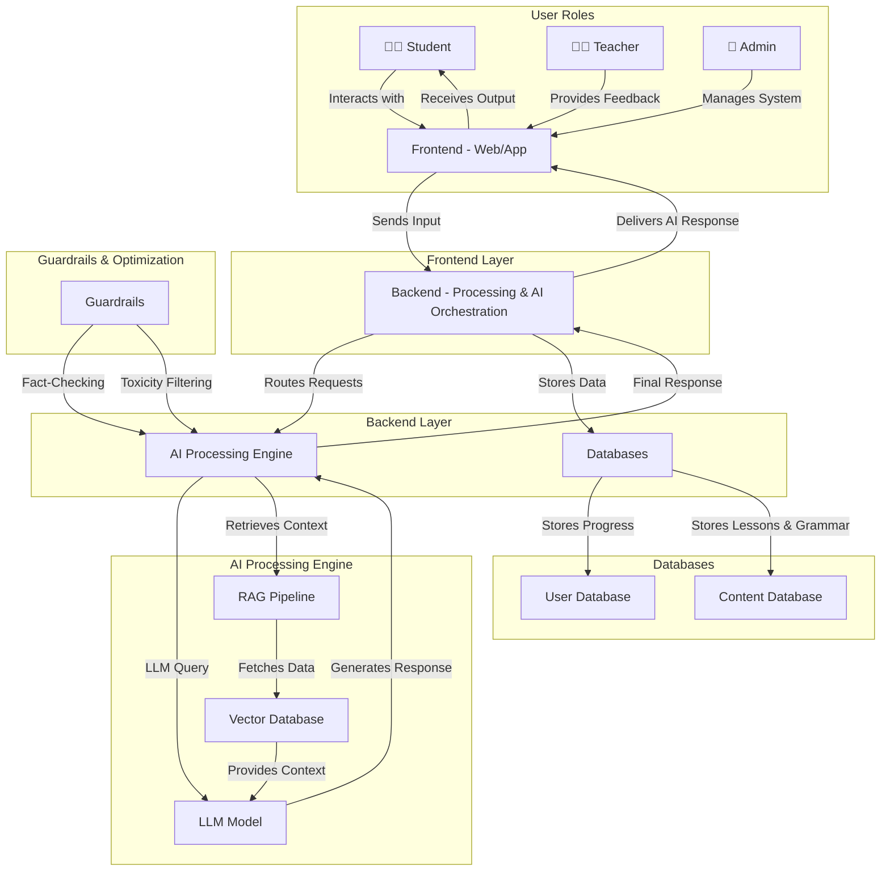

# Conceptual Design - GenAI Architecting

This document presents the **high-level conceptual architecture** for the AI-powered **HagXwon** language learning platform. The goal is to provide stakeholders with a **clear understanding of the system's core components, data flow, and AI functionalities**.

## **High-Level System Overview**

The system is designed to support **AI-driven language learning**, integrating **personalized AI tutors**, **retrieval-augmented generation (RAG)** for context-aware responses, and **adaptive learning models**.

### **Key Components**

- **User Roles**  
  - **Students** → Interact with AI-powered language tutors.  
  - **Teachers** → Provide feedback and oversee progress.  
  - **Admins** → Manage curriculum, compliance, and AI configurations.  

- **AI Functionalities**  
  - **Conversational AI Tutor** – Adaptive speaking practice.  
  - **Sentence Constructor** – AI-powered sentence correction.  
  - **Personalized Learning Paths** – AI dynamically adjusts difficulty.  
  - **RAG Pipeline** – Improves AI accuracy with contextual knowledge.  
  - **Guardrails** – Ensures factual, unbiased, and safe AI responses.  

- **System Layers**
  1. **Frontend (Web/App)** – User interactions & UI/UX.  
  2. **Backend (Processing & AI Orchestration)** – Routing requests, AI execution.  
  3. **AI Engine (LLMs & RAG)** – Intelligent response generation.  
  4. **Databases (User & Content Storage)** – Stores lessons, progress, and context.  

## **System Diagram (Mermaid)**

