# Conceptual Design - GenAI Architecting

This document presents the **high-level conceptual architecture** for the AI-powered **HagXwon** language learning platform. The goal is to provide stakeholders with a **clear understanding of the system's core components, data flow, and AI functionalities**.

## **High-Level System Overview**

The system is designed to support **AI-driven language learning**, integrating **personalized AI tutors**, **retrieval-augmented generation (RAG)** for context-aware responses, and **adaptive learning models**.

### **Key Components**

- **User Roles**  
  - **Students** → Interact with AI-powered language tutors.  
  - **Teachers** → Provide feedback and oversee progress.  
  - **Admins** → Manage curriculum, compliance, and AI configurations.  

- **AI Functionalities**  
  - **Conversational AI Tutor** – Adaptive speaking practice.  
  - **Sentence Constructor** – AI-powered sentence correction.  
  - **Personalized Learning Paths** – AI dynamically adjusts difficulty.  
  - **RAG Pipeline** – Improves AI accuracy with contextual knowledge.  
  - **Guardrails** – Ensures factual, unbiased, and safe AI responses.  

- **System Layers**
  1. **Frontend (Web/App)** – User interactions & UI/UX.  
  2. **Backend (Processing & AI Orchestration)** – Routing requests, AI execution.  
  3. **AI Engine (LLMs & RAG)** – Intelligent response generation.  
  4. **Databases (User & Content Storage)** – Stores lessons, progress, and context.  

## **System Diagram (Mermaid)**

```mermaid
graph TD;
    subgraph "User Roles"
        A[👩‍🎓 Student] -->|Interacts with| B[Frontend - Web/App]
        C[👨‍🏫 Teacher] -->|Provides Feedback| B
        D[🔧 Admin] -->|Manages System| B
    end

    subgraph "Frontend Layer"
        B -->|Sends Input| E[Backend - Processing & AI Orchestration]
        B -->|Receives Output| A
    end

    subgraph "Backend Layer"
        E -->|Routes Requests| F[AI Processing Engine]
        E -->|Stores Data| G[Databases]
    end

    subgraph "AI Processing Engine"
        F -->|LLM Query| H[LLM Model]
        F -->|Retrieves Context| I[RAG Pipeline]
        I -->|Fetches Data| J[Vector Database]
    end

    subgraph "Databases"
        G -->|Stores Progress| K[User Database]
        G -->|Stores Lessons & Grammar| L[Content Database]
    end

    subgraph "Guardrails & Optimization"
        M[Guardrails] -->|Fact-Checking| F
        M -->|Toxicity Filtering| F
    end

    %% Connections
    J -->|Provides Context| H
    H -->|Generates Response| F
    F -->|Final Response| E
    E -->|Delivers AI Response| B
```

