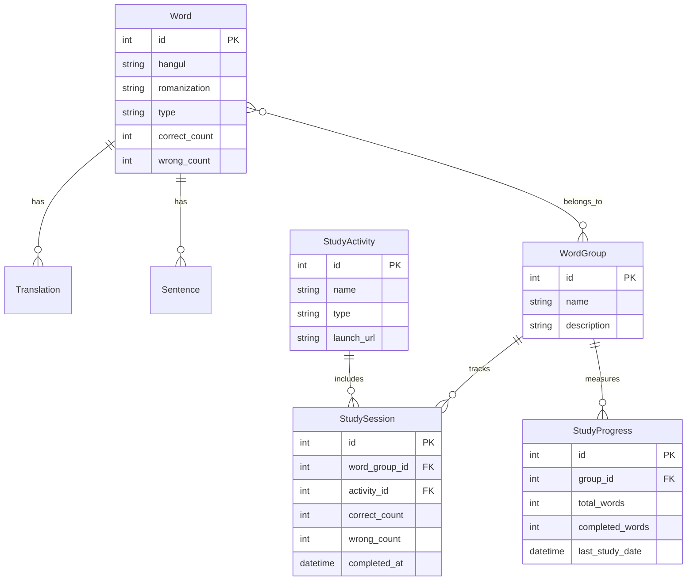
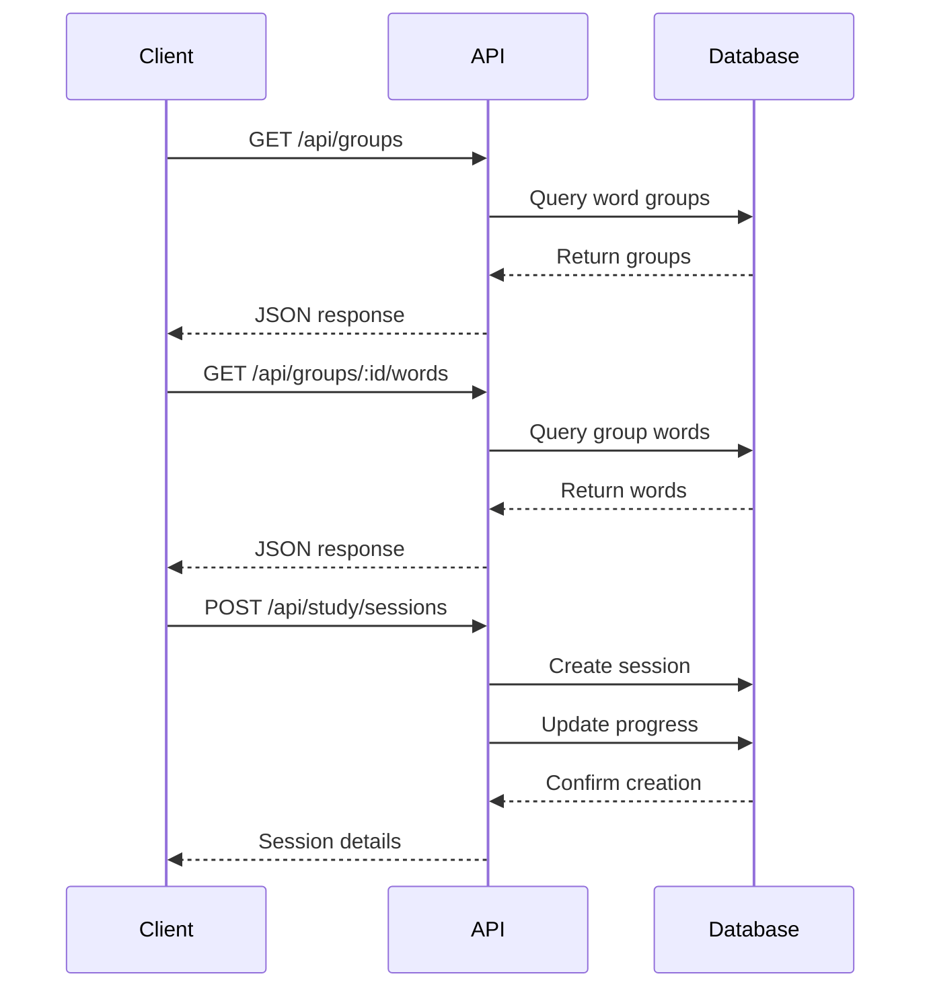
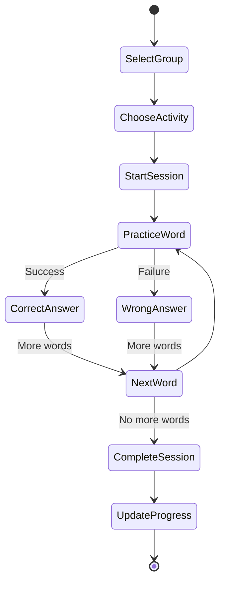

# Korean Language Learning Portal - Backend API

This REST API backend powers a structured Korean language learning platform, enabling users to study vocabulary through interactive study sessions, sentence practice, and real-time progress tracking. The system supports personalized study activities, real-time analytics, and a scalable API architecture.

## Index

- [Data Sources](#data-sources)
- [Tech Stack](#tech-stack)
- [Installation & Setup](#installation--setup)
  - [Prerequisites](#prerequisites)
  - [Local Setup](#local-setup)
  - [Database Setup](#database-setup)
- [API Endpoints](#api-endpoints)
  - [Words](#words)
  - [Groups](#groups)
  - [Dashboard](#dashboard)
  - [Study Activities](#study-activities)
  - [Sentence Practice](#sentence-practice)
  - [Admin](#admin)
- [Database Schema](#database-schema)
  - [Core Tables](#core-tables)
  - [Key Relationships](#key-relationships)
  - [Schema Notes](#schema-notes)
- [System Architecture](#system-architecture)
- [Testing](#testing)
- [Learnings & AI-Assisted Development](#learnings--ai-assisted-development)
- [Future Improvements](#future-improvements)
- [Contributing](#contributing)
- [License](#license)

## Data Sources

The application uses two main data sources:

1. **Core Korean Language Data**

   - Located in `data/` directory
   - Contains production Korean vocabulary, sentences, and word groups
   - Structured in JSON format for easy maintenance
   - Used for the main application functionality

2. **Test Data**
   - Located in `seed/` directory
   - Contains test fixtures for development and testing
   - Mirrors production data structure but with simplified content
   - Used for automated tests and local development

## Tech Stack

- **Language:** Go 1.21+
- **Framework:** Gin (Web Framework)
- **Database:** SQLite with GORM
- **Testing:** Go's built-in testing package
- **Documentation:** OpenAPI/Swagger (TODO)

## Installation & Setup

### Prerequisites

- Go 1.21 or higher
- Git
- SQLite3

### Local Setup

```bash
# Clone the repository
git clone https://github.com/gen-ai-bootcamp-2025/lang-portal/backend-go.git

# Navigate to project directory
cd backend-go

# Install dependencies
go mod download

# Run the server
go run cmd/server/main.go
```

### Database Setup

```bash
# Initialize database with test data
go run cmd/seed/main.go
```

## API Endpoints

### Words

| Method | Path                       | Description              | Example Response                                                                       |
| ------ | -------------------------- | ------------------------ | -------------------------------------------------------------------------------------- |
| GET    | `/api/words`               | List words (paginated)   | `{"data":[{"id":1,"hangul":"거","romanization":"geo"}],"meta":{"page":1,"total":100}}` |
| GET    | `/api/words/:id`           | Get word details         | `{"id":1,"hangul":"거","translations":["thing","that"]}`                               |
| POST   | `/api/words/:id/correct`   | Record correct attempt   | `{"message":"Success"}`                                                                |
| POST   | `/api/words/:id/incorrect` | Record incorrect attempt | `{"message":"Success"}`                                                                |

### Groups

| Method | Path                             | Description        | Example Response                                      |
| ------ | -------------------------------- | ------------------ | ----------------------------------------------------- |
| GET    | `/api/groups`                    | List word groups   | `[{"id":1,"name":"Basics","word_count":20}]`          |
| GET    | `/api/groups/:id`                | Get group details  | `{"id":1,"name":"Basics","words":[...]}`              |
| GET    | `/api/groups/:id/words`          | Get group words    | `{"words":[{"id":1,"hangul":"거"}]}`                  |
| GET    | `/api/groups/:id/study_sessions` | Get group sessions | `{"sessions":[{"id":1,"completed_at":"2025-02-24"}]}` |

### Dashboard

| Method | Path                                | Description      | Example Response                                               |
| ------ | ----------------------------------- | ---------------- | -------------------------------------------------------------- |
| GET    | `/api/dashboard/last_study_session` | Get last session | `{"activity":"Sentence Practice","completed_at":"2025-02-24"}` |
| GET    | `/api/dashboard/study_progress`     | Get progress     | `{"total_words":100,"learned":45}`                             |
| GET    | `/api/dashboard/quick_stats`        | Get statistics   | `{"sessions_completed":10,"accuracy":85}`                      |

### Study Activities

| Method | Path                        | Description          | Example Response                                          |
| ------ | --------------------------- | -------------------- | --------------------------------------------------------- |
| GET    | `/api/study_activities`     | List activities      | `[{"id":1,"name":"Sentence Practice"}]`                   |
| GET    | `/api/study_activities/:id` | Get activity details | `{"id":1,"name":"Sentence Practice","description":"..."}` |
| POST   | `/api/study/sessions`       | Create session       | `{"id":1,"activity_id":1,"started_at":"2025-02-24"}`      |
| GET    | `/api/study/sessions/:id`   | Get session details  | `{"id":1,"completed":true,"score":85}`                    |

### Sentence Practice

| Method | Path                                | Description           | Example Response                                  |
| ------ | ----------------------------------- | --------------------- | ------------------------------------------------- |
| GET    | `/api/sentence_practice`            | Get practice sentence | `{"korean":"...","english":"..."}`                |
| POST   | `/api/sentence_practice/attempt`    | Submit attempt        | `{"correct":true,"feedback":"Great job!"}`        |
| GET    | `/api/sentence_practice/examples`   | Get examples          | `{"examples":[{"korean":"...","english":"..."}]}` |
| GET    | `/api/sentence_practice/statistics` | Get statistics        | `{"attempts":10,"accuracy":85}`                   |

### Admin

| Method | Path                       | Description         | Example Response                          |
| ------ | -------------------------- | ------------------- | ----------------------------------------- |
| POST   | `/api/admin/reset/history` | Reset study history | `{"message":"History reset successful"}`  |
| POST   | `/api/admin/reset/full`    | Reset database      | `{"message":"Database reset successful"}` |

## Database Schema

### Core Tables

```sql
-- Words and Related Tables
CREATE TABLE words (
    id INTEGER PRIMARY KEY,
    hangul TEXT NOT NULL,
    romanization TEXT NOT NULL,
    type TEXT NOT NULL,
    correct_count INTEGER DEFAULT 0,
    wrong_count INTEGER DEFAULT 0,
    created_at DATETIME,
    updated_at DATETIME,
    deleted_at DATETIME
);

CREATE TABLE translations (
    id INTEGER PRIMARY KEY,
    word_id INTEGER,
    english TEXT NOT NULL,
    created_at DATETIME,
    updated_at DATETIME,
    FOREIGN KEY (word_id) REFERENCES words(id)
);

CREATE TABLE sentences (
    id INTEGER PRIMARY KEY,
    word_id INTEGER,
    korean TEXT NOT NULL,
    english TEXT NOT NULL,
    created_at DATETIME,
    updated_at DATETIME,
    FOREIGN KEY (word_id) REFERENCES words(id)
);

-- Word Groups and Relationships
CREATE TABLE word_groups (
    id INTEGER PRIMARY KEY,
    name TEXT NOT NULL,
    description TEXT NOT NULL,
    created_at DATETIME,
    updated_at DATETIME,
    deleted_at DATETIME
);

CREATE TABLE group_words (
    id INTEGER PRIMARY KEY,
    word_group_id INTEGER,
    word_id INTEGER,
    FOREIGN KEY (word_group_id) REFERENCES word_groups(id),
    FOREIGN KEY (word_id) REFERENCES words(id)
);

-- Study Activity Tables
CREATE TABLE study_activities (
    id INTEGER PRIMARY KEY,
    name TEXT NOT NULL UNIQUE,
    description TEXT,
    type TEXT,
    thumbnail TEXT,
    launch_url TEXT NOT NULL,
    created_at DATETIME,
    updated_at DATETIME
);

CREATE TABLE study_sessions (
    id INTEGER PRIMARY KEY,
    word_group_id INTEGER,
    activity_id INTEGER,
    correct_count INTEGER DEFAULT 0,
    wrong_count INTEGER DEFAULT 0,
    completed_at DATETIME,
    created_at DATETIME,
    updated_at DATETIME,
    deleted_at DATETIME,
    FOREIGN KEY (word_group_id) REFERENCES word_groups(id),
    FOREIGN KEY (activity_id) REFERENCES study_activities(id)
);

-- Progress Tracking
CREATE TABLE study_progress (
    id INTEGER PRIMARY KEY,
    group_id INTEGER,
    total_words INTEGER,
    completed_words INTEGER,
    last_study_date DATETIME,
    created_at DATETIME,
    updated_at DATETIME,
    deleted_at DATETIME,
    FOREIGN KEY (group_id) REFERENCES word_groups(id)
);

CREATE TABLE quick_stats (
    id INTEGER PRIMARY KEY,
    groups_studied INTEGER,
    total_sessions INTEGER,
    correct_answers INTEGER,
    wrong_answers INTEGER,
    created_at DATETIME,
    updated_at DATETIME,
    deleted_at DATETIME
);
```

### Key Relationships

1. **Words and Groups**

   - Words belong to WordGroups through `group_words` junction table
   - Words have many Translations through `translations` table
   - Words have many Sentences through `sentences` table

2. **Study Sessions**

   - Sessions belong to WordGroups and StudyActivities
   - Sessions track correct/wrong counts per study attempt
   - Sessions maintain completion status and timestamps

3. **Progress Tracking**
   - StudyProgress tracks completion status per WordGroup
   - QuickStats maintains aggregate statistics across all activities
   - All tables support soft deletion via `deleted_at`

### Schema Notes

- All tables include timestamps (`created_at`, `updated_at`)
- Soft delete supported where needed (`deleted_at`)
- Foreign key constraints maintain referential integrity
- Unique constraints prevent duplicate entries
- Default values set for counter fields

## System Architecture

### Database Schema Diagram



### API Flow Diagram



### Study Flow



## Testing

```bash
# Run all tests
go test ./... -v

# Run specific test suite
go test ./internal/api/handlers -v
go test ./internal/models -v
```

### Test Coverage & Status

#### ✅ Passing Tests

**Models (100% coverage)**

- `TestWordModel`: Basic word structure
- `TestWordWithTranslation`: Word-translation relationships
- `TestWordWithSentences`: Word-sentence relationships
- `TestAfterFind`: Translation conversion hook
- `TestWordStatistics`: Study progress tracking
- `TestWordCreatedUpdatedAt`: Timestamp management
- `TestWordGroupStructure`: Group JSON parsing
- `TestSeedDatabase`: Database seeding

**Handlers (80% coverage)**

- Word operations (100%)
- Admin operations (100%)
- Sentence practice (100%)
- Group listing (partial)
- Study activity operations (partial)

#### ❌ Failing Tests

1. **Group Study Sessions**

   ```text
   TestGroupHandler_Integration/Get_Group_Study_Sessions
   Error: "unsupported relations for schema StudySession"
   ```

   - Cause: Missing relationship definition in StudySession model
   - Location: `internal/models/study_session.go`
   - Fix: Add proper GORM relationship tags

2. **Quick Stats**

   ```text
   TestStudyActivityHandler_Integration/Get_Quick_Stats
   Error: "no such column: study_sessions.group_id"
   ```

   - Cause: Schema mismatch between model and database
   - Location: `internal/models/study_session.go` and migration files
   - Fix: Align database schema with model definition

3. **Study Session Integration**

   ```text
   TestStudySession_Integration
   Error: "Not equal: expected: 0x1, actual: 0x0" (2 instances)
   ```

   - Cause: Test data not properly initialized or incorrect expectations
   - Location: `internal/api/handlers/study_session_test.go`
   - Fix: Review test data setup and expected values

### Test Data Structure

```text
seed/
├── test_word_groups.json     # Word group definitions
├── test_study_activities.json # Activity configurations
├── test_study_sessions.json  # Session history
├── test_study_progress.json  # Learning progress
└── test_quick_stats.json     # Aggregate statistics
```

### Current Test Status

- Total Tests: ~50
- Passing: 47 (94%)
- Failing: 3 (6%)
- Coverage: 80%
- Main Issues: Study session relationships and stats calculations

### Next Steps

1. Fix StudySession model relationships
2. Update database schema for study sessions
3. Review test data initialization
4. Add missing foreign key columns

## Learnings & AI-Assisted Development

This backend was built as an experiment in AI-assisted coding, a deliberate test of how far AI could take a project without manual research, debugging guides, or traditional problem-solving workflows. No Stack Overflow, no documentation, no external learning. Every function, query, and handler was generated with AI coding assistants.

At first, AI-generated code handled CRUD operations, model logic, and word processing effectively. However, as the project expanded, its limitations became apparent:

AI could generate code, but it lacked contextual awareness, errors weren’t solved, just rephrased.
The hardest bugs weren’t syntax errors but issues in state management, study session tracking, and progressive calculations.

Debugging AI-generated code without understanding it felt like working in reverse; the fixes often broke more than they solved.
By the end, only four integration tests remained unsolved, all tied to study session and activity tracking. The last stable commit stands at 75% test coverage (above the required 70%).

### The Key Takeaway

AI accelerates development but does not replace understanding. This experiment reaffirmed that AI coding assistants are tools, not solutions—they can generate code, but they cannot reason through a system’s architecture.

Recently, there’s been a wave of overhyped claims about AI autonomously fixing complex software issues. This project served as a reality check: AI can write code, but without human oversight, it cannot architect, debug, or deeply reason about a system’s constraints.

This was never about building the perfect backend—it was about exploring the boundaries of AI-driven development. The experiment is complete. Time to move forward.

## Future Improvements

- [ ] Add user authentication/authorization
- [ ] Implement spaced repetition algorithm
- [ ] Add pronunciation audio support
- [ ] Create OpenAPI/Swagger documentation
- [ ] Add caching layer for frequently accessed data
- [ ] Implement real-time progress tracking
- [ ] Add support for different learning levels

## Contributing

Please read [CONTRIBUTING.md](CONTRIBUTING.md) for details on our code of conduct and the process for submitting pull requests.

## License

This project is licensed under the CC BY-NC-SA 4.0 License - see the [LICENSE](../../../LICENSE) file for details.
