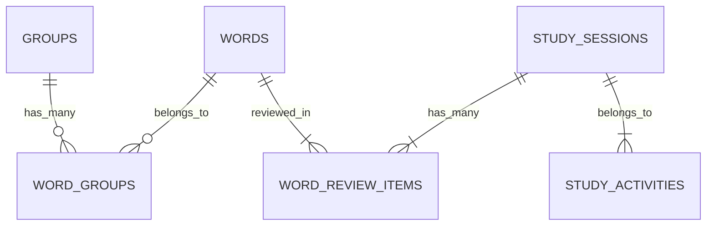

# Backend — Lang Portal

## Difficulty: Level 200

## Business Goal  

A language learning school wants to build a prototype of a **learning portal** which will serve three key functions:  

1. **Inventory of possible vocabulary** that can be learned.  
2. **Learning Record Store (LRS)** to track correct and incorrect vocabulary practice.  
3. **A unified launchpad** to access different learning applications.  

You have been tasked with **creating the backend API** for this application.  

---

## Technical Restrictions  

- **Database:** SQLite3  
- **Language & Framework:** Any (Flask, FastAPI, Node.js, etc.)  
- **Authentication:** Not required (assume a single user)  
- **AI Coding Assistants Allowed:**  
  - Cursor  
  - Windsurf  
  - Codeium  
  - GitHub Copilot  
  - Amazon Q Developer  
  - Google Code Assist  

---

## Technical Specification  

### **API Routes**  

#### **1️⃣ Vocabulary Endpoints**

- `GET /words` – Retrieve a **paginated list** of words with review statistics.  

#### **2️⃣ Group Endpoints**

- `GET /groups` – Retrieve a **paginated list** of word groups with word counts.  
- `GET /groups/:id` – Get words from a specific group (**used by target apps**).  

#### **3️⃣ Study Session Endpoints**

- `POST /study_sessions` – Create a **new study session** for a group.  
- `POST /study_sessions/:id/review` – Log a **review attempt** for a word during a study session.  

### **API Query Parameters**

#### `GET /words`

| Parameter | Description | Default Value |
|-----------|------------|--------------|
| `page` | Page number | `1` |
| `sort_by` | Sort field (`kanji`, `romaji`, `english`, `correct_count`, `wrong_count`) | `kanji` |
| `order` | Sort order (`asc`, `desc`) | `asc` |

#### `GET /groups/:id`

| Parameter | Description | Default Value |
|-----------|------------|--------------|
| `page` | Page number | `1` |
| `sort_by` | Sort field (`name`, `words_count`) | `name` |
| `order` | Sort order (`asc`, `desc`) | `asc` |

---

## Database Schema  

### **Words Table** (`words`)

Stores **individual Japanese vocabulary words**.  

| Column | Type | Description |
|--------|------|-------------|
| `id` | Primary Key | Unique identifier for each word |
| `kanji` | String | Japanese kanji representation |
| `romaji` | String | Romanized version of the word |
| `english` | String | English translation |
| `parts` | JSON | Word components stored as JSON |

### **Groups Table** (`groups`)

Manages **collections of words**.  

| Column | Type | Description |
|--------|------|-------------|
| `id` | Primary Key | Unique identifier for each group |
| `name` | String | Name of the group |
| `words_count` | Integer (default: 0) | Counter for words in the group |

### **Word Groups Table** (`word_groups`)

Enables a **many-to-many relationship** between words and groups.  

| Column | Type | Description |
|--------|------|-------------|
| `word_id` | Foreign Key | References `words.id` |
| `group_id` | Foreign Key | References `groups.id` |

### **Study Activities Table** (`study_activities`)

Defines different **study activities**.  

| Column | Type | Description |
|--------|------|-------------|
| `id` | Primary Key | Unique identifier for each activity |
| `name` | String | Name of the activity (e.g., "Flashcards", "Quiz") |
| `url` | String | URL of the activity |

### **Study Sessions Table** (`study_sessions`)

Records **individual study sessions**.  

| Column | Type | Description |
|--------|------|-------------|
| `id` | Primary Key | Unique identifier for each session |
| `group_id` | Foreign Key | References `groups.id` |
| `study_activity_id` | Foreign Key | References `study_activities.id` |
| `created_at` | Timestamp | Default: Current Time |

### **Word Review Items Table** (`word_review_items`)

Tracks **individual word reviews** within a study session.  

| Column | Type | Description |
|--------|------|-------------|
| `id` | Primary Key | Unique identifier for each review |
| `word_id` | Foreign Key | References `words.id` |
| `study_session_id` | Foreign Key | References `study_sessions.id` |
| `correct` | Boolean | Whether the answer was correct |
| `created_at` | Timestamp | Default: Current Time |

---

## **Entity Relationships**

---

## **Design Notes**

✔ **Auto-incrementing primary keys** for all tables.  
✔ **Timestamps are automatically set** on creation where applicable.  
✔ **Foreign key constraints** maintain data integrity.  
✔ **JSON storage** for word parts allows flexible component storage.  
✔ **Counter cache** optimizes word counting queries in `groups.words_count`.  

---

## **Home Challenge**

- **Level 1:** Implement the **missing API endpoints**.  
- **Level 5:** Rebuild the entire backend **in a different language/framework** of your choice.  

---

📌 This document outlines the **technical specifications, database schema, and implementation goals** for the **Lang Portal Backend**.
