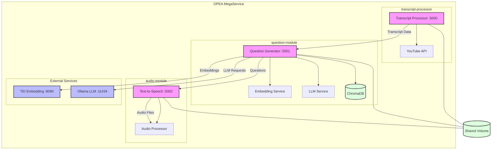

# Korean Listening Comprehension MegaService Architecture

Key Components:

1. Transcript Processor (Port 5000):

   - Handles YouTube video processing
   - Extracts and segments Korean transcripts
   - Communicates with question module

2. Question Module (Port 5001):

   - Generates questions using LLM
   - Stores embeddings in ChromaDB
   - Integrates with Ollama and TEI services

3. Audio Module (Port 5002):

   - Converts text to speech
   - Handles audio file management
   - Uses Korean TTS model

4. External Services:

   - TEI Embedding Service (Port 8080)
   - Ollama LLM Service (Port 11434)

5. Shared Resources:
   - Volume mounted at /shared/data
   - Persistent storage for all services
   - ChromaDB for vector storage

Data Flow:

1. Video URL → Transcript Processor
2. Transcript → Question Generator
3. Questions → TTS Service
4. Audio Files → Client

OPEA Integration:

- All services use ServiceOrchestrator
- Standardized request/response protocols
- Shared volume for data persistence
- Health monitoring enabled
