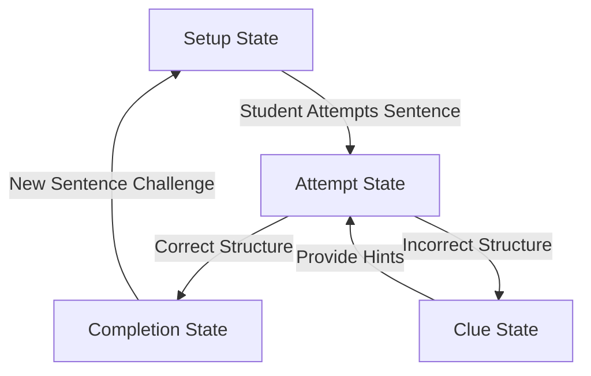

# Sentence Constructor Project

## Index

- [Overview](#overview)
- [Project Goals](#project-goals)
- [Structure](#structure)
  - [Baseline Testing](#1️⃣-baseline-testing)
  - [Prompt Engineering Strategy](#2️⃣-prompt-engineering-strategy)
  - [Refined Prompting & Adaptive Testing](#3️⃣-refined-prompting--adaptive-testing)
- [AI Prompting Structure](#ai-prompting-structure)
  - [AI Role Definition](#ai-role-definition)
  - [AI-State Awareness & Interaction Flow](#ai-state-awareness--interaction-flow)
  - [Language Level Adjustments](#language-level-adjustments)
  - [Handling Politeness Levels](#handling-politeness-levels)
  - [Example AI Interaction](#example-ai-interaction)
- [Intermediate & Final Results](#intermediate--final-results)
- [Final Evaluation & Conclusions](#final-evaluation--conclusions)

## Overview

The **Sentence Constructor Project** is an AI-driven experiment aimed at developing an intelligent **Korean language tutor** that helps students construct sentences through structured guidance rather than direct translations. The project explores **prompt engineering strategies** to optimize AI models for **interactive, step-by-step learning** while enforcing grammatical correctness and language comprehension.

## Project Goals

- Develop a **structured AI tutor** for Korean sentence construction.
- Use **prompt engineering** to ensure **guided learning** instead of direct answer-giving.
- Evaluate how different AI models handle structured learning and refine prompts accordingly.
- **Iterate on prompts** to optimize model performance through adaptive refinement.

## Structure

The project consists of multiple phases, each refining the AI’s performance based on observed behavior:

### **1️⃣ Baseline Testing**

- The AI models were tested using a **Baseline Prompt** to assess their natural response tendencies.
- Models were evaluated based on how well they followed structured guidance and whether they prematurely revealed answers.
- Results are documented in **[Baseline Results](./baseline-results.md)**.

### **2️⃣ Prompt Engineering Strategy**

- A dedicated **Prompting Strategy** document details the structured approach taken to improve model guidance.
- This document outlines **baseline issues, refinements, and testing phases**.
- Refer to **[Prompting Strategy](prompting-strategy.md)** for methodology.

### **3️⃣ Refined Prompting & Adaptive Testing**

- Based on **baseline testing**, a **Refined Prompt** was developed to enforce multiple attempts and stronger hint-based learning.
- AI models were tested again to measure improvements in structured learning.
- Results are detailed in **[Refined Results](refined-prompt.md)**.

## AI Prompting Structure

### **AI Role Definition**

- The AI acts as a **Korean language tutor**, guiding students through sentence construction.
- It provides **structured hints and feedback** instead of direct translations.
- The AI ensures step-by-step learning, focusing on **grammar, sentence order, and politeness levels**.

### **AI-State Awareness & Interaction Flow**

- **Setup State**: AI provides a **vocabulary table** and **sentence structure guide**, then prompts the student to construct the sentence.
- **Attempt State**: AI evaluates without confirming correctness immediately.
- **Clue State**: AI provides **targeted feedback** and prompts revision attempts.
- **Completion State**: AI confirms correctness after sufficient attempts and moves to a new challenge.

### **Language Level Adjustments**

| Level | Example English Sentence | Expected Korean Complexity |
|-------|------------------------|------------------------|
| Beginner (TOPIK 1) | "I eat rice." | Basic SOV order, present tense |
| Intermediate (TOPIK 2-3) | "I usually eat rice at home." | Time expressions, adverbs |
| Advanced (TOPIK 4+) | "If I had known, I wouldn’t have eaten rice." | Conditionals, complex grammar |

### **Handling Politeness Levels**

- **Casual/Formal Speech Differences:**
  - "I eat rice" → 나는 밥을 먹어 (casual) / 저는 밥을 먹어요 (polite)
  - "Do you have time?" → 시간 있어? (casual) / 시간 있으세요? (formal)
- **Honorifics for speaking to teachers/elders:**
  - "Teacher is coming" → 선생님이 오세요 (honorific verb form)

### **Example AI Interaction**

**Student Input:** English sentence: "I will go to school tomorrow."

**Student attempt:** "나는 학교 가다 내일."

**AI Response:**

📌 **Vocabulary Table:**

| Korean | Romanization | English Meaning |
|--------|-------------|----------------|
| 나 | na | I (informal) |
| 학교 | hakgyo | school |
| 가다 | gada | to go |
| 내일 | naeil | tomorrow |

📌 **Sentence Structure:**
(Subject) + (Time Expression) + (Object) + (Verb)

📌 **AI Feedback:**

- "Good attempt! But in Korean, the time expression (내일) should come before the verb."
- "Also, 가다 should be conjugated to future tense. Try using 갈 거예요 (polite) or 갈 거야 (casual)."
- "Try again before I give you more hints."

📌 **AI Prompt:**
"Attempt the sentence once more, considering the hints given above."

## Intermediate & Final Results

### **Key Takeaways from Testing**

- **Baseline models tended to confirm answers too soon**—most had an implicit “two-attempt rule” before giving the correct sentence.
- **Refined prompting improved structure**—enforcing **multiple attempts, guided corrections, and progressive difficulty scaling**.
- **Some models still validated near-correct responses too quickly**, requiring further iteration.

### **Final Evaluation & Conclusions**

The **Sentence Constructor Project** successfully demonstrated the power of **structured prompt engineering** in controlling AI behavior. By refining the way AI models provide feedback, we improved **student engagement, self-correction, and structured language learning**. While some models performed better than others, the overall approach proved effective in **guiding AI toward being a more interactive tutor** rather than a simple translator.

This project highlights the **importance of prompt iteration** and **model-specific tuning** in AI-driven education. The next steps could involve **expanding beyond sentence construction** into **full conversational learning** with more complex grammar rules and real-world scenarios.

Additionally, a key takeaway is that limiting the model’s choices may be the most effective path forward. Rather than allowing freeform responses, the AI could be optimized to cycle through a set of predefined sentence structures within **beginner, intermediate, and advanced levels**. This would help maintain structured progression and ensure that students gradually build upon their knowledge without large jumps in difficulty, a common issue in many language-learning courses. Establishing **connections between different learning levels** can further enhance progression, making the transition from beginner to intermediate smoother and more natural. This refined approach could lead to a more scalable and consistent AI tutoring experience.
